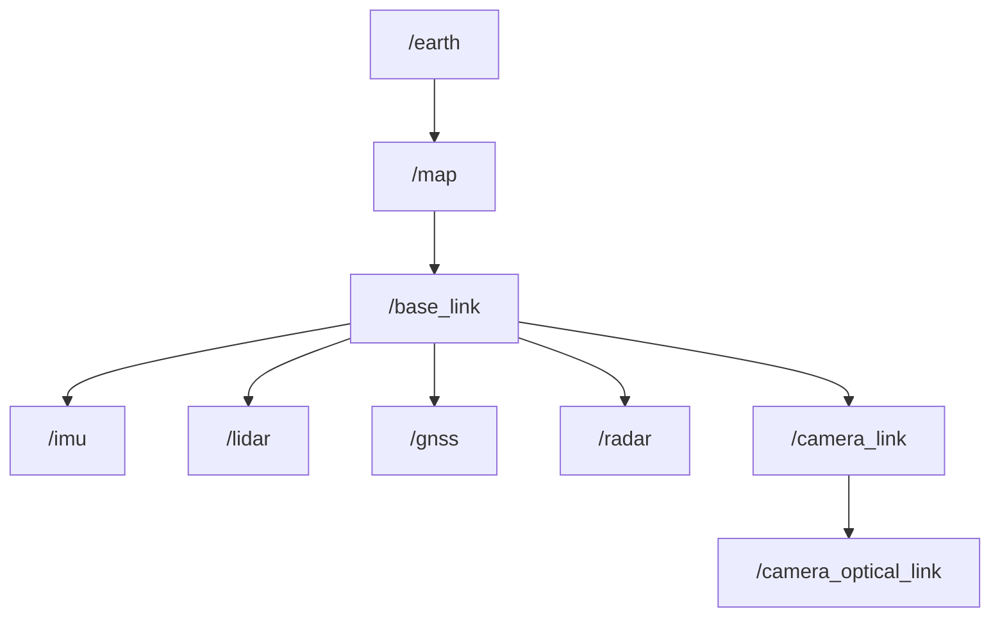
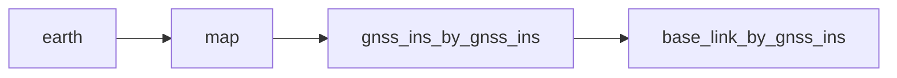

# 座標系

## 概要

一般的に使用される座標系には世界座標系、車両座標系、センサー座標系などがあります。

- 世界座標系は車両が配置されている環境内の物理空間を定義する固定座標系です。

- 車両座標系は車両独自の座標系であり、世界座標系における車両の位置と方向を定義します。

- センサー座標系はセンサー独自の座標系であり、車両座標系におけるセンサーの位置と方向を定義するために使用されます。

## Autowareにおける座標の使用方法

Autowareでは通常、空間内の車両や障害物の位置と動きを表すために座標系が使用されます。座標系は経路計画、認識、制御に一般的に使用され、車両が障害物を回避する方法を決定し、安全で効率的な移動経路を計画するのに役立ちます。

1. センサーデータの変換

   Autowareでは各センサーに固有の座標系があり、そのデータは座標で表現されます。異なるセンサー間の独立したデータを関連付けるためには各センサーと車体の位置関係を見つける必要があります。センサーの車体への取り付け位置が決まると走行中はセンサーが固定されるため、オフラインキャリブレーション方法を使用して、車体に対する各センサーの正確な位置を決定できます。

2. ROS TF2

   `TF2`システムは、異なる座標系間の関係を表す座標変換のツリーを維持します。各座標系には一意の名前が付けられ、座標変換によって接続されます。 `TF2`の使用方法については[TF2チュートリアル](http://docs.ros.org/en/galactic/Concepts/About-Tf2.html)を参照してください。

## TFツリー

Autowareにおける一般的な座標系の構造を以下に示します。:



- earth: `earth`座標系は、測地経度、緯度、高度の観点から地球上の任意の点の位置を表します。Autowareでは`earth`フレームは`GnssInsPositionStamped`メッセージでのみ使用されます。

- map: `map`座標系は、ローカルマップ上の点の位置を表すために使用されます。地理座標系はUTMまたはMGRSを使用して平面直交座標系にマッピングされます。[座標軸の規則](#coordinate-axes-conventions)で説明されているように、`map`フレームの軸は東、北、上方向を指します。.

- base_link: 車両座標系のことでこの座標系の原点は車両の後車軸の中心です。

- imu, lidar, gnss, radar: これらはセンサーフレームであり、取り付け関係を通じて車両座標系に転送されます。

- camera_link: `camera_link`はROS標準のカメラ座標系です。

- camera_optical_link: `camera_optical_link`は画像標準のカメラ座標系です。

### 他のセンサーを使用した`base_link`フレームの推定

一般に、`base_link`フレームには物理的に位置特定センサーがありません。したがってさまざまなセンサーは、それ自体のフレーム (`sensor`フレームと呼ぶことにします) を基準にして位置を特定します。

新しいフレーム命名規則`x_by_y`を導入します:

```yaml
x: 推定フレーム名
y: 位置推定手法/ソース
```

`sensor`フレームを直接取得することはできません。最初に`base_link`フレームを推定するためにEKFモジュールが必要になるためです。

EKFモジュールがなければ、私たちができる最善のことは、このセンサーを使用して`Map[map] --> sensor_by_sensor --> base_link_by_sensor`を推定することです。

#### GNSS/INSセンサーによる例

統合されたGNSS/INSでは以下のフレームを使用します:



`gnss_ins_by_gnss_ins`フレームは、GNSS/INSセンサーからの座標によって取得されます。座標は`gnss_poser`ノードを使用して`map`フレームに変換されます。

最後に`gnss_ins_by_gnss_ins`フレームは、`map`内の`gnss_ins`センサーによって推定された`gnss_ins`の位置を表します。

次に`gnss_ins`と`base_link`フレームの間の静的変換を使用することにより`base_link_by_gnss_ins`フレームを取得できます。これは`gnss_ins`センサーによって推定された`base_link`を表します。

参考:

- <https://www.ros.org/reps/rep-0105.html#earth>

### 座標軸の規則

デフォルトではスタック全体でEast、North、Up(ENU)座標軸規則を使用しています。

```yaml
X+: East
Y+: North
Z+: Up
```

位置、方向、速度、加速度はすべて同じ軸規則で定義されます。

GNSS/INSセンサーによる位置は`earth`座標系であると予想されます。

GNSS/INSセンサーによる方向、速度、加速度はセンサーフレーム内にあることが期待されます。軸は`map`フレームに平行です。

ロール、ピッチ、ヨーが指定されている場合、それらはそれぞれ X、Y、Z 軸の周りの回転に対応します。

```yaml
Rotation around:
  X+: roll
  Y+: pitch
  Z+: yaw
```

参考:

- <https://www.ros.org/reps/rep-0103.html#axis-orientation>

## 作成方法

1. センサーの校正

   各センサー座標系と`base_link`の間の変換関係はセンサーキャリブレーション技術によって取得できます。
   センサーを調整する方法については[センサーの調整](../../../how-to-guides/integrating-autoware/creating-vehicle-and-sensor-model/calibrating-sensors) を参照してください。

2. 位置推定

   `base_link`座標系と`map`座標系の関係は車両の位置と姿勢によって決まり、車両の位置推定結果から求めることができます。

3. 地図データの地理参照

   地理参照情報は、`earth`座標系からローカル`map`座標系への変換関係を取得できます。
