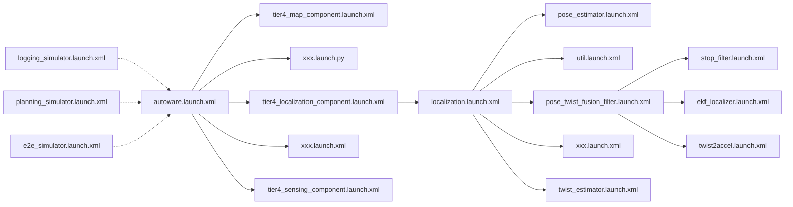

# Launchファイル

## Overview

AutowareはROS2起動システムを使用してソフトウェアを起動します。ROS2起動システムに詳しくない場合は[公式ドキュメント](https://docs.ros.org/en/humble/Tutorials/Intermediate/Launch/Launch-Main.html)を参照して、ROS2起動システムの基本を理解してください。

## ガイドライン

### Autowareの起動ファイルの構成

Autowareには主に、起動ファイルの構成に関連する2つのリポジトリ: [autoware.universe](https://github.com/autowarefoundation/autoware.universe)と[autoware_launch](https://github.com/autowarefoundation/autoware_launch)があります。

#### autoware.universe

`autoware.universe`にはメインのAutowareモジュールのコードが含まれており、その`launch`ディレクトリは各モジュールのノードの起動を担当します。Autowareソフトウェアスタックは[アーキテクチャ](https://autowarefoundation.github.io/autoware-documentation/main/design/autoware-architecture/#high-level-architecture-design)に基づいて編成されているため、アーキテクチャ (ファイルの分割、名前空間) と同様の起動構造を一致させようとしていることがわかります。たとえば`tier4_map_launch`サブディレクトリはマップモジュールに対応し、他の`tier4_*_launch`サブディレクトリも同様です。

#### autoware_launch

`autoware_launch`は`autoware.universe`を参照するリポジトリです。このリポジトリを導入する主な目的はAutowareソフトウェアスタックを開始するための一般的な入り口を提供すること、つまり各モジュールの起動ファイルを呼び出すことです。

- `autoware.launch.xml`は、道路運転シナリオの基本的な起動ファイルです。

  内容からわかるように、起動ファイル全体は、_車両_、_システム_、_マップ_、_センシング_、_ローカリゼーション_、_知覚_、_計画_、_制御_などを含むいくつかの異なるモジュールに分割されています。`launch_*`引数を`true`または`false`に設定することで、どのモジュールをロードするかを決定できます。

- `logging_simulator.launch.xml`は、ターゲットモジュール(_センシング_、_位置推定_、_知覚_など)が正常に機能するかどうかをデバッグするために、記録されたROSバグと一緒によく使用されます。

- `planning_simulator.launch.xml`は、計画シミュレータツールに基づいており、主に交通ルール、動的オブジェクトとの相互作用、自車両への制御コマンドをシミュレートすることにより、_Planning_モジュールのテスト/検証に使用されます。

- `e2e_simulator.launch.xml`はデジタルツインシミュレーション環境のランチャーです。

### Autowareに新しいパッケージを追加する

新しく作成されたパッケージに実行可能ノードがある場合、前の[ディレクトリ構造](https://autowarefoundation.github.io/autoware-documentation/main/contributing/coding-guidelines/ros-nodes/directory-structure/)ページで示した推奨構造と同様に、パッケージ内にサンプルの起動ファイルと構成が含まれることが予想されます。

Autowareの起動時に新しく追加されたパッケージを自動的にロードするには対応する起動ファイルに必要な変更を加える必要があります。たとえばポイントクラウド登録アルゴリズムとしてNDTの代わりにICPを使用する場合、`autoware.universe/launch/tier4_localization_launch/launch/pose_estimator/pose_estimator.launch.xml`ファイルを変更して、新しく追加されたICPパッケージをロードできます。

## パラメータ管理

`autoware_launch`リポジトリを導入するもう1つの目的は、Autowareのパラメータ管理を容易にすることです。この状況について考えてみます。Autowareを特定の車両に統合してパラメータを変更したい場合は`autoware.universe`をフォークする必要があります。`autoware.universe`にはパラメータ以外にも多くのコードがあり、開発者によって頻繁に更新されます。これらのパラメータを `autoware_launch`に統合することで、`autoware_launch`リポジトリをフォークするだけでAutowareパラメータをカスタマイズできます。位置推定モジュールを例に挙げます:

1. 位置推定コンポーネントのすべての“launch parameters”は、`autoware_launch/autoware_launch/config/localization`の下のファイルにリストされています。
2. "launch parameters"ファイルのパスは、`autoware_launch/autoware_launch/launch/components/tier4_localization_component.launch.xml`ファイルに設定されます。
3. `autoware.universe/launch/tier4_localization_launch/launch`では、パラメータ設定ファイルで引数が指定されている場合、起動ファイルは“launch parameters”をロードします。各パッケージのデフォルトパラメータを使用して、`autoware.universe`内で`tier4_localization_launch`を起動することもできます。
