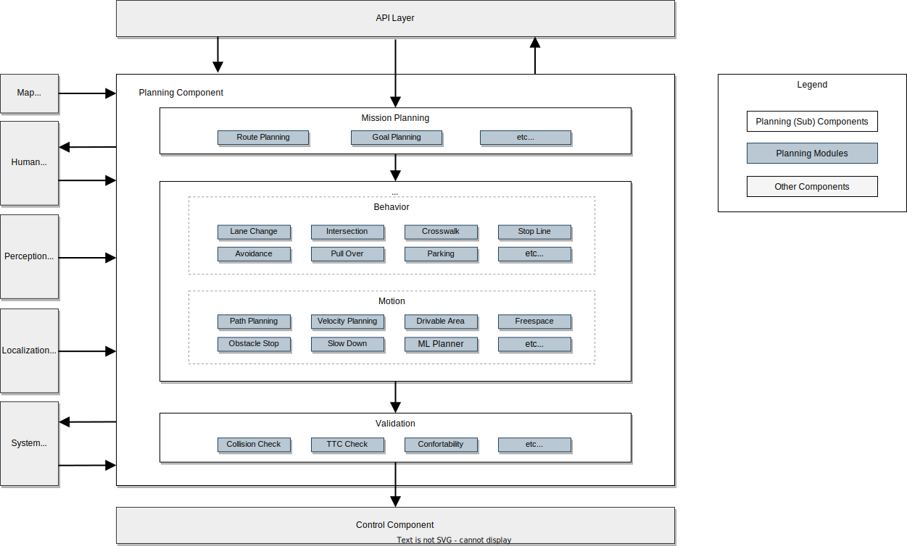

設計の詳細
サポートされている機能
機能説明	要件	形	デモ
経路計画	自車位置から目的地までの経路を計画します。リファレンス実装はMission Planner

にあり、ノードを起動することで有効になります。mission_planner	- レーンレットマップ（運転レーンレット）	経路計画	
経路からの道筋計画	指定された経路からたどる経路を計画します。

参照実装はBehavior Path Plannerにあります。	- レーンレットマップ（レーンレットの運転）	車線追従	
障害物回避	ステアリング操作で障害物を回避するように経路を計画します。

参照実装は、Avoidance、Obstacleavoidance Plannerにあります。パラメータ内のフラグを有効にする:launch obstacle_avoidance_planner true	- オブジェクト情報	障害物回避	デモビデオ
デモビデオ
道筋の平滑化	スムーズなステアリングを実現するために経路を計画します。

参照実装は障害物回避プランナーにあります。	- レーンレットマップ（走行レーンレット）	パスの平滑化	デモビデオ
デモビデオ
狭所走行	走行可能エリア内で走行するための経路を計画します。また、走行可能領域内を走行できない場合は、車両を停止し、走行可能領域から出ないようにしてください。

参照実装は障害物回避プランナーにあります。	- 車線図（高精度車線境界線）	狭いスペースでの運転	デモビデオ
デモビデオ
車線変更	目的地に到達するための車線変更の経路を計画します。

リファレンス実装はLane Changeにあります。	- レーンレットマップ（レーンレットの運転）	車線変更	デモビデオ
デモビデオ
乗り上げ	路肩に車を停めるための経路を計画します。

参照実装はGoal Plannerにあります。	- レーンレットマップ（路肩レーン）	乗り上げ	デモビデオ:
シンプルなプルオーバー アーク 前方プルオーバーアーク後方プルオーバー
デモビデオ

デモビデオ

デモビデオ
発進	車寄せのための経路を路肩から開始するように計画します。

参照実装はPull Out Moduleにあります。	- レーンレットマップ（路肩レーン）	引き出す	デモビデオ:
シンプルな引き出し、 後方引き出し
デモビデオ

デモビデオ
パスシフト	外部からの指示に応じて横方向の経路を計画します。

リファレンス実装はSide Shift Moduleにあります。	- なし	サイドシフト	
障害物停止	経路上の障害物に合わせて停止する速度を計画します。

リファレンス実装は、Obstacle Stop Planner、Obstacle Cruise Plannerにあります。launch obstacle_stop_plannerおよび有効フラグ: TODO、launch obstacle_cruise_plannerおよび有効フラグ:TODO	- オブジェクト情報	障害物停止	デモビデオ
デモビデオ
障害物の減速	経路の周囲にある障害物に対して減速するように速度を計画します。

リファレンス実装は、Obstacle Stop Planner、Obstacle Cruise Plannerにあります。	- オブジェクト情報	障害物減速	デモビデオ
デモビデオ
適応的クルーズコントロール	自車両の前を走行する車両に追従するように速度を計画します。

リファレンス実装は、Obstacle Stop Planner、Obstacle Cruise Plannerにあります。	- オブジェクト情報	アダプティブクルーズ	
割り込み車両に対する減速	車両が自車線に割り込むリスクを回避するために速度を計画してください。

リファレンス実装はObstacle Cruise Plannerにあります。	- オブジェクト情報	割り込む	
起動時の周辺確認	車両の周囲に障害物がある場合に移動を防止するために速度を計画します。

リファレンス実装はSurround Obstacle Checkerにあります。パラメータのフラグを有効にする:use_surround_obstacle_check true tier4_planning_component.launch.xml <	- オブジェクト情報	サラウンドチェック	デモビデオ
デモビデオ
カーブの減速	カーブでは減速するように速度を計画します。

リファレンス実装はMotion Velocity Smootherにあります。	- なし	カーブでの減速	
障害物に対するカーブの減速	経路周囲の障害物との衝突の危険を考慮して、カーブでは減速するように速度を計画します。

リファレンス実装はObstacle Velocity Limiterにあります。	- オブジェクト情報
- レーンレットマップ（静的障害物）	カーブ上の障害物減速	デモビデオ
デモビデオ
横断歩道	横断歩道に近づいたり歩いたりする歩行者が停止または減速する速度を計画します。

参照実装はCrosswalk モジュールにあります。	- オブジェクト情報
- レーンレットマップ（横断歩道）	横断歩道	デモビデオ
デモビデオ
交差点対向車確認	対向車との危険を避けるために、交差点での右折または左折の速度を計画します。

参照実装はIntersection モジュールにあります。	・オブジェクト情報
・レーンレットマップ（交差点車線、譲り車線）	交差点	デモビデオ
デモビデオ
交差点死角チェック	死角の後ろから来る他の車両やバイクとの危険を避けるために、交差点で右折または左折するときの速度を計画してください。

リファレンス実装はBlind Spot Moduleにあります。	・オブジェクト情報
・レーンレットマップ（交差点車線）	盲点	デモビデオ
デモビデオ
交差点のオクルージョンチェック	オクルージョンエリアから車両が来る可能性があるリスクを回避するために、交差点での右折または左折の速度を計画します。

参照実装はIntersection モジュールにあります。	・オブジェクト情報
・レーンレットマップ（交差点車線）	交差オクルージョン	デモビデオ
デモビデオ
交差点の渋滞検知	渋滞で前方に車両が停止している場合、交差点に進入しないように交差点の速度を計画してください。

参照実装はIntersection モジュールにあります。	・オブジェクト情報
・レーンレットマップ（交差点車線）	交差点渋滞	デモビデオ
デモビデオ
信号機	信号に従って交差点の速度を計画します。

リファレンス実装はTraffic Light Moduleにあります。	- 信号機の色情報	信号機	デモビデオ
デモビデオ
振れチェック	近くの物体が経路に飛び出してしまう可能性を考慮して、速度を減速するように計画します。

リファレンス実装はRun Out Moduleにあります。	- オブジェクト情報	なくなる	デモビデオ
デモビデオ
停止線	停止線で停止するように計画速度を設定します。

リファレンス実装はStop Line Moduleにあります。	- レーンレットマップ（停止線）	停止線	デモビデオ
デモビデオ
オクルージョンスポットチェック	大型車両の後ろなどからオブジェクトがオクルージョン エリアから飛び出してくる場合に減速するように速度を計画します。

リファレンス実装はOcclusion Spot Moduleにあります。	- オブジェクト情報
- レーンレットマップ（プライベートレーン/パブリックレーン）	オクルージョンスポット	デモビデオ
デモビデオ
停車禁止エリア	消防署出入り口前など、停止禁止区域では停止しないように速度を計画してください。

リファレンス実装はNo Stopping Area モジュールにあります。	- レーンレットマップ（停車エリアなし）	一時停止禁止区域	
私有地から公道への合流	歩行者や他の車両との衝突の危険を避けるために、私道から公道に入るときの速度を計画してください。

リファレンス実装はMerge from Private Area モジュールにあります。	- オブジェクト情報
- レーンレットマップ（プライベートレーン/パブリックレーン）	WIP	
スピードバンプ	スピードバンプでは減速するように速度を計画します。

リファレンス実装はSpeed Bump Moduleにあります。	- レーンレットマップ（スピードバンプ）	スピードバンプ	デモビデオ
デモビデオ
検知エリア	指定された検出エリアに物体が存在する場合、対応する停止位置で停止するように計画速度を設定します。

参照実装は検出エリア モジュールにあります。	- レーンレットマップ（検知エリア）	検出エリア	デモビデオ
デモビデオ
走行可能な車線なし	ODD (運用設計ドメイン) で指定されたエリアを出る前に停止するように速度を計画するか、ODD 車線外で自律モードが開始された場合に車両を停止します。

リファレンス実装はNo Drivable Lane Moduleにあります。	- Laneletマップ（走行可能な車線なし）	走行不能車線	
車線逸脱時の衝突検知	自車両が自分の車線から逸脱したときに、別の車線を走行している他の車両との衝突を避けるために速度を計画します。

リファレンス実装はOut of Lane Moduleにあります。	・オブジェクト情報
・レーンレットマップ（走行車線）	WIP	
駐車場	駐車エリアでの特定の目標に向けて経路と速度を計画します。

リファレンス実装はFree Space Plannerにあります。	- オブジェクト情報
- レーンレットマップ（駐車場）	駐車場	デモビデオ
デモビデオ
自動緊急ブレーキ (AEB)	前方の物体との衝突が予想される場合は、緊急停止してください。この機能は最終的な安全層として期待されており、ローカリゼーションまたは知覚システムに障害が発生した場合でも機能するはずであることに注意してください。

リファレンス実装はOut of Lane Moduleにあります。	- プリミティブオブジェクト	aeb	
最小リスク行動 (MRM)	危険な事象が発生した場合には、適切な MRM (最小リスク行動) 指示を提供します。例えば、センサーの異常が発見された場合、状況に応じて緊急ブレーキ、適度な停止、路肩寄せなどの指示を出します。

リファレンス実装は TODO 内にあります	- TODO	WIP	
軌道の検証	計画された軌道が安全であることを確認してください。安全でない場合は、軌道を変更する、軌道の送信を停止する、自動運転システムに報告するなどの適切な措置を講じます。

参照実装はPlanning Validatorにあります。	- なし	軌道検証	
レーンマップ生成の実行中	手動運転で記録された位置特定データからレーンマップを生成します。

リファレンス実装は WIP にあります	- なし	WIP	
ランニングレーンの最適化	車両の運動学を考慮してマップの中心線 (基準パス) を最適化して滑らかにします。

参照実装はStatic Centerline Optimizerにあります。	- Laneletマップ（走行車線）	WIP	

# 計画コンポーネント設計

## 目的

自動運転システムの計画コンポーネントは自動運転車両の目標軌道(経路と速度)を生成する際に重要な役割を果たします。安全と交通ルールの順守を確保し、特定の使命を果たします。

このドキュメントでは、Autoware 内の計画要件と設計の概要を説明し、開発者が計画コンポーネントの設計と拡張性を理解するのに役立ちます。

このドキュメントは2つの部分に分かれており、最初の部分では高レベルの要件と設計について説明し、後半の部分では実際の実装と提供される機能に焦点を当てます。

## 目標と非目標

私たちの目標は、単に自動運転システムの開発だけにとどまりません。ユーザーが個々のニーズに合わせて自動運転機能を強化できる"自動運転プラットフォーム"の提供を目指します。

Autowareでは、高い拡張性、機能モジュール性、明確に定義されたインターフェイスを重視する[マイクロオートノミーアーキテクチャmicroautonomy architecture](https://autowarefoundation.github.io/autoware-documentation/main/design/autoware-concepts) の概念を利用しています。

これを念頭に置いて、計画コンポーネントの設計ポリシーは、すべての複雑な自動運転シナリオに対処すること (これは非常に困難な問題であるため) ではなく、**カスタマイズ可能で簡単に拡張可能な計画開発プラットフォームを提供すること**に重点を置いています。このアプローチにより、プラットフォームが幅広いニーズに対応できるようになり、最終的には多くの複雑なユースケースが解決されると考えています。

この方針を明確にするために目標と非目標を次のように定義します:

**目標:**

- **単純なODDを定義できるように、基本的な関数が提供されています**
  - 機能を拡張する前に、計画コンポーネントは自動運転に必要な重要な機能を提供する必要があります。これには、移動、停止、方向転換などの基本操作に加え、比較的安全で単純な状況での車線変更や障害物の回避の処理も含まれます。
- **機能はユーザー主導の拡張のためにモジュール化されています**
  - このシステムは、拡張機能を備えたさまざまな運用設計ドメイン (ODD) に適応するように設計されています。プラグインに似たモジュール化により、さまざまなレベルの自動運転やさまざまな車両または環境アプリケーション（例：Lv4/Lv2 自動運転、公共/私道走行、大型車両、小型ロボットなど）など、多様なニーズに合わせたシステムの作成が可能になります。
  - 障害物のない私道など、特定のODDの機能を削減することも重要な側面です。このモジュール式アプローチにより、特定のユーザーのニーズに合わせて消費電力やセンサー要件を削減できます。
- **この機能は人間のオペレーターの判断によって拡張可能です**
  - オペレーター支援を組み込むことは、機能拡張の重要な側面です。これは、システムが人間のサポートを受けながら、複雑で困難なシナリオに適応できることを意味します。特定の種類の演算子はここでは定義されていません。それは、プロトタイプの開発段階で車両に同乗する人かもしれないし、自動運転サービス中の緊急時に接続される遠隔操作者かもしれない。

**非目標:**

計画コンポーネントはサードパーティのモジュールで拡張できるように設計されています。したがって、以下はAutowareの計画コンポーネントの目標ではありません:

- ユーザーが必要とするすべての機能をデフォルトで提供します。
- 自動運転システムの完全な機能と性能特性を提供する。
- 常に人間の能力を超えた性能を提供すること、あるいは絶対的な安全性を確保すること。

これらの側面は自動運転"プラットフォーム"という当社のビジョンに特有のものであり、一般的な自動運転計画コンポーネントには当てはまらない場合があります。

## 高次元のデザイン

この図は、計画コンポーネントの高レベルのアーキテクチャを示しています。これは理想的な設計を表しており、現在の実装は異なる場合があります。実装の詳細については、このドキュメントの後半のセクションで説明します。

マイクロオートノミーアーキテクチャの原則に従って、モジュール式システムフレームワークを採用しました。計画領域内の機能は、特定の使用例に応じて動的または静的に適応できるモジュールとして実装されます。これには、車線変更、交差点処理、横断歩道などのモジュールが含まれます。

計画コンポーネントは、いくつかのサブコンポーネントで構成されます:

- **ミッション計画**: 地図データを利用して現在地から目的地までのルートを計算するモジュールです。その機能は、フリート管理システム(FMS)やカーナビゲーションの経路計画に似ています。
- **計画モジュール**: これらのモジュールは、ターゲットの軌道、ウィンカー信号などを含む、割り当てられたミッションに対する車両の動作を計画します。これらのモジュールは、行動と動作のカテゴリに分類されます。:
  - **行動**: 安全でルールに準拠したルートの計算、車線変更、交差点進入、停止線での停止の決定の管理に重点を置きます。
  - **動作**: 行動モジュールと連携して、車両の動きと乗り心地を考慮して車両の軌道を決定します。これには、経路形成と速度計算のための横方向および縦方向の計画が含まれます。
- **検証**: 緊急対応機能を備え、計画された軌道の安全性と適切性を保証します。計画された軌道が不適切な場合、緊急プロトコルがトリガーされるか、代替経路が生成されます。

### ハイライト

この高レベル設計の重要な側面は次のとおりです:

#### 各機能の調整

経路生成、車線変更、交差点管理などの重要な計画機能がモジュール化されています。これらのモジュールには標準化されたインターフェイスが付属しており、追加や変更が簡単に行えます。これらのインターフェイスの詳細については、後続のセクションで説明します。各モジュールを有効/無効にする方法の詳細については、[計画の実装ドキュメント](https://autowarefoundation.github.io/autoware.universe/main/planning/#how-to-enable-or-disable-planning-module)を参照してください。

#### ミッション計画サブコンポーネントの分離

ミッションプランニングは、FMS(フリート管理システム)などの既存のサービスに通常見られる機能の代替として機能します。高レベルの設計で定義されたインターフェイスを遵守することで、サードパーティのサービスとの統合が容易になります。

#### 検証サブコンポーネントの分離

計画コンポーネントの拡張可能な性質を考慮すると、すべての機能にわたって一貫した安全レベルを確保することは困難です。したがって、検証機能はコアの計画モジュールから独立して管理され、計画モジュールの任意の変更に対しても安全性のベースラインを維持します。

#### HMI用インターフェース（ヒューマン・マシン・インターフェース）

HMIは人間のオペレーターとスムーズに連携できるように設計されています。これらのインターフェイスにより、車内または遠隔地にかかわらず、計画コンポーネントとオペレーター間の調整が可能になります。

#### 計画とその他のコンポーネントの分離に関するトレードオフ

Autowareの包括的な設計では、計画、認識、位置推定、制御などのコンポーネントを分離することで、サードパーティモジュールとの連携が容易になります。ただし、この分離にはパフォーマンスと拡張性の間のトレードオフが伴います。たとえば、知覚コンポーネントは、計画から分離されているため、不要なオブジェクトを処理する可能性があります。同様に、計画と制御を分離すると、計画中に車両の運動を考慮する際に課題が生じる可能性があります。これらの問題を軽減するには、インターフェイス情報を強化するか、計算量を増やす必要がある場合があります。

## 機能をカスタマイズする

計画コンポーネント設計の重要な機能は、外部モジュールと統合できることです。以下の図は、外部機能を組み込むためのさまざまな方法を示しています。

### 1. 計画コンポーネントへの新しいモジュールの追加

ユーザーは、既存の計画機能を新しいモジュールで拡張または置き換えることができます。このアプローチは一般的に機能を拡張するために使用され、目的のODDにない機能の追加や既存の機能の簡素化を可能にします。

ただし、これらの機能を追加するには、よく整理されたモジュールインターフェイスが必要です。2023年11月の時点では、理想的なモジュラーシステムは完全には確立されておらず、いくつかの制限があります。詳細については、リファレンス実装セクションの[現在の実装での機能のカスタマイズ](#customize-features-in-the-current-implementation)と[計画の実装ドキュメント](https://autowarefoundation.github.io/autoware.universe/main/planning/#how-to-enable-or-disable-planning-module)を参照してください。

### 2. 計画のサブコンポーネントの置き換え

サブコンポーネント レベルでのコラボレーションと拡張に興味を持つユーザーもいるかもしれません。これには、ミッション計画を既存の FMS サービスに置き換えたり、既存の検証機能を利用しながらサードパーティの軌道生成モジュールを組み込んだりすることが含まれる可能性があります。

[計画コンポーネントの内部インターフェイス](#internal-interface-in-the-planning-component)に準拠すると、このレベルでのコラボレーションと拡張が可能になります。既存の計画機能との複雑な連携は制限される場合がありますが、特定の計画コンポーネント機能と外部モジュール間の統合が可能になります。

### 3. 計画コンポーネント全体の置き換え

自動運転計画システムを開発している組織や研究機関は、独自の計画ソリューションとAutowareの知覚モジュールまたは制御モジュールの統合に興味があるかもしれません。これは、コンポーネント間で定義された堅牢で安定したインターフェイスに従って、計画システム全体を置き換えることによって実現できます。ただし、既存の計画モジュールと直接調整できない場合があることに注意することが重要です。

## コンポーネントインターフェース

このセクションでは、計画コンポーネントとその内部モジュールの入力と出力について説明します。現在の実装については[計画コンポーネントインターフェイス](../../autoware-interfaces/components/planning.md)ページを参照してください。

### 計画コンポーネントへの入力

- **地図から**
  - ベクターマップ: 経路計画のための車線接続情報、参照パスを生成するための車線形状、交通ルール関連情報など、環境に関するすべての静的情報が含まれます。
- **知覚から**
  - 検出物体情報: 歩行者や他の車両など、事前に知ることができない物体に関するリアルタイムの情報を提供します。計画コンポーネントは、これらの物体との衝突を回避するための操縦を計画します。
  - 検出された障害物情報: 障害物の位置に関するリアルタイム情報を提供します。これは、検出されたオブジェクトよりも原始的なもので、緊急停止やその他の安全対策に使用されます。
  - 占有マップ情報: 歩行者や他の車両の存在に関するリアルタイムの情報と、遮蔽されたエリアの情報を提供します。
  - 信号機認識結果: 各信号機の現在の状態をリアルタイムで提供します。計画コンポーネントは、計画された経路に関連する情報を抽出し、交差点で停止するかどうかを決定します。
- **位置推定から**
  - 車両運動情報: 自車両の位置、速度、加速度、およびその他の運動関連データが含まれます。
- **システムから**
  - 動作モード: 車両が自律モードで動作しているかどうかを示します。
- **ヒューマンマシンインターフェイス(HMI)から**
  - 機能の実行: 人間のオペレーターによる、車線変更や交差点への進入などの自動運転操作の実行/承認を可能にします。
- **APIレイヤーから**
  - 目的地(目標): 計画コンポーネントが到達することを目指す最終的な位置を表します。
  - チェックポイント: 目的地までの経路上の中間点を表します。これは経路計算時に使用されます。
  - 速度制限: 車両の最高速度制限を設定します。

### 計画コンポーネントからの出力

- **制御へ**
  - 軌道: 制御コンポーネントが従う必要があるポーズ、ツイスト、加速のスムーズなシーケンスを提供します。軌跡の長さは通常10秒、分解能は0.1秒です。
  - 方向指示器: 計画された操作に基づいて、右、左、ハザードなどの車両の方向指示器を制御します。
- **システムへ**
  - 診断: 計画コンポーネントの状態をレポートし、処理が正しく実行されているかどうか、安全な計画が生成されているかどうかを示します。
- **ヒューマン・マシン・インターフェース(HMI)へ**
  - 機能実行の可用性: 車線変更や交差点への進入など、実行できる操作または必要な操作のステータスを示します。
  - 軌道候補: ユーザーの実行後に実行される可能性のある軌道を示します。
- **APIレイヤーへ**
  - 計画要因: 現在の計画動作の背後にある理由に関する情報を提供します。これには、回避すべき目標物の位置、停止の決定に至った障害物、およびその他の関連情報が含まれる場合があります。

### 計画コンポーネントの内部インターフェース

- **ミッション計画からシナリオ計画まで**
  - 経路: 出発地から目的地までたどる必要がある経路のガイダンスを提供します。この経路は、地図上に定義されたレーンIDなどの情報に基づいて決定されます。経路レベルでは、どの特定の車線を使用するかは明示的に示されず、経路には複数の車線が含まれる場合があります。
- **行動計画から動作計画へ**
  - 通過点: 車両がたどる大まかな位置と速度を提供します。これらの通過点ポイントは通常約1メートルの間隔で定義されます。他の間隔距離も可能ですが、計画コンポーネントの精度やパフォーマンスに影響を与える可能性があります。
  - 走行可能エリア: 車線内や物理的に走行可能なエリアなど、車両が走行できる領域を定義します。動作プランナーがこの定義された領域内で最終的な軌道を計算することを前提としています。
- **シナリオの計画から検証へ**
  - 軌道: 制御コンポーネントが追従しようとする目的の位置、速度、加速度を定義します。軌道点は軌道速度に基づいて約0.1秒間隔で定義されます。
- **検証から制御コンポーネントへ**
  - 軌道: 上記と同じですが、追加の安全上の考慮事項がいくつかあります。

## Detailed design

### Supported features

| Feature                                      | Description                                                                                                                                                                                                                                                                                                                                                                                                                                                                                                                              | Requirements                                                                | Figure                                                                          | Demonstration                                                                                                                                                                                                                                                                                                                                                                                                                                                                                                                                                                 |
| -------------------------------------------- | ---------------------------------------------------------------------------------------------------------------------------------------------------------------------------------------------------------------------------------------------------------------------------------------------------------------------------------------------------------------------------------------------------------------------------------------------------------------------------------------------------------------------------------------- | --------------------------------------------------------------------------- | ------------------------------------------------------------------------------- | ----------------------------------------------------------------------------------------------------------------------------------------------------------------------------------------------------------------------------------------------------------------------------------------------------------------------------------------------------------------------------------------------------------------------------------------------------------------------------------------------------------------------------------------------------------------------------- |
| Route Planning                               | Plan route from the ego vehicle position to the destination.    Reference implementation is in [Mission Planner](https://autowarefoundation.github.io/autoware.universe/main/planning/mission_planner/), enabled by launching the `mission_planner` node.                                                                                                                                                                                                                                                                          | - Lanelet map (driving lanelets)                                            |                      |
| Path Planning from Route                     | Plan path to be followed from the given route.     Reference implementation is in [Behavior Path Planner](https://autowarefoundation.github.io/autoware.universe/main/planning/behavior_path_planner/).                                                                                                                                                                                                                                                                                                                            | - Lanelet map (driving lanelets)                                            |                            |
| Obstacle Avoidance                           | Plan path to avoid obstacles by steering operation.     Reference implementation is in [Avoidance](https://autowarefoundation.github.io/autoware.universe/main/planning/behavior_path_planner/docs/behavior_path_planner_avoidance_design/), [Obstacle Avoidance Planner](https://autowarefoundation.github.io/autoware.universe/main/planning/obstacle_avoidance_planner/). Enable flag in parameter: `launch obstacle_avoidance_planner true`                                                                                    | - objects information                                                       |                       | [Demonstration Video](https://youtu.be/A_V9yvfKZ4E)                                                                                                                                                                                                                                                                                                                                                                                                     |
| Path Smoothing                               | Plan path to achieve smooth steering.     Reference implementation is in [Obstacle Avoidance Planner](https://autowarefoundation.github.io/autoware.universe/main/planning/obstacle_avoidance_planner/).                                                                                                                                                                                                                                                                                                                           | - Lanelet map (driving lanelet)                                             |                      | [Demonstration Video](https://youtu.be/RhyAF26Ppzs)                                                                                                                                                                                                                                                                                                                                                                                                     |
| Narrow Space Driving                         | Plan path to drive within the drivable area. Furthermore, when it is not possible to drive within the drivable area, stop the vehicle to avoid exiting the drivable area.     Reference implementation is in [Obstacle Avoidance Planner](https://autowarefoundation.github.io/autoware.universe/main/planning/obstacle_avoidance_planner/).                                                                                                                                                                                       | - Lanelet map (high-precision lane boundaries)                              |          | [Demonstration Video](https://youtu.be/URzcLO2E1vY)                                                                                                                                                                                                                                                                                                                                                                                                     |
| Lane Change                                  | Plan path for lane change to reach the destination.     Reference implementation is in [Lane Change](https://autowarefoundation.github.io/autoware.universe/main/planning/behavior_path_planner/docs/behavior_path_planner_lane_change_design/).                                                                                                                                                                                                                                                                                   | - Lanelet map (driving lanelets)                                            |                            | [Demonstration Video](https://youtu.be/0jRDGQ84cD4)                                                                                                                                                                                                                                                                                                                                                                                                     |
| Pull Over                                    | Plan path for pull over to park at the road shoulder.     Reference implementation is in [Goal Planner](https://autowarefoundation.github.io/autoware.universe/main/planning/behavior_path_planner/docs/behavior_path_planner_goal_planner_design/).                                                                                                                                                                                                                                                                               | - Lanelet map (shoulder lane)                                               |                                | Demonstration Videos:   [Simple Pull Over](https://youtu.be/r3-kAmTb4hc)      [Arc Forward Pull Over](https://youtu.be/ornbzkWxRWU)      [Arc Backward Pull Over](https://youtu.be/if-0tG3AkLo)    |
| Pull Out                                     | Plan path for pull over to start from the road shoulder.     Reference implementation is in [Pull Out Module](https://autowarefoundation.github.io/autoware.universe/main/planning/behavior_path_planner/docs/behavior_path_planner_start_planner_design/#:~:text=WIP-,Path%20Generation,-%23).                                                                                                                                                                                                                                    | - Lanelet map (shoulder lane)                                               |                                  | Demonstration Video:   [Simple Pull Out](https://youtu.be/xOjnPqoHup4)      [Backward Pull Out](https://youtu.be/iGieijPcPcQ)                                                                                                                                                                                               |
| Path Shift                                   | Plan path in lateral direction in response to external instructions.     Reference implementation is in [Side Shift Module](https://autowarefoundation.github.io/autoware.universe/main/planning/behavior_path_planner/docs/behavior_path_planner_side_shift_design/).                                                                                                                                                                                                                                                             | - None                                                                      |                              |
| Obstacle Stop                                | Plan velocity to stop for an obstacle on the path.     Reference implementation is in [Obstacle Stop Planner](https://autowarefoundation.github.io/autoware.universe/main/planning/obstacle_stop_planner/), [Obstacle Cruise Planner](https://autowarefoundation.github.io/autoware.universe/main/planning/obstacle_cruise_planner/). `launch obstacle_stop_planner` and enable flag: `TODO`, `launch obstacle_cruise_planner` and enable flag: `TODO`                                                                             | - objects information                                                       |                        | [Demonstration Video](https://youtu.be/d8IRW_xArcE)                                                                                                                                                                                                                                                                                                                                                                                                     |
| Obstacle Deceleration                        | Plan velocity to decelerate for an obstacle located around the path.     Reference implementation is in [Obstacle Stop Planner](https://autowarefoundation.github.io/autoware.universe/main/planning/obstacle_stop_planner/), [Obstacle Cruise Planner](https://autowarefoundation.github.io/autoware.universe/main/planning/obstacle_cruise_planner/).                                                                                                                                                                            | - objects information                                                       |                      | [Demonstration Video](https://youtu.be/gvN1otgeaaw)                                                                                                                                                                                                                                                                                                                                                                                                     |
| Adaptive Cruise Control                      | Plan velocity to follow the vehicle driving in front of the ego vehicle.     Reference implementation is in [Obstacle Stop Planner](https://autowarefoundation.github.io/autoware.universe/main/planning/obstacle_stop_planner/), [Obstacle Cruise Planner](https://autowarefoundation.github.io/autoware.universe/main/planning/obstacle_cruise_planner/).                                                                                                                                                                        | - objects information                                                       |                    |
| Decelerate for cut-in vehicles               | Plan velocity to avoid a risk for cutting-in vehicle to ego lane.     Reference implementation is in [Obstacle Cruise Planner](https://autowarefoundation.github.io/autoware.universe/main/planning/obstacle_cruise_planner/).                                                                                                                                                                                                                                                                                                     | - objects information                                                       |                                      |
| Surround Check at starting                   | Plan velocity to prevent moving when an obstacle exists around the vehicle.     Reference implementation is in [Surround Obstacle Checker](https://autowarefoundation.github.io/autoware.universe/main/planning/surround_obstacle_checker/). Enable flag in parameter: `use_surround_obstacle_check true` in [tier4_planning_component.launch.xml](https://github.com/autowarefoundation/autoware_launch/blob/2850d7f4e20b173fde2183d5323debbe0067a990/autoware_launch/launch/components/tier4_planning_component.launch.xml#L8) < | - objects information                                                       |                      | [Demonstration Video](https://youtu.be/bbGgtXN3lC4)                                                                                                                                                                                                                                                                                                                                                                                                     |
| Curve Deceleration                           | Plan velocity to decelerate the speed on a curve.     Reference implementation is in [Motion Velocity Smoother](https://autowarefoundation.github.io/autoware.universe/main/planning/motion_velocity_smoother/).                                                                                                                                                                                                                                                                                                                   | - None                                                                      |                      |
| Curve Deceleration for Obstacle              | Plan velocity to decelerate the speed on a curve for a risk of obstacle collision around the path.     Reference implementation is in [Obstacle Velocity Limiter](https://autowarefoundation.github.io/autoware.universe/main/planning/obstacle_velocity_limiter/).                                                                                                                                                                                                                                                                | - objects information   - Lanelet map (static obstacle)                  |  | [Demonstration Video](https://youtu.be/I-oFgG6kIAs)                                                                                                                                                                                                                                                                                                                                                                                                     |
| Crosswalk                                    | Plan velocity to stop or decelerate for pedestrians approaching or walking on a crosswalk.     Reference implementation is in [Crosswalk Module](https://autowarefoundation.github.io/autoware.universe/main/planning/behavior_velocity_crosswalk_module/).                                                                                                                                                                                                                                                                        | - objects information   - Lanelet map (pedestrian crossing)              |                                | [Demonstration Video](https://youtu.be/tUvthyIL2W8)                                                                                                                                                                                                                                                                                                                                                                                                     |
| Intersection Oncoming Vehicle Check          | Plan velocity for turning right/left at intersection to avoid a risk with oncoming other vehicles.     Reference implementation is in [Intersection Module](https://autowarefoundation.github.io/autoware.universe/main/planning/behavior_velocity_intersection_module/).                                                                                                                                                                                                                                                          | - objects information   - Lanelet map (intersection lane and yield lane) |                          | [Demonstration Video](https://youtu.be/SGD07Hqg4Hk)                                                                                                                                                                                                                                                                                                                                                                                                     |
| Intersection Blind Spot Check                | Plan velocity for turning right/left at intersection to avoid a risk with other vehicles or motorcycles coming from behind blind spot.     Reference implementation is in [Blind Spot Module](https://autowarefoundation.github.io/autoware.universe/main/planning/behavior_velocity_blind_spot_module/).                                                                                                                                                                                                                          | - objects information   - Lanelet map (intersection lane)                |                              | [Demonstration Video](https://youtu.be/oaTCJRafDGA)                                                                                                                                                                                                                                                                                                                                                                                                     |
| Intersection Occlusion Check                 | Plan velocity for turning right/left at intersection to avoid a risk with the possibility of coming vehicles from occlusion area.     Reference implementation is in [Intersection Module](https://autowarefoundation.github.io/autoware.universe/main/planning/behavior_velocity_intersection_module/).                                                                                                                                                                                                                           | - objects information   - Lanelet map (intersection lane)                |      | [Demonstration Video](https://youtu.be/bAHXMB7kbFc)                                                                                                                                                                                                                                                                                                                                                                                                     |
| Intersection Traffic Jam Detection           | Plan velocity for intersection not to enter the intersection when a vehicle is stopped ahead for a traffic jam.     Reference implementation is in [Intersection Module](https://autowarefoundation.github.io/autoware.universe/main/planning/behavior_velocity_intersection_module/).                                                                                                                                                                                                                                             | - objects information   - Lanelet map (intersection lane)                |  | [Demonstration Video](https://youtu.be/negK4VbrC5o)                                                                                                                                                                                                                                                                                                                                                                                                     |
| Traffic Light                                | Plan velocity for intersection according to a traffic light signal.     Reference implementation is in [Traffic Light Module](https://autowarefoundation.github.io/autoware.universe/main/planning/behavior_velocity_traffic_light_module/).                                                                                                                                                                                                                                                                                       | - Traffic light color information                                           |                        | [Demonstration Video](https://youtu.be/lGA53KljQrM)                                                                                                                                                                                                                                                                                                                                                                                                     |
| Run-out Check                                | Plan velocity to decelerate for the possibility of nearby objects running out into the path.     Reference implementation is in [Run Out Module](https://autowarefoundation.github.io/autoware.universe/main/planning/behavior_velocity_run_out_module/).                                                                                                                                                                                                                                                                          | - objects information                                                       |                                    | [Demonstration Video](https://youtu.be/9IDggldT2t0)                                                                                                                                                                                                                                                                                                                                                                                                     |
| Stop Line                                    | Plan velocity to stop at a stop line.     Reference implementation is in [Stop Line Module](https://autowarefoundation.github.io/autoware.universe/main/planning/behavior_velocity_stop_line_module/).                                                                                                                                                                                                                                                                                                                             | - Lanelet map (stop line)                                                   |                                | [Demonstration Video](https://youtu.be/eej9jYt-GSE)                                                                                                                                                                                                                                                                                                                                                                                                     |
| Occlusion Spot Check                         | Plan velocity to decelerate for objects running out from occlusion area, for example, from behind a large vehicle.     Reference implementation is in [Occlusion Spot Module](https://autowarefoundation.github.io/autoware.universe/main/planning/behavior_velocity_occlusion_spot_module/).                                                                                                                                                                                                                                      | - objects information   - Lanelet map (private/public lane)              |                      | [Demonstration Video](https://youtu.be/3qs8Ivjh1fs)                                                                                                                                                                                                                                                                                                                                                                                                     |
| No Stop Area                                 | Plan velocity not to stop in areas where stopping is prohibited, such as in front of the fire station entrance.     Reference implementation is in [No Stopping Area Module](https://autowarefoundation.github.io/autoware.universe/main/planning/behavior_velocity_no_stopping_area_module/).                                                                                                                                                                                                                                     | - Lanelet map (no stopping area)                                            |                  |
| Merge from Private Area to Public Road       | Plan velocity for entering the public road from a private driveway to avoid a risk of collision with pedestrians or other vehicles.     Reference implementation is in [Merge from Private Area Module](https://autowarefoundation.github.io/autoware.universe/main/planning/behavior_velocity_intersection_module/).                                                                                                                                                                                                              | - objects information   - Lanelet map (private/public lane)              | WIP                                                                             |
| Speed Bump                                   | Plan velocity to decelerate for speed bumps.     Reference implementation is in [Speed Bump Module](https://autowarefoundation.github.io/autoware.universe/main/planning/behavior_velocity_speed_bump_module/).                                                                                                                                                                                                                                                                                                                    | - Lanelet map (speed bump)                                                  |                              | [Demonstration Video](https://youtu.be/FpX3q3YaaCw)                                                                                                                                                                                                                                                                                                                                                                                                     |
| Detection Area                               | Plan velocity to stop at the corresponding stop when an object exist in the designated detection area.     Reference implementation is in [Detection Area Module](https://autowarefoundation.github.io/autoware.universe/main/planning/behavior_velocity_detection_area_module/).                                                                                                                                                                                                                                                  | - Lanelet map (detection area)                                              |                      | [Demonstration Video](https://youtu.be/YzXF4U69lJs)                                                                                                                                                                                                                                                                                                                                                                                                     |
| No Drivable Lane                             | Plan velocity to stop before exiting the area designated by ODD (Operational Design Domain) or stop the vehicle if autonomous mode started in out of ODD lane.     Reference implementation is in [No Drivable Lane Module](https://autowarefoundation.github.io/autoware.universe/main/planning/behavior_velocity_no_drivable_lane_module/).                                                                                                                                                                                      | - Lanelet map (no drivable lane)                                            |                  |
| Collision Detection when deviating from lane | Plan velocity to avoid conflict with other vehicles driving in the another lane when the ego vehicle is deviating from own lane.     Reference implementation is in [Out of Lane Module](https://autowarefoundation.github.io/autoware.universe/main/planning/behavior_velocity_out_of_lane_module/).                                                                                                                                                                                                                              | - objects information   - Lanelet map (driving lane)                     | WIP                                                                             |
| Parking                                      | Plan path and velocity for given goal in parking area.     Reference implementation is in [Free Space Planner](https://autowarefoundation.github.io/autoware.universe/main/planning/freespace_planner/).                                                                                                                                                                                                                                                                                                                           | - objects information   - Lanelet map (parking area)                     |                                    | [Demonstration Video](https://youtu.be/rAIYmwpNWfA)                                                                                                                                                                                                                                                                                                                                                                                                     |
| Autonomous Emergency Braking (AEB)           | Perform an emergency stop if a collision with an object ahead is anticipated. It is noted that this function is expected as a final safety layer, and this should work even in the event of failures in the Localization or Perception system.     Reference implementation is in [Out of Lane Module](https://autowarefoundation.github.io/autoware.universe/main/planning/behavior_velocity_out_of_lane_module/).                                                                                                                | - Primitive objects                                                         |                                            |
| Minimum Risk Maneuver (MRM)                  | Provide appropriate MRM (Minimum Risk Maneuver) instructions when a hazardous event occurs. For example, when a sensor trouble found, send an instruction for emergency braking, moderate stop, or pulling over to the shoulder, depending on the severity of the situation.     Reference implementation is in TODO                                                                                                                                                                                                               | - TODO                                                                      | WIP                                                                             |
| Trajectory Validation                        | Check the planned trajectory is safe. If it is unsafe, take appropriate action, such as modify the trajectory, stop sending the trajectory or report to the autonomous driving system.     Reference implementation is in [Planning Validator](https://autowarefoundation.github.io/autoware.universe/main/planning/planning_validator/).                                                                                                                                                                                          | - None                                                                      |        |
| Running Lane Map Generation                  | Generate lane map from localization data recorded in manual driving.     Reference implementation is in WIP                                                                                                                                                                                                                                                                                                                                                                                                                        | - None                                                                      | WIP                                                                             |
| Running Lane Optimization                    | Optimize the centerline (reference path) of the map to make it smooth considering the vehicle kinematics.     Reference implementation is in [Static Centerline Optimizer](https://autowarefoundation.github.io/autoware.universe/main/planning/static_centerline_optimizer/).                                                                                                                                                                                                                                                     | - Lanelet map (driving lanes)                                               | WIP                                                                             |

<!--  -->

### リファレンス実装

次の図は、計画コンポーネントのリファレンス実装を示しています。新しいモジュールを追加したり、機能を拡張したりすることで、さまざまなODDをサポートできます。

_一部の実装は、実装の難しさのために高レベルのアーキテクチャ設計に準拠しておらず、更新が必要であることに注意してください。_

詳細は各パッケージの設計資料をご参照ください。

- [_mission_planner_](https://autowarefoundation.github.io/autoware.universe/main/planning/mission_planner/): 地図情報をもとにスタートからゴールまでのルートを計算します。
- [_behavior_path_planner_](https://autowarefoundation.github.io/autoware.universe/main/planning/behavior_path_planner/): 交通規則に基づいて経路と走行可能エリアを計算します。
  - [_lane_following_](https://autowarefoundation.github.io/autoware.universe/main/planning/behavior_path_planner/#lane-following)
  - [_lane_change_](https://autowarefoundation.github.io/autoware.universe/main/planning/behavior_path_planner/#lane-change)
  - [_avoidance_](https://autowarefoundation.github.io/autoware.universe/main/planning/behavior_path_planner/#avoidance)
  - [_pull_over_](https://autowarefoundation.github.io/autoware.universe/main/planning/behavior_path_planner/#pull-over)
  - [_pull_out_](https://autowarefoundation.github.io/autoware.universe/main/planning/behavior_path_planner/#pull-out)
  - _side_shift_
- [_behavior_velocity_planner_](https://autowarefoundation.github.io/autoware.universe/main/planning/behavior_velocity_planner/): 交通ルールに基づいて最大速度を計算します。
  - [_detection_area_](https://autowarefoundation.github.io/autoware.universe/main/planning/behavior_velocity_detection_area_module/docs/detection-area-design/)
  - [_blind_spot_](https://autowarefoundation.github.io/autoware.universe/main/planning/behavior_velocity_blind_spot_module/docs/blind-spot-design/)
  - [_cross_walk_](https://autowarefoundation.github.io/autoware.universe/main/planning/behavior_velocity_crosswalk_module/docs/crosswalk-design/)
  - [_stop_line_](https://autowarefoundation.github.io/autoware.universe/main/planning/behavior_velocity_stop_line_module/docs/stop-line-design/)
  - [_traffic_light_](https://autowarefoundation.github.io/autoware.universe/main/planning/behavior_velocity_traffic_light_module/docs/traffic-light-design/)
  - [_intersection_](https://autowarefoundation.github.io/autoware.universe/main/planning/behavior_velocity_intersection_module/docs/intersection-design/)
  - [_no_stopping_area_](https://autowarefoundation.github.io/autoware.universe/main/planning/behavior_velocity_no_stopping_area_module/docs/no-stopping-area-design/)
  - [_virtual_traffic_light_](https://autowarefoundation.github.io/autoware.universe/main/planning/behavior_velocity_virtual_traffic_light_module/docs/virtual-traffic-light-design/)
  - [_occlusion_spot_](https://autowarefoundation.github.io/autoware.universe/main/planning/behavior_velocity_occlusion_spot_module/docs/occlusion-spot-design/)
  - [_run_out_](https://autowarefoundation.github.io/autoware.universe/main/planning/behavior_velocity_run_out_module/docs/run-out-design/)
- [_obstacle_avoidance_planner_](https://autowarefoundation.github.io/autoware.universe/main/planning/obstacle_avoidance_planner/): 障害物と走行可能領域の制約の下で経路形状を計算します
- [_surround_obstacle_checker_](https://autowarefoundation.github.io/autoware.universe/main/planning/surround_obstacle_checker/): 自車両の周囲に障害物がある場合に車両を停止させ続けます。車両停止時のみ作動します。
- [_obstacle_stop_planner_](https://autowarefoundation.github.io/autoware.universe/main/planning/obstacle_stop_planner/): 軌道上またはその近くに障害物がある場合、停止、減速、適応クルーズ (車に追従) の状況に応じて軌道ポイントの最大速度を計算します。
  - [_stop_](https://autowarefoundation.github.io/autoware.universe/main/planning/obstacle_stop_planner/#obstacle-stop-planner_1)
  - [_slow_down_](https://autowarefoundation.github.io/autoware.universe/main/planning/obstacle_stop_planner/#slow-down-planner)
  - [_adaptive_cruise_](https://autowarefoundation.github.io/autoware.universe/main/planning/obstacle_stop_planner/#adaptive-cruise-controller)
- [_costmap_generator_](https://autowarefoundation.github.io/autoware.universe/main/planning/costmap_generator/): 動的オブジェクトとレーン情報からパス生成のためのコストマップを生成します。
- [_freespace_planner_](https://autowarefoundation.github.io/autoware.universe/main/planning/freespace_planner/): フリースペース シーンの実現可能性 (曲率など) を考慮して軌道を計算します。アルゴリズムについては[ここ](https://autowarefoundation.github.io/autoware.universe/main/planning/freespace_planning_algorithms/)で説明します。
- _scenario_selector_ : 現在のシナリオに従って軌道を選択します。
- [_external_velocity_limit_selector_](https://autowarefoundation.github.io/autoware.universe/main/planning/external_velocity_limit_selector/): 複数の候補から適切な速度制限を取得します。
- [_motion_velocity_smoother_](https://autowarefoundation.github.io/autoware.universe/main/planning/motion_velocity_smoother/): 速度、加速度、ジャーク制約を考慮して最終速度を計算します。

### 現在の実装における重要な情報

#### シナリオプランニングレイヤーの導入

きちんと構造化された車線での運転と、駐車場などの空きスペースでの運転との間のインターフェースには、異なる要件があります。たとえば、レーンドライビングではマップIDを使用してルートを処理できますが、これは空きスペースでの計画には適していません。計画サブコンポーネントをシナリオレベル(車線走行、駐車など)で切り替えるメカニズムにより、インターフェイスの柔軟な設計が可能になりますが、異なるシナリオ間でモジュールを再利用するという欠点があります。

#### 行動と動作の分離

計画の古典的なアプローチの1つは、アクションを決定する"行動"と最終的な動きを決定する"動作"に分割することです。ただし、機能の分離が進むとパフォーマンスが低下する傾向があるため、この分離はパフォーマンスとのトレードオフを意味します。たとえば行動は動作が最終的に実行する計算についての事前知識なしで意思決定を行う必要があるため、一般に保守的な意思決定が行われます。一方で、動作と動作を統合すると動作性能と意思決定が相互依存するため、地域の交通ルールに合わせて意思決定機能のみを拡張したい場合など、拡張性の点で課題が生じます。

この背景を理解するにはこちらの[以前に説明した文書](https://github.com/tier4/AutowareArchitectureProposal.proj/blob/main/docs/design/software_architecture/Planning/DesignRationale.md)が役立つかもしれません。

### 現在の実装の機能をカスタマイズする

現在の実装ではモジュール レベルの機能を追加することは可能ですが、すべての機能に対応する統一インターフェイスは提供されていません。現在の実装におけるモジュールレベルでの拡張方法について簡単に説明します。

#### behavior_velocity_plannerまたはbehavior_path_plnnerに新しいモジュールを追加します

[behavior_path_planner](https://autowarefoundation.github.io/autoware.universe/main/planning/behavior_path_planner/)や[behavior_velocity_planner](https://autowarefoundation.github.io/autoware.universe/main/planning/behavior_velocity_planner/)どの ROSノードには、プラグインを通じて使用できるモジュールインターフェイスがあります。これらのROSノードで定義されたモジュールインターフェースに従ってモジュールを追加することで、モジュールの動的なロード/アンロードが可能になります。モジュールを追加する具体的な方法については、各パッケージのドキュメントを参照してください。

#### 計画コンポーネントに新しいrosノードを追加します

動作計画にモジュールを追加する場合、モジュールをROSノードとして作成し、計画コンポーネントに統合する必要があります。現在の構成では、上流で計算された目標軌道に情報を追加する処理が行われており、このプロセスにROS Nodeを導入することで機能拡張が可能となっています。

#### シナリオを追加または置き換える

現在の実装では、複数のモジュールを一括して切り替える方法として、シナリオレベルの切り替えロジックを導入しています。これにより、新しいシナリオ (高速道路での運転など) を追加できます。

シナリオをrosノードとして作成し、scenario_selector rosノードをそれに合わせることで統合が完了します。この利点は、他のシナリオ (車線走行など) の実装に影響を与えることなく、重要な新機能を導入できることです。ただし、シナリオの切り替えによるシナリオレベルの調整のみが可能であり、既存の計画モジュールレベルでの調整は可能ではありません。

<!--
### Important Parameters

| Package                      | Parameter                                                     | Type   | Description                                                                                                        |
| ---------------------------- | ------------------------------------------------------------- | ------ | ------------------------------------------------------------------------------------------------------------------ |
| `obstacle_stop_planner`      | `stop_planner.stop_position.max_longitudinal_margin`          | double | distance between the ego and the front vehicle when stopping (when `cruise_planner_type:=obstacle_stop_planner`)   |
| `obstacle_cruise_planner`    | `common.safe_distance_margin`                                 | double | distance between the ego and the front vehicle when stopping (when `cruise_planner_type:=obstacle_cruise_planner`) |
| `behavior_path_planner`      | `avoidance.avoidance.lateral.lateral_collision_margin`        | double | minimum lateral margin to obstacle on avoidance                                                                    |
| `behavior_path_planner`      | `avoidance.avoidance.lateral.lateral_collision_safety_buffer` | double | additional lateral margin to obstacle if possible on avoidance                                                     |
| `obstacle_avoidance_planner` | `option.enable_outside_drivable_area_stop`                    | bool   | If set true, a stop point will be inserted before the path footprint is outside the drivable area.                 |

### Notation

#### [1] self-crossing road and overlapped

To support the self-crossing road and overlapped road in the opposite direction, each planning module has to meet the [specifications](https://autowarefoundation.github.io/autoware.universe/main/common/motion_utils/)

Currently, the supported modules are as follows.

- lane_following (in behavior_path_planner)
- detection_area (in behavior_velocity_planner)
- stop_line (in behavior_velocity_planner)
- virtual_traffic_light (in behavior_velocity_planner)
- obstacle_avoidance_planner
- obstacle_stop_planner
- motion_velocity_smoother

#### [2] Size of Path Points

Some functions do not support paths with only one point. Therefore, each modules should generate the path with more than two path points. -->
