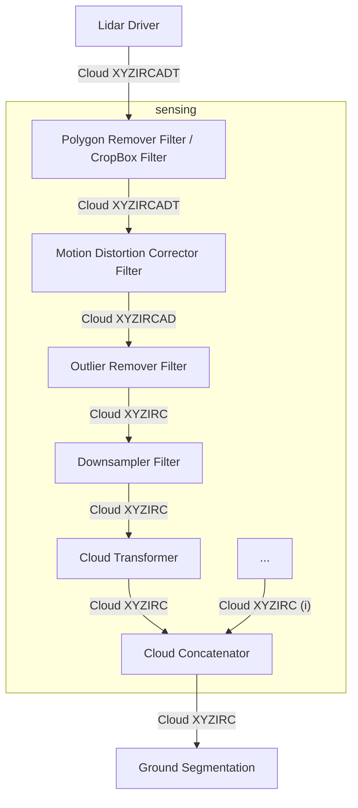

# 点群前処理設計

## 概要
点群前処理は、生のセンサーデータにいくつかの原始的な前処理を適用するモジュールの集まりです。

このパイプラインは、ドライバーから認識スタックまでのデータの流れをカバーします。

## 推奨前処理パイプライン

## モジュールのリスト

ここで使用されるモジュールは[pointcloud_preprocessorパッケージ](https://github.com/autowarefoundation/autoware.universe/tree/main/sensing/pointcloud_preprocessor)からのものです。

モジュールの詳細については[以下の表](https://github.com/autowarefoundation/autoware.universe/tree/main/sensing/pointcloud_preprocessor#inner-workings--algorithms)を参照してください。

これらのモジュールは、単一のコンテナでコンポーネントとして使用することをお勧めします。詳細については[ROS 2構成](https://docs.ros.org/en/rolling/Tutorials/Intermediate/Composition.html)を参照してください。

## 点群のフィールド

理想的なケースでは、ドライバーは`PointXYZIRCADT`ポイント型を使用して点群を出力することが期待されます。

| 名前              | データ型  | 派生 | 説明                                                              |
| ----------------- | --------- | ------- | ------------------------------------------------------------------------ |
| `X`               | `FLOAT32` | `false` | X座標                                                               |
| `Y`               | `FLOAT32` | `false` | Y座標                                                               |
| `Z`               | `FLOAT32` | `false` | Z座標                                                               |
| `I` (強度)   | `FLOAT32` | `false` | 測定された反射率、点の強度                            |
| `R` (戻り値の型) | `UINT8`   | `false` | デュアルリターンライダー用レーザーの戻り値                                 |
| `C` (チャンネル)     | `UINT16`  | `false` | ポイントを測定したレーザーの垂直チャネルID                 |
| `A` (方位角)     | `FLOAT32` | `true`  | `atan2(Y, X)`、lidarの正面からポイントまでの水平角 |
| `D` (距離)    | `FLOAT32` | `true`  | `hypot(X, Y, Z)`、ポイントから LIDAR までのユークリッド距離               |
| `T` (タイムスタンプ)  | `FLOAT64` | `false` | このポイントが測定されたヘッダーの時刻からの経過秒数 |

!!! 注記

    `A (方位)`フィールドと`D (距離)`フィールドは派生フィールドです。
    これらは、認識スタックの一部の計算負荷を軽減するためにドライバーによって提供されます。

!!! 注記

    `モーション歪み補正フィルタ`を使用しない場合は、`T(時間)`フィールドを省略し、`PointXYZIRCAD`ポイント型を使用できます。 

!!! 警告

    Autowareは試作の目的で、`PointXYZI`から`PointXYZIRC`または`PointXYZIRCAD`(チャネルあり、戻り値が0に設定される)への変換をサポートします。
    ただしこの変換は効率的ではないため運用環境での使用には推奨されません。

### 強度

[VLP16ユーザーマニュアル](https://usermanual.wiki/Pdf/VLP16Manual.1719942037/view)と互換性のある次の強度範囲を使用します:

VLP-16ユーザーマニュアルからの引用:

> レーザー測定ごとに、距離に加えて反射率バイトが返されます。
> 反射率バイト値は2つの範囲に分割され、ソフトウェアが低範囲の拡散反射体(木の幹、衣服など)と
> 高範囲の再帰反射体(道路標識、ナンバープレートなど) を区別できるようにします。
> 再帰反射体は、散乱を最小限に抑えながら光を光源に反射します。
> VLP-16は独自の光を提供し、送信レーザーと受信検出器間の分離が無視できるほど小さいため、
> 反射エネルギーを散乱させる傾向がある拡散反射板と比較して、再帰反射面は反射したIR光で飛び立ちます。
>
> - 拡散反射体は、0%～100%の反射率に対して0～100の値を報告します。
> - 再帰反射器は101～255 の値を報告します。255は理想的な反射を表します。

再帰反射体のない一般的な点群では、すべての強度点は 0 ～ 100 になります。

[Retroreflective Gradient road sign, Image Source](https://commons.wikimedia.org/wiki/File:Retroreflective_Gradient_road_sign.jpg)

But in a point cloud with retroreflectors, the intensity points will be between 0 and 255.

#### 他のlidarブランドの強度マッピング

##### Hesai PandarXT16

[Hesai Pandar XT16ユーザーマニュアル](https://www.oxts.com/wp-content/uploads/2021/01/Hesai-PandarXT16_User_Manual.pdf)

このlidarには反射率を報告するための2つのモードがあります:

- 線形マッピング
- 非線形マッピング

線形マッピング モードを使用している場合は、点群を作成するときに[0, 255]から[0, 100]にマッピングする必要があります。

非線形マッピング モードを使用している場合は, (hesaiからautowareへ)マッピングする必要があります。

- [0, 251]から[0, 100]と
- [252, 254]から[101, 255]へ

点群を構築するとき。

##### Livox Mid-70

[Livox Mid-70ユーザーマニュアル](https://terra-1-g.djicdn.com/65c028cd298f4669a7f0e40e50ba1131/Download/Mid-70/new/Livox%20Mid-70%20User%20Manual_EN_v1.2.pdf)

このlidarには、Velodyne VLP-16と同様に反射率を報告するための2つのモードがありますが、範囲のみがわずかに異なります。

(livoxからautowareに)マッピングする必要があります

- [0, 150]から[0, 100]へと
- [151, 255]から[101, 255]へ

点群を構築するとき。

##### RoboSense RS-LiDAR-16

[RoboSense RS-LiDAR-16ユーザーマニュアル](https://cdn.robosense.cn/20200723161715_42428.pdf)

Velodyne VLP-16と同じであり、マッピングは不要です。

##### Ouster OS-1-64

[全てのOusterセンサーのソフトウェアユーザーマニュアルv2.0.0](https://data.ouster.io/downloads/software-user-manual/software-user-manual-v2p0.pdf)

マニュアルには次のように記載されています:

> 反射率 [16 bit unsigned int] - センサーのシグナルフォトンの測定値は、測定範囲とその範囲でのセンサー感度に基づいてスケールされ、ターゲットの反射率を示します。この測定の校正は現在厳密に実装されていませんが、将来のファームウェアリリースで更新される予定です。

したがって、16 ビットの反射率を[0, 100]の範囲にマッピングすることをお勧めします。

##### Leishen CH64W

[英語のユーザーマニュアルを入手できませんでした。ウェブサイトのリンク](http://www.lslidar.com/en/down)

ユーザーマニュアルには次のように書かれているのを見つけることができました:

> バイト7はエコー強度を表し、値の範囲は0-255です。エコー強度は、
> 実際の測定環境における測定対象物のエネルギー反射特性を
> 反映することができるため、反射特性の異なる対象物を
> 区別するために使用できます。）

したがって、[0, 255]から[0, 100]の範囲をマップすることをお勧めします。

### 戻り値の型

さまざまなlidarが複数のリターンモードをサポートしています。Velodyne lidarは、**Strongest**および**Last**のリターンモードをサポートしています。

`PointXYZIRCT`および`PointXYZIRC`のタイプでは、`R`フィールドはリターン モードを`UINT8`で表します。

| R (戻り値の型) | 説明          |
| --------------- | -------------------- |
| `0`             | Unknown / Not Marked |
| `1`             | Strongest            |
| `2`             | Last                 |

### チャネル

チャネルフィールドは、ポイントを測定したレーザーの垂直チャネルを識別するために使用されます。
さまざまな LIDAR マニュアルや文献では、_レーザー ID_、 _リング_、 _レーザーライン_と呼ばれることもあります。

Velodyne VLP-16の場合、16 チャンネルがあります。ドライバー内のチャネルのデフォルトの順序は、通常、起動順です。

`PointXYZIRCT`および`PointXYZIRC`型では、`C`フィールドは垂直チャネルIDを`UINT16`で表します。

#### ソリッドステートライダーとペタルパターンライダー

!!! 警告

    このセクションは変更される可能性があります。以下は提案であり、議論の余地があります。

ラインを持つソリッドステートlidarの場合、行番号をチャンネルIDとして割り当てます。

ペタルパターンlidarの場合は、チャンネル0を維持できます。.

### タイムスタンプ

lidar点群では、各点の測定値に個別のタイムスタンプを付けることができます。
この情報は、スキャン中のlidarの動きによって生じるモーションブラーを除去するために使用できます。

#### 点群ヘッダー時間

ヘッダーには[Timeフィールド(https://github.com/ros2/rcl_interfaces/blob/rolling/builtin_interfaces/msg/Time.msg)が含まれます。
Timeフィールドには 2 つのコンポーネントがあります:

| フィールド     | 型     | 説明                                       |
| --------- | -------- | ------------------------------------------------- |
| `sec`     | `int32`  | Unix 時間 (1970年1月1日からの経過秒数) |
| `nanosec` | `uint32` | `sec`フィールドからの経過時間 (ナノ秒)         |

点群メッセージのヘッダーには、その点が持つ最も古い点の時間が含まれることが期待されます。

!!! 注記

    `sec`フィールドは、ROS 2 humbleでは`int32`で表現できる最大値は2^31秒であることから2038年問題の対象です。
    ROS 2コミュニティ側のアクションを待ちます。

    **さらなる情報はこちら:** https://github.com/ros2/rcl_interfaces/issues/85

#### 個別ポイントのタイムスタンプ

各`PointXYZIRCT`ポイント型には、点群の最初のショットポイントから経過した秒数を表す`T`フィールドがあります。

各ポイントが撮影された正確な時間を計算するには、その`T`秒数がヘッダー時間に追加されます。
