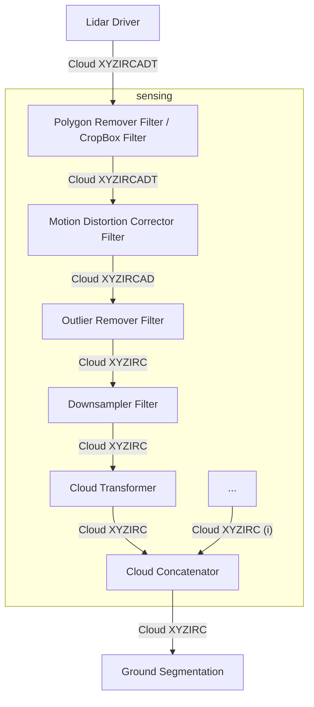

点群前処理設計
概要
点群前処理は、生のセンサー データにいくつかの原始的な前処理を適用するモジュールのコレクションです。

このパイプラインは、ドライバーから認識スタックまでのデータの流れをカバーします。

推奨される処理パイプライン

モジュールのリスト
ここで使用されるモジュールは、pointcloud_preprocessor パッケージからのものです。

モジュールの詳細については、次の表を参照してください。

これらのモジュールは、単一のコンテナーでコンポーネントとして使用することをお勧めします。詳細については、「ROS 2 構成」を参照してください。

点群フィールド
理想的なケースでは、ドライバーはポイントPointXYZIRCADTタイプを使用して点群を出力することが期待されます。

名前	データ・タイプ	派生	説明
X	FLOAT32	false	X位置
Y	FLOAT32	false	Y位置
Z	FLOAT32	false	Z位置
I（強度）	FLOAT32	false	測定された反射率、点の強度
R(戻り値の型)	UINT8	false	デュアルリターンライダー用レーザーリターンタイプ
C（チャネル）	UINT16	false	ポイントを測定したレーザーの垂直チャネル ID
A(方位角)	FLOAT32	true	atan2(Y, X), LIDAR の正面からポイントまでの水平角
D（距離）	FLOAT32	true	hypot(X, Y, Z)、ポイントから LIDAR までのユークリッド距離
T(タイムスタンプ)	FLOAT64	false	このポイントが測定されたヘッダーの時刻からの経過秒数
!!! 注記

`A (azimuth)` and `D (distance)` fields are derived fields.
They are provided by the driver to reduce the computational load on some parts of the perception stack.
!!! 注記

If the `Motion Distortion Corrector Filter` won't be used, the `T (time)` field can be omitted, `PointXYZIRCAD` point type can be used.
!!! 警告

Autoware will support conversion from `PointXYZI` to `PointXYZIRC` or `PointXYZIRCAD` (with channel and return is set to 0) for prototyping purposes.
However, this conversion is not recommended for production use since it's not efficient.
強度
VLP16 ユーザーマニュアルと互換性のある次の強度範囲を使用します。

VLP-16 ユーザーマニュアルからの引用:

レーザー測定ごとに、距離に加えて反射率バイトが返されます。反射率バイト値は 2 つの範囲に分割され、ソフトウェアが低範囲の拡散反射体 (木の幹、衣服など) と高範囲の再帰反射体 (道路標識、ナンバー プレートなど) を区別できるようにします。再帰反射体は、散乱を最小限に抑えながら光を光源に反射します。VLP-16 は独自の光を提供し、送信レーザーと受信検出器間の分離が無視できるほど小さいため、反射エネルギーを散乱させる傾向がある拡散反射板と比較して、再帰反射面は反射した IR 光で飛び立ちます。

拡散反射体は、0% ～ 100% の反射率に対して 0 ～ 100 の値を報告します。
再帰反射器は 101 ～ 255 の値を報告します。255 は理想的な反射を表します。
再帰反射体のない一般的な点群では、すべての強度点は 0 ～ 100 になります。

再帰反射勾配道路標識、画像ソース

ただし、再帰反射体を備えた点群では、強度ポイントは 0 ～ 255 になります。

他の LIDAR ブランドの強度マッピング
ヘサイ パンダルXT16
Hesai Pandar XT16 ユーザーマニュアル

この LIDAR には、反射率を報告するための 2 つのモードがあります。

線形マッピング
非線形マッピング
線形マッピング モードを使用している場合は、点群を作成するときに [0, 255] から [0, 100] にマッピングする必要があります。

非線形マッピング モードを使用している場合は、(hesai から autoware) にマッピングする必要があります。

[0, 251] ～ [0, 100] および
[252、254] ～ [101、255]
点群を構築するとき。

Livox ミッド 70
Livox Mid-70 ユーザーマニュアル

この LIDAR には、Velodyne VLP-16 と同様に反射率を報告するための 2 つのモードがありますが、範囲のみがわずかに異なります。

(livox から autoware に) マッピングする必要があります。

[0, 150] ～ [0, 100] および
[151、255] ～ [101、255]
点群を構築するとき。

ロボセンス RS-LiDAR-16
RoboSense RS-LiDAR-16 ユーザーマニュアル

Velodyne VLP-16 と同様にマッピングは必要ありません。

オースター OS-1-64
すべての Ouster センサー用ソフトウェア ユーザー マニュアル v2.0.0

マニュアルには次のように記載されています。

反射率 [16 ビット unsigned int] - センサーのシグナル フォトンの測定値は、測定範囲とその範囲でのセンサー感度に基づいてスケールされ、ターゲットの反射率を示します。この測定の校正は現在厳密に実装されていませんが、将来のファームウェア リリースで更新される予定です。

したがって、16 ビットの反射率を [0, 100] の範囲にマッピングすることをお勧めします。

レーシェン CH64W
英語のユーザーマニュアル、ウェブサイトのリンクが入手できませんでした

ユーザーマニュアルには次のように書かれているのを見つけることができました。

バイト 7 はエコー強度を表し、値の範囲は 0 ～ 255 です。（エコー強度は、実際の測定環境における測定対象物のエネルギー反射特性を反映することができるため、反射特性の異なる対象物を区別するために使用できます。）

したがって、[0, 255] から [0, 100] の範囲をマップすることをお勧めします。

戻り値の型
さまざまな LIDAR が複数のリターン モードをサポートしています。Velodyne LIDAR は、最強および最後のリターン モードをサポートしています。

PointXYZIRCTおよび のタイプではPointXYZIRC、Rフィールドはリターン モードを で表しますUINT8。

R（戻り値の型）	説明
0	不明 / マークなし
1	最強
2	最後
チャネル
チャネル フィールドは、ポイントを測定したレーザーの垂直チャネルを識別するために使用されます。さまざまな LIDAR マニュアルや文献では、レーザー ID、リング、レーザー ラインと呼ばれることもあります。

Velodyne VLP-16 の場合、16 チャンネルがあります。ドライバー内のチャネルのデフォルトの順序は、通常、起動順です。

PointXYZIRCTおよびタイプではPointXYZIRC、Cフィールドは垂直チャネル ID を . で表しますUINT16。

ソリッドステートライダーと花びらパターンライダー
!!! 警告

This section is subject to change. Following are suggestions and open for discussion.
ラインを持つソリッド ステート LIDAR の場合、行番号をチャネル ID として割り当てます。

花びらパターン LIDAR の場合は、チャネル 0 を維持できます。

タイムスタンプ
LIDAR 点群では、各点の測定値に個別のタイムスタンプを付けることができます。この情報は、スキャン中の LIDAR の動きによって生じるモーション ブラーを除去するために使用できます。

点群ヘッダー時間
ヘッダーにはTime フィールドが含まれます。時間フィールドには 2 つのコンポーネントがあります。

分野	タイプ	説明
sec	int32	Unix 時間 (1970 年 1 月 1 日からの経過秒数)
nanosec	uint32	secフィールドからの経過時間 (ナノ秒)
点群メッセージのヘッダーには、その点が持つ最も古い点の時間が含まれることが期待されます。

!!! 注記

The `sec` field is `int32` in ROS 2 humble. The largest value it can represent is 2^31 seconds, it is subject to
year 2038 problems. We will wait for actions on ROS 2 community side.

**More info at:** https://github.com/ros2/rcl_interfaces/issues/85
個別ポイントのタイムスタンプ
各PointXYZIRCTポイント タイプには、T点群の最初のショット ポイントから経過した秒数を表すフィールドがあります。

各ポイントがシュートされた正確な時間を計算するには、そのT秒数がヘッダー時間に追加されます。
# Point cloud pre-processing design

## Overview

Point cloud pre-processing is a collection of modules that apply some primitive pre-processing to the raw sensor data.

This pipeline covers the flow of data from drivers to the perception stack.

## Recommended processing pipeline

## List of modules

The modules used here are from [pointcloud_preprocessor package](https://github.com/autowarefoundation/autoware.universe/tree/main/sensing/pointcloud_preprocessor).

For details about the modules, see [the following table](https://github.com/autowarefoundation/autoware.universe/tree/main/sensing/pointcloud_preprocessor#inner-workings--algorithms).

It is recommended that these modules are used in a single container as components. For details see [ROS 2 Composition](https://docs.ros.org/en/rolling/Tutorials/Intermediate/Composition.html)

## Point cloud fields

In the ideal case, the driver is expected to output a point cloud with the `PointXYZIRCADT` point type.

| name              | datatype  | derived | description                                                              |
| ----------------- | --------- | ------- | ------------------------------------------------------------------------ |
| `X`               | `FLOAT32` | `false` | X position                                                               |
| `Y`               | `FLOAT32` | `false` | Y position                                                               |
| `Z`               | `FLOAT32` | `false` | Z position                                                               |
| `I` (intensity)   | `FLOAT32` | `false` | Measured reflectivity, intensity of the point                            |
| `R` (return type) | `UINT8`   | `false` | Laser return type for dual return lidars                                 |
| `C` (channel)     | `UINT16`  | `false` | Vertical channel id of the laser that measured the point                 |
| `A` (azimuth)     | `FLOAT32` | `true`  | `atan2(Y, X)`, Horizontal angle from the front of the lidar to the point |
| `D` (distance)    | `FLOAT32` | `true`  | `hypot(X, Y, Z)`, Euclidean distance of the point to lidar               |
| `T` (time stamp)  | `FLOAT64` | `false` | Seconds passed since the time of the header when this point was measured |

!!! note

    `A (azimuth)` and `D (distance)` fields are derived fields.
    They are provided by the driver to reduce the computational load on some parts of the perception stack.

!!! note

    If the `Motion Distortion Corrector Filter` won't be used, the `T (time)` field can be omitted, `PointXYZIRCAD` point type can be used.

!!! warning

    Autoware will support conversion from `PointXYZI` to `PointXYZIRC` or `PointXYZIRCAD` (with channel and return is set to 0) for prototyping purposes.
    However, this conversion is not recommended for production use since it's not efficient.

### Intensity

We will use following ranges for intensity, compatible with [the VLP16 User Manual](https://usermanual.wiki/Pdf/VLP16Manual.1719942037/view):

Quoting from the VLP-16 User Manual:

> For each laser measurement, a reflectivity byte is returned in addition to distance.
> Reflectivity byte values are segmented into two ranges, allowing software to distinguish diffuse reflectors
> (e.g. tree trunks, clothing) in the low range from retroreflectors (e.g. road signs, license plates) in the high range.
> A retroreflector reflects light back to its source with a minimum of scattering.
> The VLP-16 provides its own light, with negligible separation between transmitting laser and receiving detector, so
> retroreflecting surfaces pop with reflected IR light compared to diffuse reflectors that tend to scatter reflected energy.
>
> - Diffuse reflectors report values from 0 to 100 for reflectivities from 0% to 100%.
> - Retroreflectors report values from 101 to 255, where 255 represents an ideal reflection.

In a typical point cloud without retroreflectors, all intensity points will be between 0 and 100.

[Retroreflective Gradient road sign, Image Source](https://commons.wikimedia.org/wiki/File:Retroreflective_Gradient_road_sign.jpg)

But in a point cloud with retroreflectors, the intensity points will be between 0 and 255.

#### Intensity mapping for other lidar brands

##### Hesai PandarXT16

[Hesai Pandar XT16 User Manual](https://www.oxts.com/wp-content/uploads/2021/01/Hesai-PandarXT16_User_Manual.pdf)

This lidar has 2 modes for reporting reflectivity:

- Linear mapping
- Non-linear mapping

If you are using linear mapping mode, you should map from [0, 255] to [0, 100] when constructing the point cloud.

If you are using non-linear mapping mode, you should map (hesai to autoware)

- [0, 251] to [0, 100] and
- [252, 254] to [101, 255]

when constructing the point cloud.

##### Livox Mid-70

[Livox Mid-70 User Manual](https://terra-1-g.djicdn.com/65c028cd298f4669a7f0e40e50ba1131/Download/Mid-70/new/Livox%20Mid-70%20User%20Manual_EN_v1.2.pdf)

This lidar has 2 modes for reporting reflectivity similar to Velodyne VLP-16, only the ranges are slightly different.

You should map (livox to autoware)

- [0, 150] to [0, 100] and
- [151, 255] to [101, 255]

when constructing the point cloud.

##### RoboSense RS-LiDAR-16

[RoboSense RS-LiDAR-16 User Manual](https://cdn.robosense.cn/20200723161715_42428.pdf)

No mapping required, same as Velodyne VLP-16.

##### Ouster OS-1-64

[Software User Manual v2.0.0 for all Ouster sensors](https://data.ouster.io/downloads/software-user-manual/software-user-manual-v2p0.pdf)

In the manual it is stated:

> Reflectivity [16 bit unsigned int] - sensor Signal Photons measurements are scaled based on measured range and sensor sensitivity at that range, providing an indication of target reflectivity. Calibration of this measurement has not currently been rigorously implemented, but this will be updated in a future firmware release.

So it is advised to map the 16 bit reflectivity to [0, 100] range.

##### Leishen CH64W

[I couldn't get the english user manual, link of website](http://www.lslidar.com/en/down)

In a user manual I was able to find it says:

> Byte 7 represents echo strength, and the value range is 0-255. (Echo strength can reflect
> the energy reflection characteristics of the measured object in the actual measurement
> environment. Therefore, the echo strength can be used to distinguish objects with
> different reflection characteristics.)

So it is advised to map the [0, 255] to [0, 100] range.

### Return type

Various lidars support multiple return modes. Velodyne lidars support **Strongest** and **Last** return modes.

In the `PointXYZIRCT` and `PointXYZIRC` types, `R` field represents return mode with an `UINT8`.

| R (return type) | Description          |
| --------------- | -------------------- |
| `0`             | Unknown / Not Marked |
| `1`             | Strongest            |
| `2`             | Last                 |

### Channel

The channel field is used to identify the vertical channel of the laser that measured the point.
In various lidar manuals or literature, it can also be called _laser id_, _ring_, _laser line_.

For Velodyne VLP-16, there are 16 channels. Default order of channels in drivers are generally in firing order.

In the `PointXYZIRCT` and `PointXYZIRC` types, `C` field represents the vertical channel id with an `UINT16`.

#### Solid state and petal pattern lidars

!!! warning

    This section is subject to change. Following are suggestions and open for discussion.

For solid state lidars that have lines, assign row number as the channel id.

For petal pattern lidars, you can keep channel 0.

### Time stamp

In lidar point clouds, each point measurement can have its individual time stamp.
This information can be used to eliminate the motion blur that is caused by the movement of the lidar during the scan.

#### Point cloud header time

The header contains a [Time field](https://github.com/ros2/rcl_interfaces/blob/rolling/builtin_interfaces/msg/Time.msg).
The time field has 2 components:

| Field     | Type     | Description                                       |
| --------- | -------- | ------------------------------------------------- |
| `sec`     | `int32`  | Unix time (seconds elapsed since January 1, 1970) |
| `nanosec` | `uint32` | Nanoseconds elapsed since the `sec` field         |

The header of the point cloud message is expected to have the time of the earliest point it has.

!!! note

    The `sec` field is `int32` in ROS 2 humble. The largest value it can represent is 2^31 seconds, it is subject to
    year 2038 problems. We will wait for actions on ROS 2 community side.

    **More info at:** https://github.com/ros2/rcl_interfaces/issues/85

#### Individual point time stamp

Each `PointXYZIRCT` point type has the `T` field for representing the seconds passed since the first-shot point of the point cloud.

To calculate exact time each point was shot, the `T` seconds are added to the header time.
