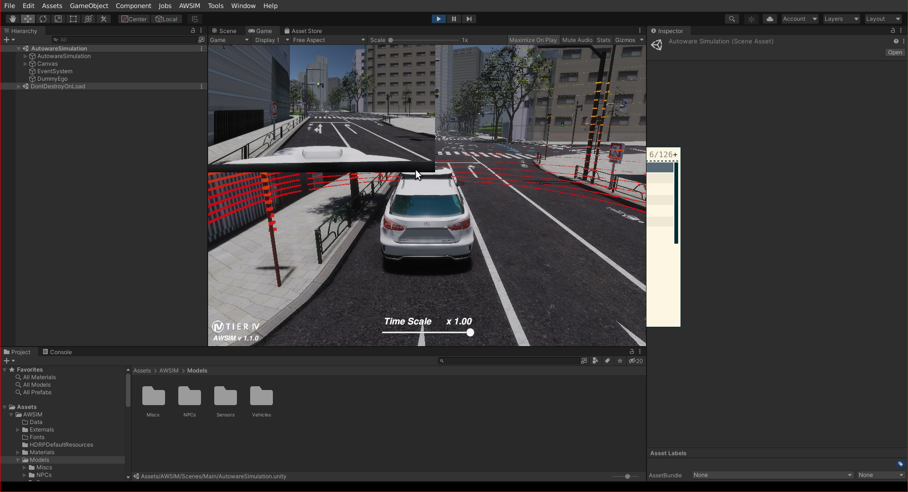
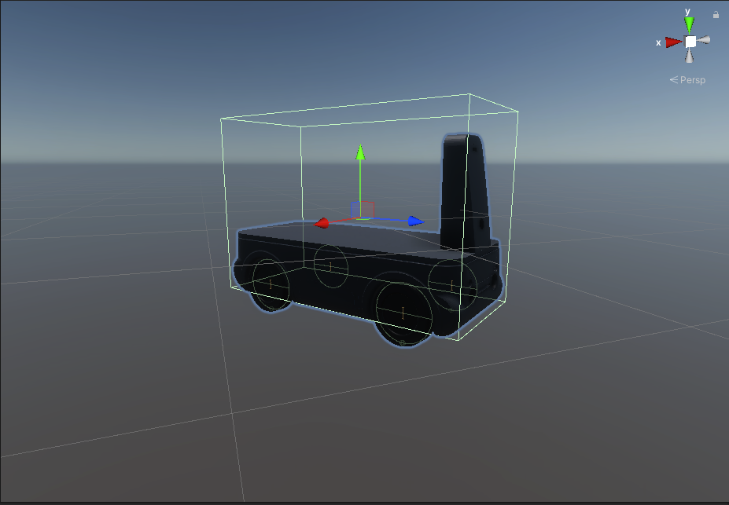

車両を AWSIM 環境に統合する方法
概要
AWSIM は、自動運転システムのトレーニングと評価のために TIER IV によって設計されたオープンソース シミュレーターです。現実世界のさまざまなシナリオをシミュレートするための現実的な仮想環境を提供し、ユーザーが実際の車両に展開する前に自律システムをテストして改良できるようにします。

Unityプロジェクトのセットアップ
環境と車両を AWSIM シミュレーションに追加するには、コンピューター上にUnity環境をセットアップする必要があります。ドキュメント ページの手順に従って、Setup Unity Project コンピューターに Unity 環境をセットアップしてください。

{ align=center } AWSSIM Unity セットアップ
新しい車両の統合
車両を AWSIM 環境に組み込むには、車両の 3D モデル ファイル (.dae、.fbx) が必要です。Add New Vehicle documentation page独自の車両を AWSIM プロジェクト環境に追加するには、の手順を参照してください。これらの手順では、車両のセンサー URDF 設計を構成します。次の画像では、AWSIM 環境でのチュートリアル車両を示しています。

{ align=center } AWSIM Unity 環境のチュートリアル ビークル
環境の統合
AWSIM 用のカスタム 3D 環境を作成することは可能ですが、.fbx ファイル形式に従うことをお勧めします。Unity とシームレスに統合するには、マテリアルとテクスチャを別のディレクトリに保存する必要があります。この形式により、マテリアルのインポートとインポート中の置換が容易になります。Add Environment documentation page カスタム環境を AWSIM プロジェクト環境に追加するには、の手順を参照してください 。

{ align=center } チュートリアル ビークル AWSIM Unity 環境
その他
さらに、 に記載されている関連ドキュメントの手順に従って、交通量と NPC を組み込み、lanlet2 マップを使用して点群マップを生成し、その他のタスクを実行することができますAWSIM documentation。
# How to integrate your vehicle in AWSIM environment

## Overview

[AWSIM](https://github.com/tier4/AWSIM) is an open-source simulator designed by TIER IV for
training and evaluating autonomous driving systems.
It provides a realistic virtual environment for simulating various real-world scenarios, enabling
users to test and refine their autonomous systems before deployment on actual vehicles.

## Setup Unity Project

To add your environment and vehicle to the AWSIM simulation,
you need to set up the [Unity](https://unity.com/) environment on your computer.
Please follow the steps on the [`Setup Unity Project`](https://tier4.github.io/AWSIM/GettingStarted/SetupUnityProject/)
documentation page
to set up the Unity environment on your computer.

<figure markdown>
  { align=center }
  <figcaption>
  AWSIM Unity Setup
  </figcaption>
</figure>

## New Vehicle Integration

To incorporate your vehicle into the AWSIM environment,
you'll need a 3D model file (.dae, .fbx) of your vehicle.
Please refer to the steps on the [`Add New Vehicle
documentation page`](https://tier4.github.io/AWSIM/Components/Vehicle/AddNewVehicle/AddAVehicle/) to add your own vehicle to the AWSIM
project environment. During these steps, you'll configure
your sensor URDF design on your vehicle.
Our tutorial vehicle is shown in the AWSIM environment in the following image.

<figure markdown>
  { align=center }
  <figcaption>
  Tutorial vehicle in AWSIM Unity Environment
  </figcaption>
</figure>

## Environment Integration

Creating custom 3D environments for AWSIM is feasible,
but it's recommended to adhere to the .fbx file format.
Materials and textures should be stored in separate directories
for seamless integration with Unity. This format facilitates material
importation and replacement during import.
Please refer to the steps on the
[`Add Environment documentation page`](https://tier4.github.io/AWSIM/Components/Environment/AddNewEnvironment/AddEnvironment/)
to add your custom environment to the AWSIM project environment.

<figure markdown>
  { align=center }
  <figcaption>
  Tutorial vehicle AWSIM Unity Environment
  </figcaption>
</figure>

## Others

Additionally, you can incorporate traffic and NPCs,
generate point cloud maps using lanelet2 maps, and
perform other tasks by following the relevant
documentation steps provided in the [`AWSIM documentation`](https://tier4.github.io/AWSIM/).
