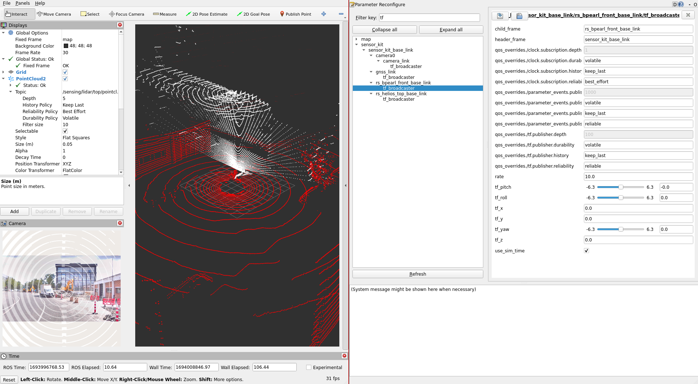

# すべてのセンサーの手動校正

## 概要

このセクションでは、センサーの[外部キャリブレーション](https://github.com/tier4/CalibrationTools/blob/tier4/universe/sensor/docs/how_to_extrinsic_manual.md)に
外部手動キャリブレーションを使用します。
このプロセスの後、最終的に使用するための正確なキャリブレーション結果は得られませんが、
他のツールの初期キャリブレーションは行われます。
たとえば、ライダーとライダーまたはカメラとライダーのキャリブレーション フェーズでは、
正確で適切なキャリブレーション結果を得るために初期キャリブレーションが必要になります。

キャリブレーション プロセスには、生の LIDAR トピックと
カメラ トピックを含むサンプル バッグ ファイルが必要です。
以下に、キャリブレーションに使用されるバッグ ファイルの例を示します:

??? 注記 "ROS 2 Bagの校正プロセスの例"

    ```sh

    Files:             rosbag2_2023_09_06-13_43_54_0.db3
    Bag size:          18.3 GiB
    Storage id:        sqlite3
    Duration:          169.12s
    Start:             Sep  6 2023 13:43:54.902 (1693997034.902)
    End:               Sep  6 2023 13:46:43.914 (1693997203.914)
    Messages:          8504
    Topic information: Topic: /sensing/lidar/top/pointcloud_raw | Type: sensor_msgs/msg/PointCloud2 | Count: 1691 | Serialization Format: cdr
                       Topic: /sensing/lidar/front/pointcloud_raw | Type: sensor_msgs/msg/PointCloud2 | Count: 1691 | Serialization Format: cdr
                       Topic: /sensing/camera/camera0/image_rect | Type: sensor_msgs/msg/Image | Count: 2561 | Serialization Format: cdr
                       Topic: /sensing/camera/camera0/camera_info | Type: sensor_msgs/msg/CameraInfo | Count: 2561 | Serialization Format: cdr
    ```

## 外部の手動ベースの校正

### 起動ファイルの作成

まず、`extrinsic_calibration_manager`パッケージの起動ファイルの作成から始めます。:

```bash
cd <YOUR-OWN-AUTOWARE-DIRECTORY>/src/autoware/calibration_tools/sensor
cd extrinsic_calibration_manager/launch
mkdir <YOUR-OWN-SENSOR-KIT-NAME> # i.e. for our guide, it will ve mkdir tutorial_vehicle_sensor_kit
cd <YOUR-OWN-SENSOR-KIT-NAME> # i.e. for our guide, it will ve cd tutorial_vehicle_sensor_kit
touch manual.launch.xml manual_sensor_kit.launch.xml manual_sensors.launch.xml
```

TIER IV のサンプル センサー キットaip_x1 を使用し`manual.launch.xml`、`manual_sensors.launch.xml`、`manual_sensor_kit.launch.xml`を変更します。
したがって、
これら 3 つのファイルの内容を[aip_x1](https://github.com/tier4/CalibrationTools/tree/tier4/universe/sensor/extrinsic_calibration_manager/launch/aip_x1)から作成したファイルにコピーする必要があります。

### センサーキットに応じて起動ファイルを変更する

お好みのテキスト エディター (code、gedit など) でこのファイルを開いてください。
それで、`manual.launch.xml`の変更を開始できます。

(オプション) vehicle_id とセンサーのモデル名を追加することから始めましょう:
(値は重要ではありません。これらのパラメーターは起動引数によってオーバーライドされます)

```diff
  <arg name="vehicle_id" default="default"/>

  <let name="sensor_model" value="aip_x1"/>
+ <?xml version="1.0" encoding="UTF-8"?>
+ <launch>
-   <arg name="vehicle_id" default="default"/>
+   <arg name="vehicle_id" default="<YOUR_VEHICLE_ID>"/>
+
-   <arg name="sensor_model" default="aip_x1"/>
+   <let name="sensor_model" value="<YOUR_SENSOR_KIT_NAME>"/>
```

tutorial_vehicle のファイル (manual.launch.xml) の最終バージョンは次のようになります:

??? 注記"チュートリアル車両のmanual.launch.xmlファイルのサンプル"note "

    ```xml
    <?xml version="1.0" encoding="UTF-8"?>
    <launch>
        <arg name="vehicle_id" default="tutorial_vehicle"/>

        <let name="sensor_model" value="tutorial_vehicle_sensor_kit"/>

        <group>
            <push-ros-namespace namespace="sensor_kit"/>
            <include file="$(find-pkg-share extrinsic_calibration_manager)/launch/$(var sensor_model)/manual_sensor_kit.launch.xml">
                <arg name="vehicle_id" value="$(var vehicle_id)"/>
            </include>
        </group>

        <group>
            <push-ros-namespace namespace="sensors"/>
            <include file="$(find-pkg-share extrinsic_calibration_manager)/launch/$(var sensor_model)/manual_sensors.launch.xml">
              <arg name="vehicle_id" value="$(var vehicle_id)"/>
            </include>
        </group>

    </launch>

    ```

manual.launch.xmlファイルが完成したら、
独自のセンサー モデルの[sensor_kit_calibration.yaml](https://github.com/autowarefoundation/sample_sensor_kit_launch/blob/main/sample_sensor_kit_description/config/sensor_kit_calibration.yaml)にmanual_sensor_kit.launch.xmlを実装する準備が整います:

オプションで、このXMLスニペットに対してsensor_modelとvehicle_idを変更することもできます。:

```diff
...
  <arg name="vehicle_id" default="default"/>

  <let name="sensor_model" value="aip_x1"/>
+ <?xml version="1.0" encoding="UTF-8"?>
+ <launch>
-   <arg name="vehicle_id" default="default"/>
+   <arg name="vehicle_id" default="<YOUR_VEHICLE_ID>"/>
+
-   <arg name="sensor_model" default="aip_x1"/>
+   <let name="sensor_model" value="<YOUR_SENSOR_KIT_NAME>"/>
...
```

次に、すべてのセンサーフレームを子フレームとして extrinsic_calibration_managerに追加します:

```diff
   <!-- extrinsic_calibration_manager -->
-  <node pkg="extrinsic_calibration_manager" exec="extrinsic_calibration_manager" name="extrinsic_calibration_manager" output="screen">
-    <param name="parent_frame" value="$(var parent_frame)"/>
-    <param name="child_frames" value="
-    [velodyne_top_base_link,
-    livox_front_left_base_link,
-    livox_front_center_base_link,
-    livox_front_right_base_link]"/>
-  </node>
+   <node pkg="extrinsic_calibration_manager" exec="extrinsic_calibration_manager" name="extrinsic_calibration_manager" output="screen">
+     <param name="parent_frame" value="$(var parent_frame)"/>
+     <!-- add your sensor frames here -->
+     <param name="child_frames" value="
+     [<YOUE_SENSOR_BASE_LINK>,
+     YOUE_SENSOR_BASE_LINK,
+     YOUE_SENSOR_BASE_LINK,
+     YOUE_SENSOR_BASE_LINK
+     ...]"/>
+   </node>
```

tutorial_vehicle には 4 つのセンサー (2つのLIDAR、1 つのカメラ、1 つの GNSS/INS) があるため、次のようになります:

??? 注記"つまり、tutorial_vehicle の extrinsic_calibration_managerのchild_frames"

    ```xml
    +   <!-- extrinsic_calibration_manager -->
    +   <node pkg="extrinsic_calibration_manager" exec="extrinsic_calibration_manager" name="extrinsic_calibration_manager" output="screen">
    +     <param name="parent_frame" value="$(var parent_frame)"/>
    +     <!-- add your sensor frames here -->
    +     <param name="child_frames" value="
    +     [rs_helios_top_base_link,
    +     rs_bpearl_front_base_link,
    +     camera0/camera_link,
    +     gnss_link]"/>
    +   </node>
    ```

最後に、センサーのフレームごとに手動キャリブレーターを起動します。
calibrator.launch.xml起動ファイル引数の名前空間 (ns) と child_frame引数を更新してください:

```diff
-  <include file="$(find-pkg-share extrinsic_manual_calibrator)/launch/calibrator.launch.xml">
-    <arg name="ns" value="$(var parent_frame)/velodyne_top_base_link"/>
-    <arg name="parent_frame" value="$(var parent_frame)"/>
-    <arg name="child_frame" value="velodyne_top_base_link"/>
-  </include>
+  <!-- extrinsic_manual_calibrator -->
+  <include file="$(find-pkg-share extrinsic_manual_calibrator)/launch/calibrator.launch.xml">
+    <arg name="ns" value="$(var parent_frame)/<YOUR_SENSOR_BASE_LINK>"/>
+    <arg name="parent_frame" value="$(var parent_frame)"/>
+    <arg name="child_frame" value="<YOUR_SENSOR_BASE_LINK>""/>
+  </include>
+
+  ...
+  ...
+  ...
+  ...
+  ...
+
```

??? 注記"つまり、各tutorial_vehicleのセンサーキットのcalibrator.launch.xml"

    ```xml
    +  <!-- extrinsic_manual_calibrator -->
    +  <include file="$(find-pkg-share extrinsic_manual_calibrator)/launch/calibrator.launch.xml">
    +    <arg name="ns" value="$(var parent_frame)/rs_helios_top_base_link"/>
    +    <arg name="parent_frame" value="$(var parent_frame)"/>
    +    <arg name="child_frame" value="rs_helios_top_base_link"/>
    +  </include>
    +
    +  <include file="$(find-pkg-share extrinsic_manual_calibrator)/launch/calibrator.launch.xml">
    +    <arg name="ns" value="$(var parent_frame)/rs_bpearl_front_base_link"/>
    +    <arg name="parent_frame" value="$(var parent_frame)"/>
    +    <arg name="child_frame" value="rs_bpearl_front_base_link"/>
    +  </include>
    +
    +  <include file="$(find-pkg-share extrinsic_manual_calibrator)/launch/calibrator.launch.xml">
    +    <arg name="ns" value="$(var parent_frame)/camera0/camera_link"/>
    +    <arg name="parent_frame" value="$(var parent_frame)"/>
    +    <arg name="child_frame" value="camera0/camera_link"/>
    +  </include>
    +
    +  <include file="$(find-pkg-share extrinsic_manual_calibrator)/launch/calibrator.launch.xml">
    +    <arg name="ns" value="$(var parent_frame)/gnss_link"/>
    +    <arg name="parent_frame" value="$(var parent_frame)"/>
    +    <arg name="child_frame" value="gnss_link"/>
    +  </include>
    + </launch>
    ```

tutorial_vehicleのmanual_sensor_kit.launch.xmlの最終バージョンは次のようになります:

??? 注記"tutorial_vehicleの[`manual_sensor_kit.launch.xml`](https://github.com/leo-drive/tutorial_vehicle_calibration_tools/blob/tutorial_vehicle/sensor/extrinsic_calibration_manager/launch/tutorial_vehicle_sensor_kit/manual_sensor_kit.launch.xml)のサンプル"

    ```xml
    <?xml version="1.0" encoding="UTF-8"?>
    <launch>
        <arg name="vehicle_id" default="tutorial_vehicle"/> <!-- You can update with your own vehicle_id -->

        <let name="sensor_model" value="tutorial_vehicle_sensor_kit"/> <!-- You can update with your own sensor model -->
        <let name="parent_frame" value="sensor_kit_base_link"/>

        <!-- extrinsic_calibration_client -->
        <arg name="src_yaml" default="$(find-pkg-share individual_params)/config/$(var vehicle_id)/$(var sensor_model)/sensor_kit_calibration.yaml"/>
        <arg name="dst_yaml" default="$(env HOME)/sensor_kit_calibration.yaml"/>

        <node pkg="extrinsic_calibration_client" exec="extrinsic_calibration_client" name="extrinsic_calibration_client" output="screen">
            <param name="src_path" value="$(var src_yaml)"/>
            <param name="dst_path" value="$(var dst_yaml)"/>
        </node>

        <!-- extrinsic_calibration_manager -->
        <node pkg="extrinsic_calibration_manager" exec="extrinsic_calibration_manager" name="extrinsic_calibration_manager" output="screen">
            <param name="parent_frame" value="$(var parent_frame)"/>
            <!-- Please Update with your own sensor frames -->
            <param name="child_frames" value="
        [rs_helios_top_base_link,
        rs_bpearl_front_base_link,
        camera0/camera_link,
        gnss_link]"/>
        </node>

        <!-- extrinsic_manual_calibrator -->
        <!-- Please create a launch for all sensors that you used. -->
        <include file="$(find-pkg-share extrinsic_manual_calibrator)/launch/calibrator.launch.xml">
            <arg name="ns" value="$(var parent_frame)/rs_helios_top_base_link"/>
            <arg name="parent_frame" value="$(var parent_frame)"/>
            <arg name="child_frame" value="rs_helios_top_base_link"/>
        </include>

        <include file="$(find-pkg-share extrinsic_manual_calibrator)/launch/calibrator.launch.xml">
            <arg name="ns" value="$(var parent_frame)/rs_bpearl_front_base_link"/>
            <arg name="parent_frame" value="$(var parent_frame)"/>
            <arg name="child_frame" value="rs_bpearl_front_base_link"/>
        </include>

        <include file="$(find-pkg-share extrinsic_manual_calibrator)/launch/calibrator.launch.xml">
            <arg name="ns" value="$(var parent_frame)/camera0/camera_link"/>
            <arg name="parent_frame" value="$(var parent_frame)"/>
            <arg name="child_frame" value="camera0/camera_link"/>
        </include>

        <include file="$(find-pkg-share extrinsic_manual_calibrator)/launch/calibrator.launch.xml">
            <arg name="ns" value="$(var parent_frame)/gnss_link"/>
            <arg name="parent_frame" value="$(var parent_frame)"/>
            <arg name="child_frame" value="gnss_link"/>
        </include>
    </launch>
    ```

変更した[sensors_calibration.yaml](https://github.com/autowarefoundation/sample_sensor_kit_launch/blob/main/sample_sensor_kit_description/config/sensors_calibration.yaml)ファイルに従って`manual_sensors.launch.xml`ファイルを更新できます。
センサーをtutorial_vehicleのbase_linkに関して直接調整するつもりはないので、
このファイルは変更しません。

### 外部手動校正器によるセンサーの校正

extrinsic_calibration_managerパッケージのmanual.launch.xml およびmanual_sensor_kit.launch.xmlファイルが完成したら、
パッケージをビルドする必要があります:

```bash
colcon build --symlink-install --cmake-args -DCMAKE_BUILD_TYPE=Release --packages-select extrinsic_calibration_manager
```

これで、手動キャリブレーターを起動して使用する準備が整いました:

```bash
ros2 launch extrinsic_calibration_manager calibration.launch.xml mode:=manual sensor_model:=<OWN-SENSOR-KIT> vehicle_model:=<OWN-VEHICLE-MODEL> vehicle_id:=<VEHICLE-ID>
```

チュートリアル車両の場合:

```bash
ros2 launch extrinsic_calibration_manager calibration.launch.xml mode:=manual sensor_model:=tutorial_vehicle_sensor_kit vehicle_model:=tutorial_vehicle vehicle_id:=tutorial_vehicle
```

次に、ROS 2 バッグ ファイルを再生します:

```bash
ros2 bag play <rosbag_path> --clock -l -r 0.2 \
--remap /tf:=/null/tf /tf_static:=/null/tf_static # if tf is recorded
```

手動の rqt_reconfigure ウィンドウが表示され、
センサーの rviz2 結果に従って手動でキャリブレーションを更新します。

- `Refresh`ボタンを押してから`Expand All`ボタンを押します。tutorial_vehicle のフレームは次のようになります:



- Filterエリアにターゲット フレーム名 (つまり、front、helios など) を書き込み、tuneable_static_tf_broadcaster_nodeを選択すると、 RQTパネルで`tf_x, tf_y, tf_z, tf_roll, tf_pitch and tf_yaw`の値を調整できます。
- 手動調整が終了したら、次のコマンドを使用してキャリブレーション結果を保存できます:

```bash
ros2 topic pub /done std_msgs/Bool "data: true"
```

- その後、$HOME/\*.yamlで出力ファイルを確認できます。

!!! 警告

    他のキャリブレーションを使用する前に、最初のキャリブレーション プロセスが重要になる場合があります。 LIDAR-LIDAR キャリブレーションとカメラ-LIDAR キャリブレーションについて検討します。
    現時点では、まったく同じフレームで 2 つのセンサーをキャリブレーションするのは難しいため、
    センサー間でほぼ (完全である必要はありません) キャリブレーション ペアを見つける必要があります。

これは、tutorial_vehicle での手動調整プロセスをデモンストレーションするビデオです:

