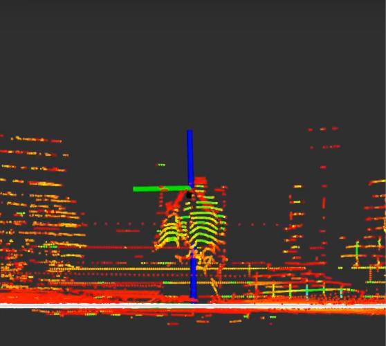
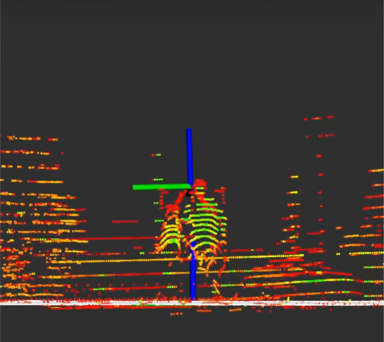

# 地上ライダーの校正

## 概要

[Ground-Lidar校正](https://github.com/tier4/CalibrationTools/blob/tier4/universe/sensor/docs/how_to_extrinsic_ground_plane.md)方法は、車両の周囲の領域が平面として表現できるという前提に基づいて動作します。
したがって、ROS 2 バッグの記録には、できるだけ広くて平らな面を見つける必要があります。
次に、このメソッドは、点群内の地面に対応する点を
base_link の XY 平面に位置合わせする方法で
キャリブレーション変換を変更します。
これは、tf の z、ロール、およびピッチの値のみがキャリブレーションを受け、
残りの x、y、およびヨーの値は、[手動調整](../extrinsic-manual-calibration)や[マッピングベースの LIDAR-LIDAR キャリブレーション](../lidar-camera-calibration)などの
他の方法を使用してキャリブレーションする必要があることを意味します。

このキャリブレーション方法を各 LIDAR に個別に適用する必要があるため、
バッグにはキャリブレーション対象のすべての LIDAR が含まれている必要があります。

生の LIDAR トピックを含む地上 LIDAR キャリブレーション プロセス用のサンプル バッグ ファイルが必要です。
サンプル バッグ ファイルが必要です。

??? 注記"tutorial_vehicle の地上ベースのキャリブレーション プロセスの ROS 2 Bag の例"

    ```sh

    Files:             rosbag2_2023_09_05-11_23_50_0.db3
    Bag size:          3.8 GiB
    Storage id:        sqlite3
    Duration:          112.702s
    Start:             Sep  5 2023 11:23:51.105 (1693902231.105)
    End:               Sep  5 2023 11:25:43.808 (1693902343.808)
    Messages:          2256
    Topic information: Topic: /sensing/lidar/front/pointcloud_raw | Type: sensor_msgs/msg/PointCloud2 | Count: 1128 | Serialization Format: cdr
                       Topic: /sensing/lidar/top/pointcloud_raw | Type: sensor_msgs/msg/PointCloud2 | Count: 1128 | Serialization Format: cdr
    ```

## 地上ライダーのキャリブレーション

### 起動ファイルの作成

前のセクションのプロセスと同様に、独自の車両の起動ファイルを作成することから始めます:

```bash
cd <YOUR-OWN-AUTOWARE-DIRECTORY>/src/autoware/calibration_tools/sensor
cd extrinsic_calibration_manager/launch
cd <YOUR-OWN-SENSOR-KIT-NAME> # i.e. for our guide, it will ve cd tutorial_vehicle_sensor_kit which is created in manual calibration
touch ground_plane.launch.xml ground_plane_sensor_kit.launch.xml
```

`ground_plane.launch.xml`と`ground_plane_sensor_kit.launch.xml`を修正するためにTIER IV のサンプル センサー キット aip_x1 を使用します。
したがって、
これら 2 つのファイルの内容を[aip_x1](https://github.com/tier4/CalibrationTools/tree/tier4/universe/sensor/extrinsic_calibration_manager/launch/aip_x1)ら作成したファイルにコピーする必要があります。

### センサーキットに応じて起動ファイルを変更する

ground_plane.launch.xml ファイルが完成したら、独自のセンサー モデルに ground_plane_sensor_kit.launch.xml を実装する準備が整います。

オプションで (これらのパラメータは起動引数によってオーバーライドされることを忘れないでください)、ground_plane.launch.xml次の XML スニペットのように sensor_kit と vehicle_id を変更できます: (rviz 構成をビデオとして保存した後、rviz_profile パスを変更できます。ページ）

+ <?xml version="1.0" encoding="UTF-8"?>
+ <launch>
-   <arg name="vehicle_id" default="default"/>
+   <arg name="vehicle_id" default="<YOUR_VEHICLE_ID>"/>
-   <arg name="sensor_model" default="aip_x1"/>
+   <let name="sensor_model" value="<YOUR_SENSOR_KIT_NAME>"/>
    <let name="base_frame" value="base_link"/>
    <let name="parent_frame" value="sensor_kit_base_link"/>
地上 LIDAR キャリブレーション プロセスのために前に rviz 設定ファイルを保存した場合:

- <let name="rviz_profile" value="$(find-pkg-share extrinsic_ground_plane_calibrator)/rviz/velodyne_top.rviz"/>
+ <let name="rviz_profile" value="$(find-pkg-share extrinsic_ground_plane_calibrator)/rviz/<YOUR-RVIZ-CONFIG>.rviz"/>
次に、すべてのセンサー フレームを子フレームとして extrinsic_calibration_manager に追加します。

    <!-- extrinsic_calibration_manager -->
-   <node pkg="extrinsic_calibration_manager" exec="extrinsic_calibration_manager" name="extrinsic_calibration_manager" output="screen">
-     <param name="parent_frame" value="$(var parent_frame)"/>
-     <param name="child_frames" value="
-     [velodyne_top_base_link,
-     livox_front_left_base_link,
-     livox_front_center_base_link,
-     livox_front_right_base_link]"/>
-   </node>
+   <node pkg="extrinsic_calibration_manager" exec="extrinsic_calibration_manager" name="extrinsic_calibration_manager" output="screen">
+     <param name="parent_frame" value="$(var parent_frame)"/>
+     <!-- add your sensor frames here -->
+     <param name="child_frames" value="
+     [<YOUE_SENSOR_BASE_LINK>,
+     YOUE_SENSOR_BASE_LINK,
+     YOUE_SENSOR_BASE_LINK,
+     YOUE_SENSOR_BASE_LINK
+     ...]"/>
+   </node>
tutorial_vehicle には 2 つの LIDAR センサー (rs_helios_top と rs_bpearl_front) があるため、次のようになります。

??? 注「つまり、tutorial_vehicle の extrinsic_calibration_manager child_frames」

```xml
+   <!-- extrinsic_calibration_manager -->
+   <node pkg="extrinsic_calibration_manager" exec="extrinsic_calibration_manager" name="extrinsic_calibration_manager" output="screen">
+     <param name="parent_frame" value="$(var parent_frame)"/>
+     <!-- add your sensor frames here -->
+     <param name="child_frames" value="
+     [rs_helios_top_base_link,
+     rs_bpearl_front_base_link]"/>
+   </node>
```
その後、地上ベースのキャリブレーターに LIDAR センサー構成を追加します。そのために、次の行をground_plane_sensor_kit.launch.xmlファイルに追加します。

-  <group>
-    <include file="$(find-pkg-share extrinsic_ground_plane_calibrator)/launch/calibrator.launch.xml">
-      <arg name="ns" value="$(var parent_frame)/velodyne_top_base_link"/>
-      <arg name="base_frame" value="$(var base_frame)"/>
-      <arg name="parent_frame" value="$(var parent_frame)"/>
-      <arg name="child_frame" value="velodyne_top_base_link"/>
-      <arg name="pointcloud_topic" value="/sensing/lidar/top/pointcloud_raw"/>
-    </include>
-  </group>
+  <group>
+   <include file="$(find-pkg-share extrinsic_ground_plane_calibrator)/launch/calibrator.launch.xml">
+     <arg name="ns" value="$(var parent_frame)/YOUR_SENSOR_BASE_LINK"/>
+     <arg name="base_frame" value="$(var base_frame)"/>
+     <arg name="parent_frame" value="$(var parent_frame)"/>
+     <arg name="child_frame" value="YOUR_SENSOR_BASE_LINK"/>
+     <arg name="pointcloud_topic" value="<YOUR_SENSOR_TOPIC_NAME>"/>
+   </include>
+ </group>
+  ...
+  ...
+  ...
+  ...
+  ...
+
??? 注「つまり、tutorial_vehicle の LIDAR ごとに calibrator.launch.xml を起動します」

```xml
  <!-- rs_helios_top_base_link: extrinsic_ground_plane_calibrator -->
  <group>
    <include file="$(find-pkg-share extrinsic_ground_plane_calibrator)/launch/calibrator.launch.xml">
      <arg name="ns" value="$(var parent_frame)/rs_helios_top_base_link"/>
      <arg name="base_frame" value="$(var base_frame)"/>
      <arg name="parent_frame" value="$(var parent_frame)"/>
      <arg name="child_frame" value="rs_helios_top_base_link"/>
      <arg name="pointcloud_topic" value="/sensing/lidar/top/pointcloud_raw"/>
    </include>
  </group>

  <!-- rs_bpearl_front_base_link: extrinsic_ground_plane_calibrator -->
  <group>
    <include file="$(find-pkg-share extrinsic_ground_plane_calibrator)/launch/calibrator.launch.xml">
      <arg name="ns" value="$(var parent_frame)/rs_bpearl_front_base_link"/>
      <arg name="base_frame" value="$(var base_frame)"/>
      <arg name="parent_frame" value="$(var parent_frame)"/>
      <arg name="child_frame" value="rs_bpearl_front_base_link"/>
      <arg name="pointcloud_topic" value="/sensing/lidar/front/pointcloud_raw"/>
    </include>
  </group>

  <node pkg="rviz2" exec="rviz2" name="rviz2" output="screen" args="-d $(var rviz_profile)" if="$(var calibration_rviz)"/>
</launch>

```
tutorial_vehicle の ground_plane_sensor_kit.launch.xml 起動ファイルは次のようになります。

??? 注「ground_plane_sensor_kit.launch.xmltutorial_vehicle のサンプル」

```xml
<?xml version="1.0" encoding="UTF-8"?>
<launch>
<arg name="vehicle_id" default="tutorial_vehicle"/>
<let name="sensor_model" value="tutorial_vehicle_sensor_kit"/>
<let name="base_frame" value="base_link"/>
<let name="parent_frame" value="sensor_kit_base_link"/>
<let name="rviz_profile" value="$(find-pkg-share extrinsic_ground_plane_calibrator)/rviz/velodyne_top.rviz"/>
<arg name="calibration_rviz" default="true"/>

  <!-- extrinsic_calibration_client -->
  <arg name="src_yaml" default="$(find-pkg-share individual_params)/config/$(var vehicle_id)/$(var sensor_model)/sensor_kit_calibration.yaml"/>
  <arg name="dst_yaml" default="$(env HOME)/sensor_kit_calibration.yaml"/>

  <node pkg="extrinsic_calibration_client" exec="extrinsic_calibration_client" name="extrinsic_calibration_client" output="screen">
    <param name="src_path" value="$(var src_yaml)"/>
    <param name="dst_path" value="$(var dst_yaml)"/>
  </node>

  <!-- extrinsic_calibration_manager -->
  <node pkg="extrinsic_calibration_manager" exec="extrinsic_calibration_manager" name="extrinsic_calibration_manager" output="screen">
    <param name="parent_frame" value="$(var parent_frame)"/>
    <param name="child_frames" value="
    [rs_helios_top_base_link,
    rs_bpearl_front_base_link]"/>
  </node>

  <!-- rs_helios_top_base_link: extrinsic_ground_plane_calibrator -->
  <group>
    <include file="$(find-pkg-share extrinsic_ground_plane_calibrator)/launch/calibrator.launch.xml">
      <arg name="ns" value="$(var parent_frame)/rs_helios_top_base_link"/>
      <arg name="base_frame" value="$(var base_frame)"/>
      <arg name="parent_frame" value="$(var parent_frame)"/>
      <arg name="child_frame" value="rs_helios_top_base_link"/>
      <arg name="pointcloud_topic" value="/sensing/lidar/top/pointcloud_raw"/>
    </include>
  </group>

  <!-- rs_bpearl_front_base_link: extrinsic_ground_plane_calibrator -->
  <group>
    <include file="$(find-pkg-share extrinsic_ground_plane_calibrator)/launch/calibrator.launch.xml">
      <arg name="ns" value="$(var parent_frame)/rs_bpearl_front_base_link"/>
      <arg name="base_frame" value="$(var base_frame)"/>
      <arg name="parent_frame" value="$(var parent_frame)"/>
      <arg name="child_frame" value="rs_bpearl_front_base_link"/>
      <arg name="pointcloud_topic" value="/sensing/lidar/front/pointcloud_raw"/>
    </include>
  </group>

  <node pkg="rviz2" exec="rviz2" name="rviz2" output="screen" args="-d $(var rviz_profile)" if="$(var calibration_rviz)"/>
</launch>

```

(オプション) vehicle_id とセンサーのモデル名を追加することから始めましょう:
 (値は重要ではありません。これらのパラメーターは起動引数によってオーバーライドされます)

```diff
  <arg name="vehicle_id" default="default"/>

  <let name="sensor_model" value="aip_x1"/>
+ <?xml version="1.0" encoding="UTF-8"?>
+ <launch>
-   <arg name="vehicle_id" default="default"/>
+   <arg name="vehicle_id" default="<YOUR_VEHICLE_ID>"/>
+
-   <arg name="sensor_model" default="aip_x1"/>
+   <let name="sensor_model" value="<YOUR_SENSOR_KIT_NAME>"/>
```

tutorial_vehicle のファイル (ground_plane.launch.xml) の最終バージョンは次のようになります:

??? 注記"チュートリアル車両のground_plane.launch.xmlファイルサンプル"

    ```xml
    <launch>
      <arg name="vehicle_id" default="tutorial_vehicle"/>
      <let name="sensor_model" value="tutorial_vehicle_sensor_kit"/>

      <group>
        <push-ros-namespace namespace="sensor_kit"/>
        <include file="$(find-pkg-share extrinsic_calibration_manager)/launch/$(var sensor_model)/ground_plane_sensor_kit.launch.xml">
          <arg name="vehicle_id" value="$(var vehicle_id)"/>
        </include>
      </group>
    </launch>

    ```

After the completing of ground_plane.launch.xml file,
we will be ready to implement ground_plane_sensor_kit.launch.xml for the own sensor model.

Optionally, (don't forget, these parameters will be overridden by launch arguments.)
you can modify sensor_kit and vehicle_id as `ground_plane.launch.xml`over this xml snippet:
(You can change rviz_profile path after the saving rviz config as video
which included at the end of the page)

```diff
+ <?xml version="1.0" encoding="UTF-8"?>
+ <launch>
-   <arg name="vehicle_id" default="default"/>
+   <arg name="vehicle_id" default="<YOUR_VEHICLE_ID>"/>
-   <arg name="sensor_model" default="aip_x1"/>
+   <let name="sensor_model" value="<YOUR_SENSOR_KIT_NAME>"/>
    <let name="base_frame" value="base_link"/>
    <let name="parent_frame" value="sensor_kit_base_link"/>

```

If you save rviz config file before for the ground-lidar calibration process:

```diff
- <let name="rviz_profile" value="$(find-pkg-share extrinsic_ground_plane_calibrator)/rviz/velodyne_top.rviz"/>
+ <let name="rviz_profile" value="$(find-pkg-share extrinsic_ground_plane_calibrator)/rviz/<YOUR-RVIZ-CONFIG>.rviz"/>
```

Then, we will add all our sensor frames on extrinsic_calibration_manager as child frames:

```diff
    <!-- extrinsic_calibration_manager -->
-   <node pkg="extrinsic_calibration_manager" exec="extrinsic_calibration_manager" name="extrinsic_calibration_manager" output="screen">
-     <param name="parent_frame" value="$(var parent_frame)"/>
-     <param name="child_frames" value="
-     [velodyne_top_base_link,
-     livox_front_left_base_link,
-     livox_front_center_base_link,
-     livox_front_right_base_link]"/>
-   </node>
+   <node pkg="extrinsic_calibration_manager" exec="extrinsic_calibration_manager" name="extrinsic_calibration_manager" output="screen">
+     <param name="parent_frame" value="$(var parent_frame)"/>
+     <!-- add your sensor frames here -->
+     <param name="child_frames" value="
+     [<YOUE_SENSOR_BASE_LINK>,
+     YOUE_SENSOR_BASE_LINK,
+     YOUE_SENSOR_BASE_LINK,
+     YOUE_SENSOR_BASE_LINK
+     ...]"/>
+   </node>
```

For tutorial_vehicle there are two lidar sensors (rs_helios_top and rs_bpearl_front),
so it will be like this:

??? note "i.e extrinsic_calibration_manager child_frames for tutorial_vehicle"

    ```xml
    +   <!-- extrinsic_calibration_manager -->
    +   <node pkg="extrinsic_calibration_manager" exec="extrinsic_calibration_manager" name="extrinsic_calibration_manager" output="screen">
    +     <param name="parent_frame" value="$(var parent_frame)"/>
    +     <!-- add your sensor frames here -->
    +     <param name="child_frames" value="
    +     [rs_helios_top_base_link,
    +     rs_bpearl_front_base_link]"/>
    +   </node>
    ```

After that we will add our lidar sensor configurations on ground-based calibrator,
to do that we will add these lines our `ground_plane_sensor_kit.launch.xml` file:

```diff
-  <group>
-    <include file="$(find-pkg-share extrinsic_ground_plane_calibrator)/launch/calibrator.launch.xml">
-      <arg name="ns" value="$(var parent_frame)/velodyne_top_base_link"/>
-      <arg name="base_frame" value="$(var base_frame)"/>
-      <arg name="parent_frame" value="$(var parent_frame)"/>
-      <arg name="child_frame" value="velodyne_top_base_link"/>
-      <arg name="pointcloud_topic" value="/sensing/lidar/top/pointcloud_raw"/>
-    </include>
-  </group>
+  <group>
+   <include file="$(find-pkg-share extrinsic_ground_plane_calibrator)/launch/calibrator.launch.xml">
+     <arg name="ns" value="$(var parent_frame)/YOUR_SENSOR_BASE_LINK"/>
+     <arg name="base_frame" value="$(var base_frame)"/>
+     <arg name="parent_frame" value="$(var parent_frame)"/>
+     <arg name="child_frame" value="YOUR_SENSOR_BASE_LINK"/>
+     <arg name="pointcloud_topic" value="<YOUR_SENSOR_TOPIC_NAME>"/>
+   </include>
+ </group>
+  ...
+  ...
+  ...
+  ...
+  ...
+
```

??? note "i.e., launch calibrator.launch.xml for each tutorial_vehicle's lidar"

    ```xml
      <!-- rs_helios_top_base_link: extrinsic_ground_plane_calibrator -->
      <group>
        <include file="$(find-pkg-share extrinsic_ground_plane_calibrator)/launch/calibrator.launch.xml">
          <arg name="ns" value="$(var parent_frame)/rs_helios_top_base_link"/>
          <arg name="base_frame" value="$(var base_frame)"/>
          <arg name="parent_frame" value="$(var parent_frame)"/>
          <arg name="child_frame" value="rs_helios_top_base_link"/>
          <arg name="pointcloud_topic" value="/sensing/lidar/top/pointcloud_raw"/>
        </include>
      </group>

      <!-- rs_bpearl_front_base_link: extrinsic_ground_plane_calibrator -->
      <group>
        <include file="$(find-pkg-share extrinsic_ground_plane_calibrator)/launch/calibrator.launch.xml">
          <arg name="ns" value="$(var parent_frame)/rs_bpearl_front_base_link"/>
          <arg name="base_frame" value="$(var base_frame)"/>
          <arg name="parent_frame" value="$(var parent_frame)"/>
          <arg name="child_frame" value="rs_bpearl_front_base_link"/>
          <arg name="pointcloud_topic" value="/sensing/lidar/front/pointcloud_raw"/>
        </include>
      </group>

      <node pkg="rviz2" exec="rviz2" name="rviz2" output="screen" args="-d $(var rviz_profile)" if="$(var calibration_rviz)"/>
    </launch>

    ```

The ground_plane_sensor_kit.launch.xml launch file for tutorial_vehicle should be this:

??? note "Sample [`ground_plane_sensor_kit.launch.xml`](https://github.com/leo-drive/tutorial_vehicle_calibration_tools/blob/tutorial_vehicle/sensor/extrinsic_calibration_manager/launch/tutorial_vehicle_sensor_kit/ground_plane_sensor_kit.launch.xml) for tutorial_vehicle"

    ```xml
    <?xml version="1.0" encoding="UTF-8"?>
    <launch>
    <arg name="vehicle_id" default="tutorial_vehicle"/>
    <let name="sensor_model" value="tutorial_vehicle_sensor_kit"/>
    <let name="base_frame" value="base_link"/>
    <let name="parent_frame" value="sensor_kit_base_link"/>
    <let name="rviz_profile" value="$(find-pkg-share extrinsic_ground_plane_calibrator)/rviz/velodyne_top.rviz"/>
    <arg name="calibration_rviz" default="true"/>

      <!-- extrinsic_calibration_client -->
      <arg name="src_yaml" default="$(find-pkg-share individual_params)/config/$(var vehicle_id)/$(var sensor_model)/sensor_kit_calibration.yaml"/>
      <arg name="dst_yaml" default="$(env HOME)/sensor_kit_calibration.yaml"/>

      <node pkg="extrinsic_calibration_client" exec="extrinsic_calibration_client" name="extrinsic_calibration_client" output="screen">
        <param name="src_path" value="$(var src_yaml)"/>
        <param name="dst_path" value="$(var dst_yaml)"/>
      </node>

      <!-- extrinsic_calibration_manager -->
      <node pkg="extrinsic_calibration_manager" exec="extrinsic_calibration_manager" name="extrinsic_calibration_manager" output="screen">
        <param name="parent_frame" value="$(var parent_frame)"/>
        <param name="child_frames" value="
        [rs_helios_top_base_link,
        rs_bpearl_front_base_link]"/>
      </node>

      <!-- rs_helios_top_base_link: extrinsic_ground_plane_calibrator -->
      <group>
        <include file="$(find-pkg-share extrinsic_ground_plane_calibrator)/launch/calibrator.launch.xml">
          <arg name="ns" value="$(var parent_frame)/rs_helios_top_base_link"/>
          <arg name="base_frame" value="$(var base_frame)"/>
          <arg name="parent_frame" value="$(var parent_frame)"/>
          <arg name="child_frame" value="rs_helios_top_base_link"/>
          <arg name="pointcloud_topic" value="/sensing/lidar/top/pointcloud_raw"/>
        </include>
      </group>

      <!-- rs_bpearl_front_base_link: extrinsic_ground_plane_calibrator -->
      <group>
        <include file="$(find-pkg-share extrinsic_ground_plane_calibrator)/launch/calibrator.launch.xml">
          <arg name="ns" value="$(var parent_frame)/rs_bpearl_front_base_link"/>
          <arg name="base_frame" value="$(var base_frame)"/>
          <arg name="parent_frame" value="$(var parent_frame)"/>
          <arg name="child_frame" value="rs_bpearl_front_base_link"/>
          <arg name="pointcloud_topic" value="/sensing/lidar/front/pointcloud_raw"/>
        </include>
      </group>

      <node pkg="rviz2" exec="rviz2" name="rviz2" output="screen" args="-d $(var rviz_profile)" if="$(var calibration_rviz)"/>
    </launch>

    ```

### Ground plane-lidar calibration process with extrinsic ground-plane calibrator
外部地表面キャリブレータを使用した地表面 LIDAR キャリブレーション プロセス
mapping_based.launch.xml および Mapping_based_sensor_kit.launch.xml を完了したら、独自のセンサー キット用のファイルを起動します。これで、LIDAR を調整する準備が整いました。まず最初に、extrinsic_calibration_manager パッケージをビルドする必要があります。

colcon build --symlink-install --cmake-args -DCMAKE_BUILD_TYPE=Release --packages-select extrinsic_calibration_manager
これで、地上ベースの LIDAR-地上校正器を起動して使用する準備が整いました。

ros2 launch extrinsic_calibration_manager calibration.launch.xml mode:=ground_plane sensor_model:=<OWN-SENSOR-KIT> vehicle_model:=<OWN-VEHICLE-MODEL> vehicle_id:=<VEHICLE-ID>
チュートリアル車両の場合:

ros2 launch extrinsic_calibration_manager calibration.launch.xml mode:=ground_plane sensor_model:=tutorial_vehicle_sensor_kit vehicle_model:=tutorial_vehicle vehicle_id:=tutorial_vehicle
いくつかの設定を含む rviz2 画面を表示します。ドキュメントの最後にあるビデオのように、センサー情報トピック、sensor_frames、pointcloud_inlier_topics で画面を更新する必要があります。また、rviz2 設定を rviz ディレクトリに保存できるため、後で を変更して使用できますmapping_based_sensor_kit.launch.xml。

extrinsic_mapping_based_calibrator/
   └─ rviz/
+        └─ tutorial_vehicle_sensor_kit.rviz
次に、ROS 2 バッグ ファイルを再生すると、キャリブレーション プロセスが開始されます。

ros2 bag play <rosbag_path> --clock -l -r 0.2 \
--remap /tf:=/null/tf /tf_static:=/null/tf_static # if tf is recorded
調整プロセスは自動的に行われるため、調整プロセスが完了すると、$HOME ディレクトリに sensor_kit_calibration.yaml が表示されます。

グランドプレーンの前 - LIDAR キャリブレーション	グラウンドプレーン後 - LIDAR キャリブレーション
before-ground-plane.png	画像/after-ground-plane.png
これは、tutorial_vehicle での地表 - LIDAR キャリブレーション プロセスをデモンストレーションするビデオです。 タイプ:ビデオ
After completing mapping_based.launch.xml and mapping_based_sensor_kit.launch.xml launch files for own sensor kit;
now we are ready to calibrate our lidars.
First of all, we need to build extrinsic_calibration_manager package:

```bash
colcon build --symlink-install --cmake-args -DCMAKE_BUILD_TYPE=Release --packages-select extrinsic_calibration_manager
```

So, we are ready to launch and use ground-based lidar-ground calibrator.

```bash
ros2 launch extrinsic_calibration_manager calibration.launch.xml mode:=ground_plane sensor_model:=<OWN-SENSOR-KIT> vehicle_model:=<OWN-VEHICLE-MODEL> vehicle_id:=<VEHICLE-ID>
```

For tutorial vehicle:

```bash
ros2 launch extrinsic_calibration_manager calibration.launch.xml mode:=ground_plane sensor_model:=tutorial_vehicle_sensor_kit vehicle_model:=tutorial_vehicle vehicle_id:=tutorial_vehicle
```

You will show the rviz2 screen with several configurations,
you need
to update it with your sensor information topics, sensor_frames and pointcloud_inlier_topics like the video,
which included an end of the document.
Also, you can save the rviz2 config on rviz directory,
so you can use it later with modifying `mapping_based_sensor_kit.launch.xml`.

```diff
extrinsic_mapping_based_calibrator/
   └─ rviz/
+        └─ tutorial_vehicle_sensor_kit.rviz
```

Then play ROS 2 bag file, the calibration process will be started:

```bash
ros2 bag play <rosbag_path> --clock -l -r 0.2 \
--remap /tf:=/null/tf /tf_static:=/null/tf_static # if tf is recorded
```

Since the calibration process is done automatically,
you can see the sensor_kit_calibration.yaml in your $HOME directory after the calibration process is complete.

|          Before Ground Plane - Lidar Calibration           |             After Ground Plane - Lidar Calibration              |
| :--------------------------------------------------------: | :-------------------------------------------------------------: |
|  |  |

Here is the video for demonstrating the ground plane - lidar calibration process on tutorial_vehicle:

