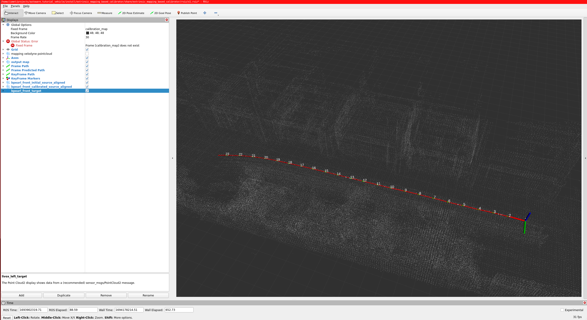
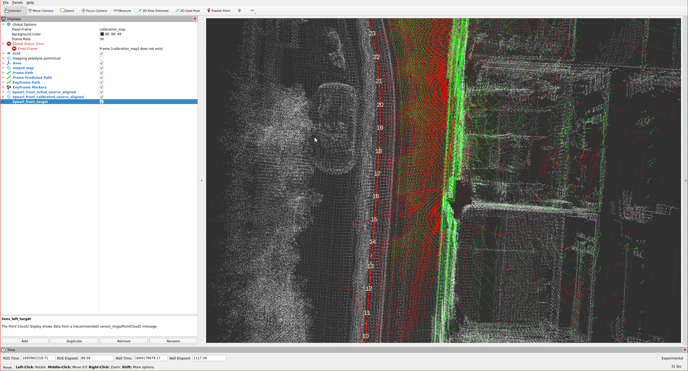

ライダー間校正
概要
このチュートリアルでは、TIER IV の CalibrationTools のマッピングベースの LIDAR-LIDAR キャリブレーション ツールを使用したLIDAR-LIDAR キャリブレーションについて説明します。

!!! 警告

Please obtain the initial calibration results from the [Manual Calibration](../extrinsic-manual-calibration) section.
This is crucial for obtaining accurate results from this tool.
We will utilize the initial calibration parameters that were calculated
in the previous step of this tutorial.
To apply these initial values in the calibration tools,
please update your sensor calibration files within the individual parameter package.
未加工の LIDAR トピックを含む LIDAR-LIDAR キャリブレーション プロセス用のサンプル バッグ ファイルが必要です。また、この点群にはトリミングされた車両点群が含まれるため、マッピングには外れ値でフィルターされた点群を使用することをお勧めします。したがって、車両ポイントはマップに含まれません。バッグの記録を開始するときは、マッピングのパフォーマンスを向上させるために、最初の 5 秒間は車両を動かさないでください。以下に、このキャリブレーションに使用されるバッグ ファイルの例を示します。

??? 注「tutorial_vehicle のキャリブレーション プロセスの ROS 2 Bag の例」

```sh

Files:             rosbag2_2023_09_05-11_23_50_0.db3
Bag size:          3.8 GiB
Storage id:        sqlite3
Duration:          112.702s
Start:             Sep  5 2023 11:23:51.105 (1693902231.105)
End:               Sep  5 2023 11:25:43.808 (1693902343.808)
Messages:          2256
Topic information: Topic: /sensing/lidar/front/pointcloud_raw | Type: sensor_msgs/msg/PointCloud2 | Count: 1128 | Serialization Format: cdr
                   Topic: /sensing/lidar/top/outlier_filtered/pointcloud | Type: sensor_msgs/msg/PointCloud2 | Count: 1128 | Serialization Format: cdr
```
マッピングベースの LIDAR 間キャリブレーション
起動ファイルの作成
まず、車両のようなExtrinsic Manual Calibration プロセスで起動ファイルを作成します。

cd <YOUR-OWN-AUTOWARE-DIRECTORY>/src/autoware/calibration_tools/sensor
cd extrinsic_calibration_manager/launch
cd <YOUR-OWN-SENSOR-KIT-NAME> # i.e. for our guide, it will ve cd tutorial_vehicle_sensor_kit which is created in manual calibration
touch mapping_based.launch.xml mapping_based_sensor_kit.launch.xml
これらを修正しmapping_based.launch.xml、mapping_based_sensor_kit.launch.xmlTIER IV のサンプル センサー キット aip_x1 を使用します。したがって、これら 2 つのファイルの内容をaip_x1から作成したファイルにコピーする必要があります。

次に、 vehicle_id とセンサー モデル名を に追加しますmapping_based.launch.xml(オプションで、値は重要ではありません。これらのパラメーターは起動引数によってオーバーライドされます)。

  <arg name="vehicle_id" default="default"/>

  <let name="sensor_model" value="aip_x1"/>
+ <?xml version="1.0" encoding="UTF-8"?>
+ <launch>
-   <arg name="vehicle_id" default="default"/>
+   <arg name="vehicle_id" default="<YOUR_VEHICLE_ID>"/>
+
-   <arg name="sensor_model" default="aip_x1"/>
+   <let name="sensor_model" value="<YOUR_SENSOR_KIT_NAME>"/>
tutorial_vehicle のファイル (mapping_based.launch.xml) の最終バージョンは次のようになります。

??? 注「チュートリアル車両のサンプルmapping_based.launch.xmlファイル」

```xml
<?xml version="1.0" encoding="UTF-8"?>
<launch>
  <arg name="vehicle_id" default="tutorial_vehicle"/>
  <let name="sensor_model" value="tutorial_vehicle_sensor_kit"/>
  <arg name="rviz" default="true"/>

  <group>
    <push-ros-namespace namespace="sensor_kit"/>
    <include file="$(find-pkg-share extrinsic_calibration_manager)/launch/$(var sensor_model)/mapping_based_sensor_kit.launch.xml">
      <arg name="vehicle_id" value="$(var vehicle_id)"/>
      <arg name="rviz" value="$(var rviz)"/>
    </include>
  </group>
</launch>

```
mapping_based.launch.xml ファイルが完成したら、独自のセンサー モデルにmapping_based_sensor_kit.launch.xmlを実装する準備が整います。

オプションで、この XML スニペットのように sensor_kit と vehicle_id を変更できますmapping_based.launch.xml: (ページの最後に含まれる rviz 構成をビデオとして保存した後に rviz_profile パスを変更できます)

各 LIDAR (マッピング LIDAR を除く) にセンサー キット フレームを追加します。チュートリアル車両のメイン LIDAR センサーとペアリングするための LIDAR が 1 つあり、次のようになります。

注: マッピング LIDAR はマッピングの目的で使用されますが、キャリブレーションは行われません。この LIDAR は、ハードウェア アーキテクチャのメイン センサーと考えることができます。したがって、他の LIDAR はマッピング LIDAR (メイン センサー) を基準にして校正されます。

+  <let name="lidar_calibration_sensor_kit_frames" value="[
+  sensor_kit_base_link,
+  sensor_kit_base_link,
+  sensor_kit_base_link
+  ...]"/>
LIDAR-LIDAR キャリブレーション プロセスのために前に rviz 構成ファイルを保存した場合:

- <let name="rviz_profile" value="$(find-pkg-share extrinsic_mapping_based_calibrator)/rviz/x1.rviz"/>
+ <let name="rviz_profile" value="$(find-pkg-share extrinsic_mapping_based_calibrator)/rviz/<YOUR-RVIZ-CONFIG>.rviz"/>
??? 注「つまり、マッピング用にメイン LIDAR が 1 つある場合、キャリブレーション用に 3 つの LIDAR がある場合」

```xml
+  <let name="lidar_calibration_sensor_kit_frames" value="[
+  sensor_kit_base_link,
+  sensor_kit_base_link,
+  sensor_kit_base_link]"/>
```
??? 注「つまり、tutorial_vehicle の場合 (マッピング用に 1 つの LIDAR メイン、キャリブレーション用に 1 つの LIDAR)」

```xml
+  <let name="lidar_calibration_sensor_kit_frames" value="[sensor_kit_base_link]"/>
```
キャリブレーター用に lidar_calibration_service_names、calibration_lidar_base_frames、および calibration_lidar_frames を追加します。

-   <let
-       name="lidar_calibration_service_names"
-       value="[
-       /sensor_kit/sensor_kit_base_link/livox_front_left_base_link,
-       /sensor_kit/sensor_kit_base_link/livox_front_center_base_link,
-       /sensor_kit/sensor_kit_base_link/livox_front_right_base_link]"
-     />
-   <let name="calibration_lidar_base_frames" value="[
-       livox_front_left_base_link,
-       livox_front_center_base_link,
-       livox_front_right_base_link]"/>
-   <let name="calibration_lidar_frames" value="[
-       livox_front_left,
-       livox_front_center,
-       livox_front_right]"/>
+   <let
+           name="lidar_calibration_service_names"
+           value="[/sensor_kit/sensor_kit_base_link/<YOUR_SENSOR_BASE_LINK>,
+                   /sensor_kit/sensor_kit_base_link/<YOUR_SENSOR_BASE_LINK
+                   ...]"
+   />
+
+   <let name="calibration_lidar_base_frames" value="[YOUR_SENSOR_BASE_LINK,
+                                                     YOUR_SENSOR_BASE_LINK
+                                                     ...]"/>
+   <let name="calibration_lidar_frames" value="[YOUR_SENSOR_LINK,
+                                                YOUR_SENSOR_LINK
+                                                ...]"/>
??? 注「つまり、tutorial_vehicle では、このスニペットのようになります。」

```xml
+   <let
+           name="lidar_calibration_service_names"
+           value="[/sensor_kit/sensor_kit_base_link/rs_bpearl_front_base_link]"
+   />

+   <let name="calibration_lidar_base_frames" value="[rs_bpearl_front_base_link]"/>
+   <let name="calibration_lidar_frames" value="[rs_bpearl_front]"/>
```
その後、これを行うためにセンサー トピックとセンサー フレームを追加し、引き続き入力していきますmapping_based_sensor_kit.launch.xml(車両雲が切り取られているため、マッピング ポイントクラウドとして /sensing/lidar/top/outlier_filtered/pointcloud トピックを使用することをお勧めします)このトピックでは pointcloud 前処理によって):

-     <let name="mapping_lidar_frame" value="velodyne_top"/>
-     <let name="mapping_pointcloud" value="/sensing/lidar/top/outlier_filtered/pointcloud"/>
+     <let name="mapping_lidar_frame" value="<MAPPING_LIDAR_SENSOR_LINK>"/>
+     <let name="mapping_pointcloud" value="<MAPPING_LIDAR_POINTCLOUD_TOPIC_NAME>"/>


-     <let name="calibration_pointcloud_topics" value="[
-       /sensing/lidar/front_left/livox/lidar,
-       /sensing/lidar/front_center/livox/lidar,
-       /sensing/lidar/front_right/livox/lidar]"/>
+     <let name="calibration_pointcloud_topics" value="[
+       <YOUR_LIDAR_TOPIC_FOR_CALIBRATION>,
+       <YOUR_LIDAR_TOPIC_FOR_CALIBRATION>,
+       ...]"/>
??? note 「tutorial_vehicle では、このスニペットのようになります。」

```xml
  <let name="calibration_lidar_base_frames" value="[rs_bpearl_front_base_link]"/>
  <let name="calibration_lidar_frames" value="[rs_bpearl_front]"/>

  <let name="mapping_lidar_frame" value="rs_helios_top"/>
  <let name="mapping_pointcloud" value="/sensing/lidar/top/pointcloud_raw"/>
  <let name="detected_objects" value="/perception/object_recognition/detection/objects"/>

<let name="calibration_pointcloud_topics" value="[
/sensing/lidar/right/pointcloud_raw]"/>
```
tutorial_vehicle の Mapping_based_sensor_kit.launch.xml 起動ファイルは次のようになります。

??? 注「つまり、mapping_based_sensor_kit.launch.xmltutorial_vehicle の場合」

```xml
<?xml version="1.0" encoding="UTF-8"?>
<launch>
  <arg name="vehicle_id" default="tutorial_vehicle"/>
  <let name="sensor_model" value="tutorial_vehicle_sensor_kit"/>

  <arg name="rviz"/>
  <let name="rviz_profile" value="$(find-pkg-share extrinsic_mapping_based_calibrator)/rviz/x1.rviz"/>

  <arg name="src_yaml" default="$(find-pkg-share individual_params)/config/$(var vehicle_id)/$(var sensor_model)/sensor_kit_calibration.yaml"/>
  <arg name="dst_yaml" default="$(env HOME)/sensor_kit_calibration.yaml"/>

  <let name="camera_calibration_service_names" value="['']"/>

  <let name="camera_calibration_sensor_kit_frames" value="['']"/>
  <let name="calibration_camera_frames" value="['']"/>
  <let name="calibration_camera_optical_link_frames" value="['']"/>
  <let name="calibration_camera_info_topics" value="['']"/>

  <let name="calibration_image_topics" value="['']"/>

  <let name="lidar_calibration_sensor_kit_frames" value="[sensor_kit_base_link]"/>

<let
name="lidar_calibration_service_names"
value="[/sensor_kit/sensor_kit_base_link/rs_bpearl_front_base_link]"
/>

  <let name="calibration_lidar_base_frames" value="[rs_bpearl_front_base_link]"/>
  <let name="calibration_lidar_frames" value="[rs_bpearl_front]"/>

  <let name="mapping_lidar_frame" value="rs_helios_top"/>
  <let name="mapping_pointcloud" value="/sensing/lidar/top/pointcloud_raw"/>
  <let name="detected_objects" value="/perception/object_recognition/detection/objects"/>

<let name="calibration_pointcloud_topics" value="[
/sensing/lidar/right/pointcloud_raw]"/>

  <group>
    <!-- extrinsic_calibration_client -->
    <node pkg="extrinsic_calibration_client" exec="extrinsic_calibration_client" name="extrinsic_calibration_client" output="screen">
      <param name="src_path" value="$(var src_yaml)"/>
      <param name="dst_path" value="$(var dst_yaml)"/>
    </node>

    <!-- extrinsic_calibration_manager -->
    <node pkg="extrinsic_calibration_manager" exec="extrinsic_calibration_manager" name="extrinsic_calibration_manager" output="screen">
      <param name="parent_frame" value="sensor_kit_base_link"/>
      <param name="child_frames" value="[rs_bpearl_front_base_link]"/>
    </node>
  </group>

  <!-- mapping based calibrator -->
  <include file="$(find-pkg-share extrinsic_mapping_based_calibrator)/launch/calibrator.launch.xml">
    <arg name="ns" value=""/>

    <arg name="camera_calibration_service_names" value="$(var camera_calibration_service_names)"/>
    <arg name="lidar_calibration_service_names" value="$(var lidar_calibration_service_names)"/>
    <arg name="camera_calibration_sensor_kit_frames" value="$(var camera_calibration_sensor_kit_frames)"/>
    <arg name="lidar_calibration_sensor_kit_frames" value="$(var lidar_calibration_sensor_kit_frames)"/>
    <arg name="calibration_camera_frames" value="$(var calibration_camera_frames)"/>
    <arg name="calibration_camera_optical_link_frames" value="$(var calibration_camera_optical_link_frames)"/>
    <arg name="calibration_lidar_base_frames" value="$(var calibration_lidar_base_frames)"/>
    <arg name="calibration_lidar_frames" value="$(var calibration_lidar_frames)"/>
    <arg name="mapping_lidar_frame" value="$(var mapping_lidar_frame)"/>

    <arg name="mapping_pointcloud" value="$(var mapping_pointcloud)"/>
    <arg name="detected_objects" value="$(var detected_objects)"/>

    <arg name="calibration_camera_info_topics" value="$(var calibration_camera_info_topics)"/>
    <arg name="calibration_image_topics" value="$(var calibration_image_topics)"/>
    <arg name="calibration_pointcloud_topics" value="$(var calibration_pointcloud_topics)"/>

    <arg name="mapping_max_range" value="150.0"/>
    <arg name="local_map_num_keyframes" value="30"/>
    <arg name="dense_pointcloud_num_keyframes" value="20"/>
    <arg name="ndt_resolution" value="0.5"/>
    <arg name="ndt_max_iterations" value="100"/>
    <arg name="ndt_epsilon" value="0.005"/>
    <arg name="lost_frame_max_acceleration" value="15.0"/>
    <arg name="lidar_calibration_max_frames" value="10"/>
    <arg name="calibration_eval_max_corr_distance" value="0.2"/>
    <arg name="solver_iterations" value="100"/>
    <arg name="calibration_skip_keyframes" value="15"/>
  </include>

  <node pkg="rviz2" exec="rviz2" name="rviz2" output="screen" args="-d $(var rviz_profile)" if="$(var rviz)"/>
</launch>

```
インタラクティブなマッピングベースのキャリブレーターを使用した Lidar-Lidar キャリブレーション プロセス
mapping_based.launch.xml および Mapping_based_sensor_kit.launch.xml を完了したら、独自のセンサー キット用のファイルを起動します。これで、LIDAR を調整する準備が整いました。まず最初に、extrinsic_calibration_manager パッケージをビルドする必要があります。

colcon build --symlink-install --cmake-args -DCMAKE_BUILD_TYPE=Release --packages-select extrinsic_calibration_manager
これで、マッピング ベースの LIDAR-LIDAR キャリブレーターを起動して使用する準備が整いました。

ros2 launch extrinsic_calibration_manager calibration.launch.xml mode:=mapping_based sensor_model:=<OWN-SENSOR-KIT> vehicle_model:=<OWN-VEHICLE-MODEL> vehicle_id:=<VEHICLE-ID>
チュートリアル車両の場合:

ros2 launch extrinsic_calibration_manager calibration.launch.xml mode:=mapping_based sensor_model:=tutorial_vehicle_sensor_kit vehicle_model:=tutorial_vehicle vehicle_id:=tutorial_vehicle
いくつかの設定を含む rviz2 画面を表示します。ビデオのようなセンサー情報のトピックで画面を更新する必要があります (ドキュメントの最後に含まれています)。また、rviz2 設定を rviz ディレクトリに保存できるため、後で を変更して使用できますmapping_based_sensor_kit.launch.xml。

extrinsic_ground_plane_calibrator/
   └─ rviz/
+        └─ tutorial_vehicle_sensor_kit.rviz
次に、ROS 2 バッグ ファイルを再生します。

ros2 bag play <rosbag_path> --clock -r 0.2 \
--remap /tf:=/null/tf /tf_static:=/null/tf_static # if tf is recorded
キャリブレーション手順は、マッピングとキャリブレーションの 2 つのフェーズで構成されます。バッグの再生が開始され、マッピングが開始され、以下の rviz2 のスクリーンショットが表示されます。

マッピングベースのキャリブレーション

したがって、赤い矢印マーカーはマッピング中のポーズを示し、緑の矢印マーカーは均一に取られた特別なポーズを示し、白い点は構築されたマップを示します。

マッピングは、事前定義されたデータしきい値に達すると停止するか、このサービスを呼び出すことで途中で終了する可能性があります。

ros2 service call /NAMESPACE/stop_mapping std_srvs/srv/Empty {}
キャリブレーションのマッピング フェーズが完了すると、キャリブレーション プロセスが開始されます。キャリブレーションが完了すると、次の画像のような rviz2 画面が表示されます。

マッピングベースのキャリブレーション結果

赤い点は、前のセクションの初期キャリブレーション結果の点群を示します。緑色の点は位置合わせされた点 (キャリブレーション結果) を示します。dst_yamlこのチュートリアルでは、キャリブレーション結果が ($HOME/sensor_kit_calibration.yaml) に自動的に保存されます 。

これは、tutorial_vehicle でのマッピングベースの LIDAR 間キャリブレーション プロセスをデモンストレーションするビデオです。 タイプ:ビデオ
# Lidar-Lidar calibration

## Overview

In this tutorial,
we will explain lidar-lidar calibration over [mapping-based lidar-lidar calibration tool](https://github.com/tier4/CalibrationTools/blob/tier4/universe/sensor/docs/how_to_extrinsic_mapping_based.md) of TIER IV's
CalibrationTools.

!!! warning

    Please obtain the initial calibration results from the [Manual Calibration](../extrinsic-manual-calibration) section.
    This is crucial for obtaining accurate results from this tool.
    We will utilize the initial calibration parameters that were calculated
    in the previous step of this tutorial.
    To apply these initial values in the calibration tools,
    please update your sensor calibration files within the individual parameter package.

We need a sample bag file for the lidar-lidar calibration process
which includes raw lidar topics.
Also, we recommend using an outlier-filtered
point cloud for mapping because this point cloud
includes a cropped vehicle point cloud. Therefore,
vehicle points are not included in the map. When you start
the bag recording,
you should not move the vehicle for the first 5 seconds for better mapping performace.
The following shows an example of a bag file used for this calibration:

??? note "ROS 2 Bag example of our calibration process for tutorial_vehicle"

    ```sh

    Files:             rosbag2_2023_09_05-11_23_50_0.db3
    Bag size:          3.8 GiB
    Storage id:        sqlite3
    Duration:          112.702s
    Start:             Sep  5 2023 11:23:51.105 (1693902231.105)
    End:               Sep  5 2023 11:25:43.808 (1693902343.808)
    Messages:          2256
    Topic information: Topic: /sensing/lidar/front/pointcloud_raw | Type: sensor_msgs/msg/PointCloud2 | Count: 1128 | Serialization Format: cdr
                       Topic: /sensing/lidar/top/outlier_filtered/pointcloud | Type: sensor_msgs/msg/PointCloud2 | Count: 1128 | Serialization Format: cdr
    ```

## Mapping-based lidar-lidar calibration

### Creating launch files

We start with creating launch file four our vehicle like `Extrinsic Manual Calibration`
process:

```bash
cd <YOUR-OWN-AUTOWARE-DIRECTORY>/src/autoware/calibration_tools/sensor
cd extrinsic_calibration_manager/launch
cd <YOUR-OWN-SENSOR-KIT-NAME> # i.e. for our guide, it will ve cd tutorial_vehicle_sensor_kit which is created in manual calibration
touch mapping_based.launch.xml mapping_based_sensor_kit.launch.xml
```

We will be modifying these `mapping_based.launch.xml` and `mapping_based_sensor_kit.launch.xml` by using TIER IV's sample sensor kit aip_x1.
So,
you should copy the contents of these two files from [aip_x1](https://github.com/tier4/CalibrationTools/tree/tier4/universe/sensor/extrinsic_calibration_manager/launch/aip_x1) to your created files.

Then we will continue with adding vehicle_id and sensor model names to the `mapping_based.launch.xml`:
(Optionally, values are not important. These parameters will be overridden by launch arguments)

```diff
  <arg name="vehicle_id" default="default"/>

  <let name="sensor_model" value="aip_x1"/>
+ <?xml version="1.0" encoding="UTF-8"?>
+ <launch>
-   <arg name="vehicle_id" default="default"/>
+   <arg name="vehicle_id" default="<YOUR_VEHICLE_ID>"/>
+
-   <arg name="sensor_model" default="aip_x1"/>
+   <let name="sensor_model" value="<YOUR_SENSOR_KIT_NAME>"/>
```

The final version of the file (mapping_based.launch.xml) for tutorial_vehicle should be like this:

??? note "Sample mapping_based.launch.xml file for tutorial vehicle"

    ```xml
    <?xml version="1.0" encoding="UTF-8"?>
    <launch>
      <arg name="vehicle_id" default="tutorial_vehicle"/>
      <let name="sensor_model" value="tutorial_vehicle_sensor_kit"/>
      <arg name="rviz" default="true"/>

      <group>
        <push-ros-namespace namespace="sensor_kit"/>
        <include file="$(find-pkg-share extrinsic_calibration_manager)/launch/$(var sensor_model)/mapping_based_sensor_kit.launch.xml">
          <arg name="vehicle_id" value="$(var vehicle_id)"/>
          <arg name="rviz" value="$(var rviz)"/>
        </include>
      </group>
    </launch>

    ```

After the completing of mapping_based.launch.xml file,
we will be ready to implement mapping_based_sensor_kit.launch.xml for the own sensor model.

Optionally,
you can modify sensor_kit and vehicle_id as `mapping_based.launch.xml`over this xml snippet:
(You can change rviz_profile path after the saving rviz config as video
which included at the end of the page)

We will add sensor kit frames for each lidar (except mapping lidar),
we have one lidar for pairing to the main lidar sensor for tutorial vehicle, so it should be like:

**Note**: The mapping lidar will be used for mapping purposes, but it will not be calibrated.
We can consider this lidar as the main sensor for our hardware architecture.
Therefore, other lidars will be calibrated with respect to the mapping lidar (main sensor).

```diff
+  <let name="lidar_calibration_sensor_kit_frames" value="[
+  sensor_kit_base_link,
+  sensor_kit_base_link,
+  sensor_kit_base_link
+  ...]"/>
```

If you save rviz config file before for the lidar-lidar calibration process:

```diff
- <let name="rviz_profile" value="$(find-pkg-share extrinsic_mapping_based_calibrator)/rviz/x1.rviz"/>
+ <let name="rviz_profile" value="$(find-pkg-share extrinsic_mapping_based_calibrator)/rviz/<YOUR-RVIZ-CONFIG>.rviz"/>
```

??? note "i.e., If you have one main lidar for mapping, three lidar for calibration"

    ```xml
    +  <let name="lidar_calibration_sensor_kit_frames" value="[
    +  sensor_kit_base_link,
    +  sensor_kit_base_link,
    +  sensor_kit_base_link]"/>
    ```

??? note "i.e., For tutorial_vehicle (one lidar main for mapping, one lidar for calibration)"

    ```xml
    +  <let name="lidar_calibration_sensor_kit_frames" value="[sensor_kit_base_link]"/>
    ```

We will add lidar_calibration_service_names,
calibration_lidar_base_frames and calibration_lidar_frames for calibrator:

```diff
-   <let
-       name="lidar_calibration_service_names"
-       value="[
-       /sensor_kit/sensor_kit_base_link/livox_front_left_base_link,
-       /sensor_kit/sensor_kit_base_link/livox_front_center_base_link,
-       /sensor_kit/sensor_kit_base_link/livox_front_right_base_link]"
-     />
-   <let name="calibration_lidar_base_frames" value="[
-       livox_front_left_base_link,
-       livox_front_center_base_link,
-       livox_front_right_base_link]"/>
-   <let name="calibration_lidar_frames" value="[
-       livox_front_left,
-       livox_front_center,
-       livox_front_right]"/>
+   <let
+           name="lidar_calibration_service_names"
+           value="[/sensor_kit/sensor_kit_base_link/<YOUR_SENSOR_BASE_LINK>,
+                   /sensor_kit/sensor_kit_base_link/<YOUR_SENSOR_BASE_LINK
+                   ...]"
+   />
+
+   <let name="calibration_lidar_base_frames" value="[YOUR_SENSOR_BASE_LINK,
+                                                     YOUR_SENSOR_BASE_LINK
+                                                     ...]"/>
+   <let name="calibration_lidar_frames" value="[YOUR_SENSOR_LINK,
+                                                YOUR_SENSOR_LINK
+                                                ...]"/>
```

??? note "i.e., At the tutorial_vehicle it should be like this snippet"

    ```xml
    +   <let
    +           name="lidar_calibration_service_names"
    +           value="[/sensor_kit/sensor_kit_base_link/rs_bpearl_front_base_link]"
    +   />

    +   <let name="calibration_lidar_base_frames" value="[rs_bpearl_front_base_link]"/>
    +   <let name="calibration_lidar_frames" value="[rs_bpearl_front]"/>
    ```

After that, we will add the sensor topics and sensor frames in order to do that,
we will continue filling the `mapping_based_sensor_kit.launch.xml` with
(we recommend
using the /sensing/lidar/top/outlier_filtered/pointcloud topic as the mapping pointcloud
because the vehicle cloud is cropped at this topic by pointcloud preprocessing):

```diff

-     <let name="mapping_lidar_frame" value="velodyne_top"/>
-     <let name="mapping_pointcloud" value="/sensing/lidar/top/outlier_filtered/pointcloud"/>
+     <let name="mapping_lidar_frame" value="<MAPPING_LIDAR_SENSOR_LINK>"/>
+     <let name="mapping_pointcloud" value="<MAPPING_LIDAR_POINTCLOUD_TOPIC_NAME>"/>


-     <let name="calibration_pointcloud_topics" value="[
-       /sensing/lidar/front_left/livox/lidar,
-       /sensing/lidar/front_center/livox/lidar,
-       /sensing/lidar/front_right/livox/lidar]"/>
+     <let name="calibration_pointcloud_topics" value="[
+       <YOUR_LIDAR_TOPIC_FOR_CALIBRATION>,
+       <YOUR_LIDAR_TOPIC_FOR_CALIBRATION>,
+       ...]"/>
```

??? note "At the tutorial_vehicle it should be like this snippet."

    ```xml
      <let name="calibration_lidar_base_frames" value="[rs_bpearl_front_base_link]"/>
      <let name="calibration_lidar_frames" value="[rs_bpearl_front]"/>

      <let name="mapping_lidar_frame" value="rs_helios_top"/>
      <let name="mapping_pointcloud" value="/sensing/lidar/top/pointcloud_raw"/>
      <let name="detected_objects" value="/perception/object_recognition/detection/objects"/>

    <let name="calibration_pointcloud_topics" value="[
    /sensing/lidar/right/pointcloud_raw]"/>
    ```

The mapping_based_sensor_kit.launch.xml launch file for tutorial_vehicle should be this:

??? note "i.e. [`mapping_based_sensor_kit.launch.xml`](https://github.com/leo-drive/tutorial_vehicle_calibration_tools/blob/tutorial_vehicle/sensor/extrinsic_calibration_manager/launch/tutorial_vehicle_sensor_kit/mapping_based_sensor_kit.launch.xml) for tutorial_vehicle"

    ```xml
    <?xml version="1.0" encoding="UTF-8"?>
    <launch>
      <arg name="vehicle_id" default="tutorial_vehicle"/>
      <let name="sensor_model" value="tutorial_vehicle_sensor_kit"/>

      <arg name="rviz"/>
      <let name="rviz_profile" value="$(find-pkg-share extrinsic_mapping_based_calibrator)/rviz/x1.rviz"/>

      <arg name="src_yaml" default="$(find-pkg-share individual_params)/config/$(var vehicle_id)/$(var sensor_model)/sensor_kit_calibration.yaml"/>
      <arg name="dst_yaml" default="$(env HOME)/sensor_kit_calibration.yaml"/>

      <let name="camera_calibration_service_names" value="['']"/>

      <let name="camera_calibration_sensor_kit_frames" value="['']"/>
      <let name="calibration_camera_frames" value="['']"/>
      <let name="calibration_camera_optical_link_frames" value="['']"/>
      <let name="calibration_camera_info_topics" value="['']"/>

      <let name="calibration_image_topics" value="['']"/>

      <let name="lidar_calibration_sensor_kit_frames" value="[sensor_kit_base_link]"/>

    <let
    name="lidar_calibration_service_names"
    value="[/sensor_kit/sensor_kit_base_link/rs_bpearl_front_base_link]"
    />

      <let name="calibration_lidar_base_frames" value="[rs_bpearl_front_base_link]"/>
      <let name="calibration_lidar_frames" value="[rs_bpearl_front]"/>

      <let name="mapping_lidar_frame" value="rs_helios_top"/>
      <let name="mapping_pointcloud" value="/sensing/lidar/top/pointcloud_raw"/>
      <let name="detected_objects" value="/perception/object_recognition/detection/objects"/>

    <let name="calibration_pointcloud_topics" value="[
    /sensing/lidar/right/pointcloud_raw]"/>

      <group>
        <!-- extrinsic_calibration_client -->
        <node pkg="extrinsic_calibration_client" exec="extrinsic_calibration_client" name="extrinsic_calibration_client" output="screen">
          <param name="src_path" value="$(var src_yaml)"/>
          <param name="dst_path" value="$(var dst_yaml)"/>
        </node>

        <!-- extrinsic_calibration_manager -->
        <node pkg="extrinsic_calibration_manager" exec="extrinsic_calibration_manager" name="extrinsic_calibration_manager" output="screen">
          <param name="parent_frame" value="sensor_kit_base_link"/>
          <param name="child_frames" value="[rs_bpearl_front_base_link]"/>
        </node>
      </group>

      <!-- mapping based calibrator -->
      <include file="$(find-pkg-share extrinsic_mapping_based_calibrator)/launch/calibrator.launch.xml">
        <arg name="ns" value=""/>

        <arg name="camera_calibration_service_names" value="$(var camera_calibration_service_names)"/>
        <arg name="lidar_calibration_service_names" value="$(var lidar_calibration_service_names)"/>
        <arg name="camera_calibration_sensor_kit_frames" value="$(var camera_calibration_sensor_kit_frames)"/>
        <arg name="lidar_calibration_sensor_kit_frames" value="$(var lidar_calibration_sensor_kit_frames)"/>
        <arg name="calibration_camera_frames" value="$(var calibration_camera_frames)"/>
        <arg name="calibration_camera_optical_link_frames" value="$(var calibration_camera_optical_link_frames)"/>
        <arg name="calibration_lidar_base_frames" value="$(var calibration_lidar_base_frames)"/>
        <arg name="calibration_lidar_frames" value="$(var calibration_lidar_frames)"/>
        <arg name="mapping_lidar_frame" value="$(var mapping_lidar_frame)"/>

        <arg name="mapping_pointcloud" value="$(var mapping_pointcloud)"/>
        <arg name="detected_objects" value="$(var detected_objects)"/>

        <arg name="calibration_camera_info_topics" value="$(var calibration_camera_info_topics)"/>
        <arg name="calibration_image_topics" value="$(var calibration_image_topics)"/>
        <arg name="calibration_pointcloud_topics" value="$(var calibration_pointcloud_topics)"/>

        <arg name="mapping_max_range" value="150.0"/>
        <arg name="local_map_num_keyframes" value="30"/>
        <arg name="dense_pointcloud_num_keyframes" value="20"/>
        <arg name="ndt_resolution" value="0.5"/>
        <arg name="ndt_max_iterations" value="100"/>
        <arg name="ndt_epsilon" value="0.005"/>
        <arg name="lost_frame_max_acceleration" value="15.0"/>
        <arg name="lidar_calibration_max_frames" value="10"/>
        <arg name="calibration_eval_max_corr_distance" value="0.2"/>
        <arg name="solver_iterations" value="100"/>
        <arg name="calibration_skip_keyframes" value="15"/>
      </include>

      <node pkg="rviz2" exec="rviz2" name="rviz2" output="screen" args="-d $(var rviz_profile)" if="$(var rviz)"/>
    </launch>

    ```

### Lidar-Lidar calibration process with interactive mapping-based calibrator

After completing mapping_based.launch.xml and mapping_based_sensor_kit.launch.xml launch files for own sensor kit;
now we are ready to calibrate our lidars.
First of all, we need to build extrinsic_calibration_manager package:

```bash
colcon build --symlink-install --cmake-args -DCMAKE_BUILD_TYPE=Release --packages-select extrinsic_calibration_manager
```

So, we are ready to launch and use mapping-based lidar-lidar calibrator:

```bash
ros2 launch extrinsic_calibration_manager calibration.launch.xml mode:=mapping_based sensor_model:=<OWN-SENSOR-KIT> vehicle_model:=<OWN-VEHICLE-MODEL> vehicle_id:=<VEHICLE-ID>
```

For tutorial vehicle:

```bash
ros2 launch extrinsic_calibration_manager calibration.launch.xml mode:=mapping_based sensor_model:=tutorial_vehicle_sensor_kit vehicle_model:=tutorial_vehicle vehicle_id:=tutorial_vehicle
```

You will show the rviz2 screen with several configurations,
you need
to update it with your sensor information topics like the video,
which included an end of the document.
Also, you can save the rviz2 config on rviz directory,
so you can use it later with modifying `mapping_based_sensor_kit.launch.xml`.

```diff
extrinsic_ground_plane_calibrator/
   └─ rviz/
+        └─ tutorial_vehicle_sensor_kit.rviz
```

Then play ROS 2 bag file:

```bash
ros2 bag play <rosbag_path> --clock -r 0.2 \
--remap /tf:=/null/tf /tf_static:=/null/tf_static # if tf is recorded
```

The calibration step consists of two phases: mapping and calibration.
At the bag starts playing, then mapping starts as well as the rviz2 screenshot below.



So, red arrow markers indicate poses during mapping,
green arrow markers are special poses taken uniformly,
and white points indicate the constructed map.

Mapping halts either upon reaching a predefined data threshold
or can be prematurely concluded by invoking this service:

```bash
ros2 service call /NAMESPACE/stop_mapping std_srvs/srv/Empty {}
```

After the mapping phase of calibration is completed, then the calibration process will start.
After the calibration is completed, then you should rviz2 screen like the image below:



The red points indicate pointcloud that initial calibration results of [previous section](../extrinsic-manual-calibration).
The green points indicate aligned point (calibration result).
The calibration results will be saved automatically on your
`dst_yaml` ($HOME/sensor_kit_calibration.yaml) at this tutorial.

Here is the video for demonstrating the mapping-based lidar-lidar calibration process on tutorial_vehicle:

