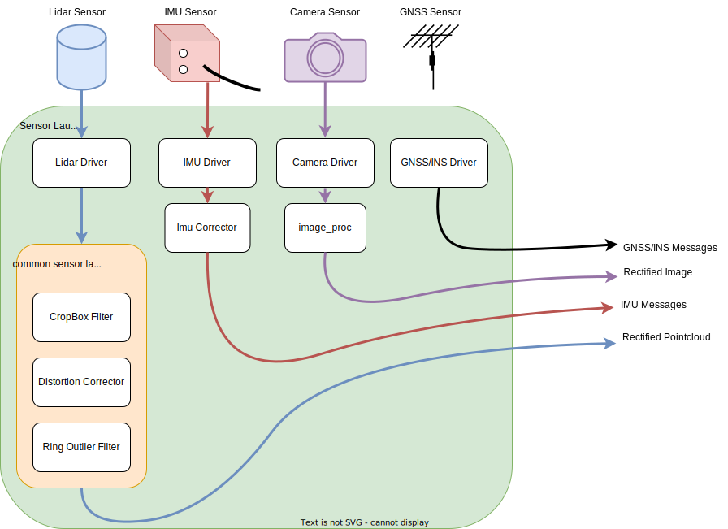
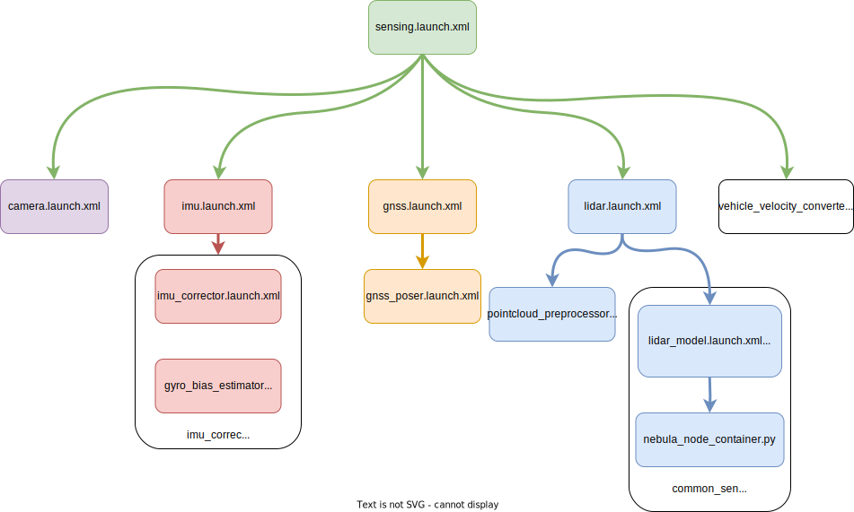

# Autowareのセンサーモデルの作成

## 導入

このページでは、センサー モデル用の次のパッケージを紹介します:

1. `common_sensor_launch`
2. `<YOUR-VEHICLE-NAME>_sensor_kit_description`
3. `<YOUR-VEHICLE-NAME>_sensor_kit_launch`

以前は、
[Autowareリポジトリの作成](../../creating-your-autoware-repositories/creating-autoware-repositories.md)ページのステップで車両モデルをフォークしました。
たとえば、
上記のステップの実装例として、[tutorial_vehicle_launch](https://github.com/leo-drive/tutorial_vehicle_launch)を
作成しました。
以下のディレクトリ構造に従って<YOUR-VEHICLE-NAME>\_vehicle_launchリポジトリが
Autowareに含まれていることを確認してください:

```diff
<YOUR-OWN-AUTOWARE-DIR>/
  └─ src/
       └─ sensor_kit/
            └─ <YOUR-VEHICLE-NAME>_sensor_kit_launch/
                 ├─ common_sensor_launch/
                 ├─ <YOUR-VEHICLE-NAME>_sensor_kit_description/
                 └─ <YOUR-VEHICLE-NAME>_sensor_kit_launch/
```

フォークされた Autoware メタ リポジトリに、上記のような正しいフォルダー構造を持つ
`<YOUR-VEHICLE-NAME>_vehicle_launch`が含まれていない場合は、
フォークされた `<YOUR-VEHICLE-NAME>_vehicle_launch`リポジトリを autoware.reposファイルに追加し
ターミナルでvcs import src < autoware.reposコマンドを実行して、
新しく組み込まれたリポジトリを autoware.repos ファイルにインポートしてください。

これで、車両用に次のセンサー モデル パッケージを変更する準備ができました。
まず、説明の名前を変更してパッケージを起動する必要があります:

```diff
<YOUR-VEHICLE-NAME>_sensor_kit_launch/
  ├─ common_sensor_launch/
- ├─ sample_sensor_kit_description/
+ ├─ <YOUR-VEHICLE-NAME>_sensor_kit_description/
- └─ sample_sensor_kit_launch/
+ └─ <YOUR-VEHICLE-NAME>_sensor_kit_launch/
```

その後、
sample_sensor_kit_description パッケージと Sample_sensor_kit_launch パッケージの package.xml ファイルと CMakeLists.txt ファイルのパッケージ名を変更します。
そのため、
任意のテキスト エディターまたは IDE で 
package.xml ファイルと CMakeLists.txt ファイルを開き、次の変更を実行します:

`package.xml`ファイルの`<name>`属性を変更します:

```diff
<package format="3">
- <name>sample_sensor_kit_description</name>
+ <name><YOUR-VEHICLE-NAME>_sensor_kit_description</name>
  <version>0.1.0</version>
  <description>The sensor_kit_description package</description>
  ...
  ...
```

`CmakeList.txt`ファイルの`project()`メソッドを変更します。

```diff
  cmake_minimum_required(VERSION 3.5)
- project(sample_sensor_kit_description)
+ project(<YOUR-VEHICLE-NAME>_sensor_kit_description)

  find_package(ament_cmake_auto REQUIRED)
...
...
```

名前の変更とプロジェクトメソッドを、`<YOUR-VEHICLE-NAME>_vehicle_description`と`<YOUR-VEHICLE-NAME>_vehicle_launch`ROS 2パッケージの
**両方に**に忘れずに適用してください。
完了したら、上記のパッケージのビルドに進むことができます:

```bash
cd <YOUR-AUTOWARE-DIR>
colcon build --symlink-install --cmake-args -DCMAKE_BUILD_TYPE=Release --packages-up-to <YOUR-VEHICLE-NAME>_sensor_kit_description <YOUR-VEHICLE-NAME>_sensor_kit_launch
```

## センサーの記述

このパッケージの主な目的は、センサー フレーム ID、
すべてのセンサーのキャリブレーション パラメーター、および urdf ファイルとのリンクを記述することです。

sensor_kit_description パッケージのフォルダー構造は次のとおりです:

```diff
<YOUR-VEHICLE-NAME>_sensor_kit_description/
   ├─ config/
   │     ├─ sensor_kit_calibration.yaml
   │     └─ sensors_calibration.yaml
   └─ urdf/
         ├─ sensor_kit.xacro
         └─ sensors.xacro
```

ここで、センサーの設計に従ってこれらのファイルを変更します。

### sensor_kit_calibration.yaml

このファイルは、`sensor_kit_base_link`を親フレームとしてセンサーの取り付け位置と向きを定義します。
`sensor_kit_base_link`フレームがメイン LiDAR センサーの下部にあると想定できます。
このファイルはオイラー形式 [x, y, z, roll, pitch, yaw]で作成する必要があります。
[キャリブレーションの段階](../calibrating-sensors)までは、これらの値を"0"として設定します。

このファイルに新しいフレームを定義し、それらの`.xacro`ファイルを接続します。
LIDARセンサーフレームに"velodyne_top"のような名前を付けることとをお勧めします。
またcalibration.yaml ファイルに"\_base_link"を追加できます。

したがって、サンプル ファイルは次のようにする必要があります:

```yaml
sensor_kit_base_link:
  velodyne_top_base_link:
    x: 0.000000
    y: 0.000000
    z: 0.000000
    roll: 0.000000
    pitch: 0.000000
    yaw: 0.000000
  camera0/camera_link:
    x: 0.000000
    y: 0.000000
    z: 0.000000
    roll: 0.000000
    pitch: 0.000000
    yaw: 0.000000
  ...
  ...
```

このファイルは、`tutorial_vehicle`の1 台のカメラ、2 台の LIDAR、および 1 台の GNSS/INS センサー用に作成されました。

??? 注記 "tutorial_vehicle_sensor_kit_description向け`sensor_kit_calibration.yaml`"

    ```yaml
    sensor_kit_base_link:
      camera0/camera_link: # Camera
        x: 0.0
        y: 0.0
        z: 0.0
        roll: 0.0
        pitch: 0.0
        yaw: 0.0
      rs_helios_top_base_link: # Lidar
        x: 0.0
        y: 0.0
        z: 0.0
        roll: 0.0
        pitch: 0.0
        yaw: 0.0
      rs_bpearl_front_base_link: # Lidar
        x: 0.0
        y: 0.0
        z: 0.0
        roll: 0.0
        pitch: 0.0
        yaw: 0.0
      GNSS_INS/gnss_ins_link: # GNSS/INS
        x: 0.0
        y: 0.0
        z: 0.0
        roll: 0.0
        pitch: 0.0
        yaw: 0.0
    ```

### sensors_calibration.yaml

このファイルは、`base_link`を親フレームとして
`sensor_kit_base_link`(子フレーム)の取り付け位置と向きを定義します。
Autowareでは、base_link`はリアアクスルの中心を地面に投影しています。
詳細については、
[車両寸法](../../../../design/autoware-interfaces/components/vehicle-dimensions.md)ページを確認してください。
これには CAD 値を使用できますが、ここでは値を`0`で埋めます。You can use CAD values for this, but we will fill the values with `0` for now.

```yaml
base_link:
  sensor_kit_base_link:
    x: 0.000000
    y: 0.000000
    z: 0.000000
    roll: 0.000000
    pitch: 0.000000
    yaw: 0.000000
```

これで.xacro ファイルを実装する準備が整いました。
これらのファイルは、センサー フレームのリンクとセンサー urdf ファイルの追加を提供します。

### sensor_kit.xacro

センサーを追加し、このファイルから不要な xacros を削除します。
たとえば、
センサー ドライバーから`velodyne_top`フレームを備えた
 LIDAR センサーを追加したい場合は、
次の xacro を sensor_kit.xacro ファイルに追加します。
このファイルにセンサーを追加し、不要なセンサーの xacros を削除してください。

```xml
    <!-- lidar -->
    <xacro:VLS-128 parent="sensor_kit_base_link" name="velodyne_top" topic="/points_raw" hz="10" samples="220" gpu="$(arg gpu)">
        <origin
                xyz="${calibration['sensor_kit_base_link']['velodyne_top_base_link']['x']}
                 ${calibration['sensor_kit_base_link']['velodyne_top_base_link']['y']}
                 ${calibration['sensor_kit_base_link']['velodyne_top_base_link']['z']}"
                rpy="${calibration['sensor_kit_base_link']['velodyne_top_base_link']['roll']}
                 ${calibration['sensor_kit_base_link']['velodyne_top_base_link']['pitch']}
                 ${calibration['sensor_kit_base_link']['velodyne_top_base_link']['yaw']}"
        />
    </xacro:VLS-128>
```

これは、1 台のカメラ、2 台の LIDAR、および 1 台の GNSS/INS センサーを備えた、tutorial_vehicle のサンプル xacro ファイルです。

??? 注記 "tutorial_vehicle_sensor_kit_description用の`sensor_kit.xacro`"

    ```xml
    <?xml version="1.0"?>
    <robot xmlns:xacro="http://ros.org/wiki/xacro">
      <xacro:macro name="sensor_kit_macro" params="parent x y z roll pitch yaw">
        <xacro:include filename="$(find velodyne_description)/urdf/VLP-16.urdf.xacro"/>
        <xacro:include filename="$(find vls_description)/urdf/VLS-128.urdf.xacro"/>
        <xacro:include filename="$(find camera_description)/urdf/monocular_camera.xacro"/>
        <xacro:include filename="$(find imu_description)/urdf/imu.xacro"/>

        <xacro:arg name="gpu" default="false"/>
        <xacro:arg name="config_dir" default="$(find tutorial_vehicle_sensor_kit_description)/config"/>

        <xacro:property name="sensor_kit_base_link" default="sensor_kit_base_link"/>

        <joint name="${sensor_kit_base_link}_joint" type="fixed">
          <origin rpy="${roll} ${pitch} ${yaw}" xyz="${x} ${y} ${z}"/>
          <parent link="${parent}"/>
          <child link="${sensor_kit_base_link}"/>
        </joint>
        <link name="${sensor_kit_base_link}">
          <origin rpy="0 0 0" xyz="0 0 0"/>
        </link>

        <!-- sensor -->
        <xacro:property name="calibration" value="${xacro.load_yaml('$(arg config_dir)/sensor_kit_calibration.yaml')}"/>

        <!-- lidar -->
        <xacro:VLS-128 parent="sensor_kit_base_link" name="rs_helios_top" topic="/points_raw" hz="10" samples="220" gpu="$(arg gpu)">
          <origin
            xyz="${calibration['sensor_kit_base_link']['rs_helios_top_base_link']['x']}
                 ${calibration['sensor_kit_base_link']['rs_helios_top_base_link']['y']}
                 ${calibration['sensor_kit_base_link']['rs_helios_top_base_link']['z']}"
            rpy="${calibration['sensor_kit_base_link']['rs_helios_top_base_link']['roll']}
                 ${calibration['sensor_kit_base_link']['rs_helios_top_base_link']['pitch']}
                 ${calibration['sensor_kit_base_link']['rs_helios_top_base_link']['yaw']}"
          />
        </xacro:VLS-128>
        <xacro:VLP-16 parent="sensor_kit_base_link" name="rs_bpearl_front" topic="/points_raw" hz="10" samples="220" gpu="$(arg gpu)">
          <origin
            xyz="${calibration['sensor_kit_base_link']['rs_bpearl_front_base_link']['x']}
                 ${calibration['sensor_kit_base_link']['rs_bpearl_front_base_link']['y']}
                 ${calibration['sensor_kit_base_link']['rs_bpearl_front_base_link']['z']}"
            rpy="${calibration['sensor_kit_base_link']['rs_bpearl_front_base_link']['roll']}
                 ${calibration['sensor_kit_base_link']['rs_bpearl_front_base_link']['pitch']}
                 ${calibration['sensor_kit_base_link']['rs_bpearl_front_base_link']['yaw']}"
          />
        </xacro:VLP-16>

        <!-- camera -->
        <xacro:monocular_camera_macro
          name="camera0/camera"
          parent="sensor_kit_base_link"
          namespace=""
          x="${calibration['sensor_kit_base_link']['camera0/camera_link']['x']}"
          y="${calibration['sensor_kit_base_link']['camera0/camera_link']['y']}"
          z="${calibration['sensor_kit_base_link']['camera0/camera_link']['z']}"
          roll="${calibration['sensor_kit_base_link']['camera0/camera_link']['roll']}"
          pitch="${calibration['sensor_kit_base_link']['camera0/camera_link']['pitch']}"
          yaw="${calibration['sensor_kit_base_link']['camera0/camera_link']['yaw']}"
          fps="30"
          width="800"
          height="400"
          fov="1.3"
        />

        <!-- gnss -->
        <xacro:imu_macro
          name="gnss"
          parent="sensor_kit_base_link"
          namespace=""
          x="${calibration['sensor_kit_base_link']['gnss_link']['x']}"
          y="${calibration['sensor_kit_base_link']['gnss_link']['y']}"
          z="${calibration['sensor_kit_base_link']['gnss_link']['z']}"
          roll="${calibration['sensor_kit_base_link']['gnss_link']['roll']}"
          pitch="${calibration['sensor_kit_base_link']['gnss_link']['pitch']}"
          yaw="${calibration['sensor_kit_base_link']['gnss_link']['yaw']}"
          fps="100"
        />

      </xacro:macro>
    </robot>

    ```

### sensors.xacro

このファイルは、sensor_kitのメインフレーム(`sensor_kit_base_link`) をbase_linkにリンクします。
また、base_link に直接調整されるセンサーがあるので、ここに追加できます。

これは、sample_sensor_kit_description パッケージの sensors.xacro ファイルです:
(velodyne_rear 変換は、base_link で直接使用されます)

```xml
<?xml version="1.0"?>
<robot name="vehicle" xmlns:xacro="http://ros.org/wiki/xacro">
  <xacro:arg name="config_dir" default="$(find sample_sensor_kit_description)/config"/>
  <xacro:property name="calibration" value="${xacro.load_yaml('$(arg config_dir)/sensors_calibration.yaml')}"/>

  <!-- sensor kit -->
  <xacro:include filename="sensor_kit.xacro"/>
  <xacro:sensor_kit_macro
    parent="base_link"
    x="${calibration['base_link']['sensor_kit_base_link']['x']}"
    y="${calibration['base_link']['sensor_kit_base_link']['y']}"
    z="${calibration['base_link']['sensor_kit_base_link']['z']}"
    roll="${calibration['base_link']['sensor_kit_base_link']['roll']}"
    pitch="${calibration['base_link']['sensor_kit_base_link']['pitch']}"
    yaw="${calibration['base_link']['sensor_kit_base_link']['yaw']}"
  />

  <!-- embedded sensors -->
  <xacro:include filename="$(find velodyne_description)/urdf/VLP-16.urdf.xacro"/>
  <xacro:VLP-16 parent="base_link" name="velodyne_rear" topic="velodyne_rear/velodyne_points" hz="10" samples="220" gpu="false">
    <origin
      xyz="${calibration['base_link']['velodyne_rear_base_link']['x']}
           ${calibration['base_link']['velodyne_rear_base_link']['y']}
           ${calibration['base_link']['velodyne_rear_base_link']['z']}"
      rpy="${calibration['base_link']['velodyne_rear_base_link']['roll']}
           ${calibration['base_link']['velodyne_rear_base_link']['pitch']}
           ${calibration['base_link']['velodyne_rear_base_link']['yaw']}"
    />
  </xacro:VLP-16>
</robot>
```

チュートリアルの車両では、
base_link に対する直接のセンサー変換はありません。
したがって、sensors.xacro ファイルには`base_link`と`sensor_kit_base_link`リンクのみが含まれます。

??? 注記 "tutorial_vehicle_sensor_kit_description用の`sensors.xacro`"

    ```xml
    <?xml version="1.0"?>
    <robot name="vehicle" xmlns:xacro="http://ros.org/wiki/xacro">
      <xacro:arg name="config_dir" default="$(find tutorial_vehicle_sensor_kit_description)/config"/>
      <xacro:property name="calibration" value="${xacro.load_yaml('$(arg config_dir)/sensors_calibration.yaml')}"/>

      <!-- sensor kit -->
      <xacro:include filename="sensor_kit.xacro"/>
      <xacro:sensor_kit_macro
        parent="base_link"
        x="${calibration['base_link']['sensor_kit_base_link']['x']}"
        y="${calibration['base_link']['sensor_kit_base_link']['y']}"
        z="${calibration['base_link']['sensor_kit_base_link']['z']}"
        roll="${calibration['base_link']['sensor_kit_base_link']['roll']}"
        pitch="${calibration['base_link']['sensor_kit_base_link']['pitch']}"
        yaw="${calibration['base_link']['sensor_kit_base_link']['yaw']}"
      />
    </robot>

    ```

`sensor_kit_calibration.yaml`, `sensors_calibration.yaml`, `sensor_kit.xacro`
および`sensors.xacro`ファイルを完成させた後, センサー記述パッケージが完成し、
`<YOUR-VEHICLE-NAME>_sensor_kit_launch`パッケージの変更を続けます

## センサー起動

このパッケージ(`<YOUR-VEHICLE-NAME>_sensor_kit_launch`)では、
センサーとそのパイプラインを起動します。
したがって、 LIDAR センシング パイプラインを起動するための`common_sensor_launch`パッケージも使用します。
以下の画像は、このセクションで構築するセンサー パイプラインを示しています。

<figure markdown>
  { align=center }
  <figcaption>
    計測設計のサンプル起動ワークフロー。
  </figcaption>
</figure>

`<YOUR-VEHICLE-NAME>_sensor_kit_launch`パッケージのフォルダー構造は次のようになります:

```diff
<YOUR-VEHICLE-NAME>_sensor_kit_launch/
      ├─ config/
      ├─ data/
      └─ launch/
+           ├─ camera.launch.xml
+           ├─ gnss.launch.xml
+           ├─ imu.launch.xml
+           ├─ lidar.launch.xml
+           ├─ pointcloud_preprocessor.launch.py
+           └─ sensing.launch.xml
```

そこで、
センサーを起動して操作するための`launch`フォルダーを
配置した起動ファイルを変更します。
メインの起動ファイルは`sensing.launch.xml`です。
この起動ファイルは他の計測起動ファイルを起動します。
現在のAutoware計測起動ファイルの`sensor_kit_launch`パッケージ設計は次の図です。

<figure markdown>
  { align=center }
  <figcaption>
    起動ファイルは、sensing.launch.xml 起動ファイル上に流れます。
  </figcaption>
</figure>

`sensing.launch.xml`もまたgyro_odometerノード用にv`vehicle_velocity_converter`パッケージを
`autoware_auto_vehicle_msgs::msg::VelocityReport`メッセージから`geometry_msgs::msg::TwistWithCovarianceStamped`へ変換するために起動します。 for gyro_odometer node.
したがって、
vehicle_interfaceが
your vehicle_interface publishes `/vehicle/status/velocity_status`トピックを`autoware_auto_vehicle_msgs::msg::VelocityReport`タイプで公開していることを確認してください。
そうでない場合は`sensing.launch.xml`の`input_vehicle_velocity_topic`を更新する必要があります。

```diff
    ...
    <include file="$(find-pkg-share vehicle_velocity_converter)/launch/vehicle_velocity_converter.launch.xml">
-     <arg name="input_vehicle_velocity_topic" value="/vehicle/status/velocity_status"/>
+     <arg name="input_vehicle_velocity_topic" value="<YOUR-VELOCITY-STATUS-TOPIC>"/>
      <arg name="output_twist_with_covariance" value="/sensing/vehicle_velocity_converter/twist_with_covariance"/>
    </include>
    ...
```

### Lidarの起動

まず、
Autoware で LIDAR センサー ドライバーを起動するための`lidar.launch.xml`ファイルを変更します。
[GitHubリポジトリ](https://github.com/tier4/nebula)の nebula ドライバーでサポートされている LIDAR センサーを確認してください。

[Velodyne Lidar](https://velodynelidar.com/)センサーを使用している場合は、
[sample_sensor_kit_launch template](https://github.com/autowarefoundation/sample_sensor_kit_launch/blob/main/sample_sensor_kit_launch/launch/lidar.launch.xml)テンプレートを使用できますが、
`sensor_id`, `data_port`, `sensor_frame`およびその他の必要な変更(`max_range`, `scan_phase`など)を
を更新する必要があります。

```diff
    <group>
-     <push-ros-namespace namespace="left"/>
+     <push-ros-namespace namespace="<YOUR-SENSOR-NAMESPACE>"/>
      <include file="$(find-pkg-share common_sensor_launch)/launch/velodyne_VLP16.launch.xml">
        <arg name="max_range" value="5.0"/>
-       <arg name="sensor_frame" value="velodyne_left"/>
+       <arg name="sensor_frame" value="<YOUR-SENSOR-FRAME>"/>
-       <arg name="sensor_ip" value="192.168.1.202"/>
+       <arg name="sensor_ip" value="<YOUR-SENSOR-IP>"/>
        <arg name="host_ip" value="$(var host_ip)"/>
-       <arg name="data_port" value="2369"/>
+       <arg name="data_port" value=<YOUR-DATA-PORT>/>
        <arg name="scan_phase" value="180.0"/>
        <arg name="cloud_min_angle" value="300"/>
        <arg name="cloud_max_angle" value="60"/>
        <arg name="launch_driver" value="$(var launch_driver)"/>
        <arg name="vehicle_mirror_param_file" value="$(var vehicle_mirror_param_file)"/>
        <arg name="use_pointcloud_container" value="$(var use_pointcloud_container)"/>
        <arg name="container_name" value="$(var pointcloud_container_name)"/>
      </include>
    </group>
```

センサーのアーキテクチャに応じて同様の起動グループを追加してください。
たとえば、 we use Robosense Lidars for our `tutorial_vehicle`には Robosense Lidar を使用するため
Robosense Lidar の LIDAR グループは次の構造のようになります:

!!! 警告

    構築中

Hesai LIDAR (つまり、PandarQT64、
サポートされているセンサーについては[nebula](https://github.com/tier4/nebula)のページを確認してください)を使用している場合は、
次の構造のようなグループをlidar.launch.xml`に追加できます:

```xml
    <group>
      <push-ros-namespace namespace="<YOUR-SENSOR-NAMESPACE>"/>
      <include file="$(find-pkg-share common_sensor_launch)/launch/hesai_PandarQT64.launch.xml">
        <arg name="max_range" value="100"/>
        <arg name="sensor_frame" value="<YOUR-HESAI-SENSOR-FRAME>"/>
        <arg name="sensor_ip" value="<YOUR-HESAI-SENSOR-IP>"/>
        <arg name="host_ip" value="$(var host_ip)"/>
        <arg name="data_port" value="<YOUR-HESAI-SENSOR-DATA-PORT>"/>
        <arg name="scan_phase" value="0.0"/>
        <arg name="cloud_min_angle" value="0"/>
        <arg name="cloud_max_angle" value="360"/>
        <arg name="launch_driver" value="$(var launch_driver)"/>
        <arg name="vehicle_mirror_param_file" value="$(var vehicle_mirror_param_file)"/>
        <arg name="use_pointcloud_container" value="$(var use_pointcloud_container)"/>
        <arg name="container_name" value="$(var pointcloud_container_name)"/>
      </include>
    </group>
```

共通センサー起動用の<YOUR-LIDAR-MODEL>.launch.xmlを作成できますので、
例として[`hesai_PandarQT64.launch.xml`](https://github.com/leo-drive/tutorial_vehicle_sensor_kit_launch/blob/main/common_sensor_launch/launch/hesai_PandarQT64.launch.xml)をご確認ください。

[nebula_node_container.py](https://github.com/autowarefoundation/sample_sensor_kit_launch/blob/main/common_sensor_launch/launch/nebula_node_container.launch.py) はautoware 用の Lidar パイプラインを作成します。
pointcloud 前処理パイプラインは LIDAR ごとに構築されます。フィルター情報については[pointcloud前処理](https://github.com/autowarefoundation/autoware.universe/tree/main/sensing/pointcloud_preprocessor)パッケージも確認してください。

たとえば、`outlier_filter`ソッドを変更したい場合は、
次のようにパイプライン コンポーネントを変更できます:

```diff

    nodes.append(
        ComposableNode(
            package="pointcloud_preprocessor",
-           plugin="pointcloud_preprocessor::RingOutlierFilterComponent",
-           name="ring_outlier_filter",
+           plugin="pointcloud_preprocessor::DualReturnOutlierFilterComponent",
+           name="dual_return_outlier_filter",
            remappings=[
                ("input", "rectified/pointcloud_ex"),
                ("output", "outlier_filtered/pointcloud"),
            ],
            extra_arguments=[{"use_intra_process_comms": LaunchConfiguration("use_intra_process")}],
        )
    )
```

tutorial_vehicle にはデフォルトの pointcloud_preprocessor パイプラインを使用するため、
[nebula_node_container.py](https://github.com/autowarefoundation/sample_sensor_kit_launch/blob/main/common_sensor_launch/launch/nebula_node_container.launch.py)は変更しません。

### カメラの起動

このセクションでは、
tutorial_vehicle の Autoware 用のカメラ ドライバーと 2D 検出パイプラインを起動します。
これを行う理由は、tutorial_vehicle 用のコンピューターが 1 台あるためです。
Autoware に 2 台以上のコンピューターを使用している場合は、
カメラと 2D 検出パイプラインを個別に起動できます。
たとえば、
`src/sensor_component/external`フォルダーに
カメラ ドライバーのクローンを作成できます
(このドライバーを`autoware.repos`ファイルに追加することを忘れないでください):

```diff
<YOUR-AUTOWARE-DIR>
   └─ src/
         └─ sensor_component/
            └─ external/
                └─ YOUR-CAMERA-DRIVER
```

その後、`camera.launch.xml`にカメラドライバーを追加すします:

```diff
    ...
+   <include file="$(find-pkg-share <YOUR-SENSOR-DRIVER>)/launch/YOUR-CAMERA-LAUNCH-FILE">
    ...
```

次に、次のようにデザインに yolo.launch.xml を追加して、tensorrt_yolo ノードを起動できます:
(つまり、
autwoare.universeの[tier4_perception_launch](https://github.com/autowarefoundation/autoware.universe/blob/ad69c2851b7b84e12c9f0c3b177fb6a9032bf284/launch/tier4_perception_launch/launch/object_recognition/detection/camera_lidar_fusion_based_detection.launch.xml#L49-L59)パッケージに含まれています)
`image_number`引数でカメラ番号を定義します。

```xml
  <include file="$(find-pkg-share tensorrt_yolo)/launch/yolo.launch.xml">
    <arg name="image_raw0" value="$(var image_raw0)"/>
    <arg name="image_raw1" value="$(var image_raw1)"/>
    <arg name="image_raw2" value="$(var image_raw2)"/>
    <arg name="image_raw3" value="$(var image_raw3)"/>
    <arg name="image_raw4" value="$(var image_raw4)"/>
    <arg name="image_raw5" value="$(var image_raw5)"/>
    <arg name="image_raw6" value="$(var image_raw6)"/>
    <arg name="image_raw7" value="$(var image_raw7)"/>
    <arg name="image_number" value="$(var image_number)"/>
  </include>
```

2D 検出パイプラインとすべての Autoware ノードに同じコンピューターを使用しているため、
[コンポーザブル ノードとコンテナー](https://docs.ros.org/en/humble/How-To-Guides/Launching-composable-nodes.html)構造を使用して
カメラと 2D 検出パイプラインを
設計します。
したがって、ネットワーク インターフェイスの使用量が減少します。
カメラセンサーから始めましょう:
[Lucid Vision TRIO54S](https://thinklucid.com/product/triton-5-mp-imx490/).
[autowarefoundation](https://github.com/autowarefoundation)組織ではこのセンサーを[lucid_vision_driver](https://github.com/autowarefoundation/lucid_vision_driver)で使用します。
この`src/sensor_component/external`ドライバーフォルダーのクローンも作成できます。
クローン作成とカメラドライバーの構築が完了したら、
同じコンテナ内でカメラと tensorrt_yolo ノードを起動するための
"camera_node_container.launch.py"を作成します。

??? 注記 "tutorial_vehicle用の[`camera_node_container.launch.py`](https://github.com/leo-drive/tutorial_vehicle_sensor_kit_launch/blob/main/common_sensor_launch/launch/camera_node_container.launch.py)起動ファイル"

    ```py
      import launch
      from launch.actions import DeclareLaunchArgument
      from launch.actions import SetLaunchConfiguration
      from launch.conditions import IfCondition
      from launch.conditions import UnlessCondition
      from launch.substitutions.launch_configuration import LaunchConfiguration
      from launch_ros.actions import ComposableNodeContainer
      from launch_ros.descriptions import ComposableNode
      from launch_ros.substitutions import FindPackageShare
      from launch.actions import OpaqueFunction
      import yaml

      def launch_setup(context, *args, **kwargs):

      output_topic= LaunchConfiguration("output_topic").perform(context)

      image_name = LaunchConfiguration("input_image").perform(context)
      camera_container_name = LaunchConfiguration("camera_container_name").perform(context)
      camera_namespace = "/lucid_vision/" + image_name

      # tensorrt params
      gpu_id = int(LaunchConfiguration("gpu_id").perform(context))
      mode = LaunchConfiguration("mode").perform(context)
      calib_image_directory = FindPackageShare("tensorrt_yolo").perform(context) + "/calib_image/"
      tensorrt_config_path = FindPackageShare('tensorrt_yolo').perform(context)+ "/config/" + LaunchConfiguration("yolo_type").perform(context) + ".param.yaml"

      with open(tensorrt_config_path, "r") as f:
          tensorrt_yaml_param = yaml.safe_load(f)["/**"]["ros__parameters"]

      camera_param_path=FindPackageShare("lucid_vision_driver").perform(context)+"/param/"+image_name+".param.yaml"
      with open(camera_param_path, "r") as f:
        camera_yaml_param = yaml.safe_load(f)["/**"]["ros__parameters"]


      container = ComposableNodeContainer(
        name=camera_container_name,
        namespace="/perception/object_detection",
        package="rclcpp_components",
        executable=LaunchConfiguration("container_executable"),
        output="screen",
        composable_node_descriptions=[
            ComposableNode(
                package="lucid_vision_driver",
                plugin="ArenaCameraNode",
                name="arena_camera_node",
                parameters=[{
                    "camera_name": camera_yaml_param['camera_name'],
                    "frame_id": camera_yaml_param['frame_id'],
                    "pixel_format": camera_yaml_param['pixel_format'],
                    "serial_no": camera_yaml_param['serial_no'],
                    "camera_info_url": camera_yaml_param['camera_info_url'],
                    "fps": camera_yaml_param['fps'],
                    "horizontal_binning": camera_yaml_param['horizontal_binning'],
                    "vertical_binning": camera_yaml_param['vertical_binning'],
                    "use_default_device_settings": camera_yaml_param['use_default_device_settings'],
                    "exposure_auto": camera_yaml_param['exposure_auto'],
                    "exposure_target": camera_yaml_param['exposure_target'],
                    "gain_auto": camera_yaml_param['gain_auto'],
                    "gain_target": camera_yaml_param['gain_target'],
                    "gamma_target": camera_yaml_param['gamma_target'],
                    "enable_compressing": camera_yaml_param['enable_compressing'],
                    "enable_rectifying": camera_yaml_param['enable_rectifying'],
                }],
                remappings=[
                ],
                extra_arguments=[
                    {"use_intra_process_comms": LaunchConfiguration("use_intra_process")}
                ],
            ),

            ComposableNode(
                namespace='/perception/object_recognition/detection',
                package="tensorrt_yolo",
                plugin="object_recognition::TensorrtYoloNodelet",
                name="tensorrt_yolo",
                parameters=[
                    {
                        "mode": mode,
                        "gpu_id": gpu_id,
                        "onnx_file": FindPackageShare("tensorrt_yolo").perform(context) +  "/data/" + LaunchConfiguration("yolo_type").perform(context) + ".onnx",
                        "label_file": FindPackageShare("tensorrt_yolo").perform(context) + "/data/" + LaunchConfiguration("label_file").perform(context),
                        "engine_file": FindPackageShare("tensorrt_yolo").perform(context) + "/data/"+ LaunchConfiguration("yolo_type").perform(context) + ".engine",
                        "calib_image_directory": calib_image_directory,
                        "calib_cache_file": FindPackageShare("tensorrt_yolo").perform(context) + "/data/" + LaunchConfiguration("yolo_type").perform(context) + ".cache",
                        "num_anchors": tensorrt_yaml_param['num_anchors'],
                        "anchors": tensorrt_yaml_param['anchors'],
                        "scale_x_y": tensorrt_yaml_param['scale_x_y'],
                        "score_threshold": tensorrt_yaml_param['score_threshold'],
                        "iou_thresh": tensorrt_yaml_param['iou_thresh'],
                        "detections_per_im": tensorrt_yaml_param['detections_per_im'],
                        "use_darknet_layer": tensorrt_yaml_param['use_darknet_layer'],
                        "ignore_thresh": tensorrt_yaml_param['ignore_thresh'],
                    }
                ],
                remappings=[
                    ("in/image", camera_namespace + "/image_rect"),
                    ("out/objects", output_topic),
                    ("out/image", output_topic + "/debug/image"),
                ],
                extra_arguments=[
                    {"use_intra_process_comms": LaunchConfiguration("use_intra_process")}
                ],
            ),
        ],

      )
      return [container]

def generate_launch_description():
launch_arguments = []

    def add_launch_arg(name: str, default_value=None, description=None):
        # a default_value of None is equivalent to not passing that kwarg at all
        launch_arguments.append(
            DeclareLaunchArgument(name, default_value=default_value, description=description)
        )
    add_launch_arg("mode","")
    add_launch_arg("input_image","", description="input camera topic")
    add_launch_arg("camera_container_name","")
    add_launch_arg("yolo_type","", description="yolo model type")
    add_launch_arg("label_file","" ,description="tensorrt node label file")
    add_launch_arg("gpu_id","", description="gpu setting")
    add_launch_arg("use_intra_process", "", "use intra process")
    add_launch_arg("use_multithread", "", "use multithread")

    set_container_executable = SetLaunchConfiguration(
        "container_executable",
        "component_container",
        condition=UnlessCondition(LaunchConfiguration("use_multithread")),
    )

    set_container_mt_executable = SetLaunchConfiguration(
        "container_executable",
        "component_container_mt",
        condition=IfCondition(LaunchConfiguration("use_multithread")),
    )

    return launch.LaunchDescription(
        launch_arguments
        + [set_container_executable, set_container_mt_executable]
        + [OpaqueFunction(function=launch_setup)]
    )

    ```

2D 検出パイプラインにコンテナーを使用する場合に
`camera_node_container.launch.py`を作成する重要なポイントは次のとおりです:

- 設計には注意してください。複数のカメラを使用している場合、設計はこれに適応できる必要があります。
- tensorrt_yoloノードの入力は入力として修正された画像を期待するため、sensor_driver が画像修正をサポートしていない場合は、[`image_proc`](https://github.com/ros-perception/image_pipeline/tree/humble/image_proc)パッケージを使用できます。
  - 修正画像を取得するためにパイプラインに次のようなものを追加できます:

```python
        ...
        ComposableNode(
        namespace=camera_ns,
        package='image_proc',
        plugin='image_proc::RectifyNode',
        name='rectify_camera_image_node',
        # Remap subscribers and publishers
        remappings=[
        ('image', camera_ns+"/image"),
        ('camera_info', input_camera_info),
        ('image_rect', 'image_rect')
        ],
        extra_arguments=[
        {"use_intra_process_comms": LaunchConfiguration("use_intra_process")}
        ],
        ),
        ...
```

- [lucid_vision_driver](https://github.com/autowarefoundation/lucid_vision_driver)はimage_rectification をサポートしているため、tutorial_vehicle に image_proc を追加する必要はありません。
- 名前空間には注意してください。
  たとえば、`/perception/object_detection`をtensorrt_yolo ノードの名前空間として使用しますが
  これについては autoware の使用セクションで説明します。
  詳細については、
  [image_projection_based_fusion](https://github.com/autowarefoundation/autoware.universe/tree/main/perception/image_projection_based_fusion)パッケージを確認してください。

フォークされた`common_sensor_launch`パッケージの`camera_node_container.launch.py`の準備が完了したら
パッケージをビルドする必要があります:

```bash
colcon build --symlink-install --cmake-args -DCMAKE_BUILD_TYPE=Release --packages-up-to common_sensor_launch
```

次に、camera_node_container.launch.py​​ を`camera.launch.xml`に追加しますが、
必要な tensorrt_yolo パラメータを次のように定義する必要があります:

```diff
+  <!--    common parameters -->
+  <arg name="image_0" default="camera_0" description="image raw topic name"/>
+  <arg name="image_1" default="camera_1" description="image raw topic name"/>
   ...

+  <!--    tensorrt params -->
+  <arg name="mode" default="FP32"/>
+  <arg name="yolo_type" default="yolov3" description="choose image raw number(0-7)"/>
+  <arg name="label_file" default="coco.names" description="yolo label file"/>
+  <arg name="gpu_id" default="0" description="choose your gpu id for inference"/>
+  <arg name="use_intra_process" default="true"/>
+  <arg name="use_multithread" default="true"/>
```

次に、これらの引数を使用してカメラ ノードを起動しますが、
2 つ以上のカメラがある場合は、次のように含めることもできます:

```diff
+  <group>
+    <push-ros-namespace namespace="camera"/>
+    <include file="$(find-pkg-share common_sensor_launch)/launch/camera_node_container.launch.py">
+      <arg name="mode" value="$(var mode)"/>
+      <arg name="input_image" value="$(var image_0)"/>
+      <arg name="camera_container_name" value="front_camera_container"/>
+      <arg name="yolo_type" value="$(var yolo_type)"/>
+      <arg name="label_file" value="$(var label_file)"/>
+      <arg name="gpu_id" value="$(var gpu_id)"/>
+      <arg name="use_intra_process" value="$(var use_intra_process)"/>
+      <arg name="use_multithread" value="$(var use_multithread)"/>
+      <arg name="output_topic" value="camera0/rois0"/>
+    </include>
+    <include file="$(find-pkg-share common_sensor_launch)/launch/camera_node_container.launch.py">
+      <arg name="mode" value="$(var mode)"/>
+      <arg name="input_image" value="$(var image_1)"/>
+      <arg name="camera_container_name" value="front_camera_container"/>
+      <arg name="yolo_type" value="$(var yolo_type)"/>
+      <arg name="label_file" value="$(var label_file)"/>
+      <arg name="gpu_id" value="$(var gpu_id)"/>
+      <arg name="use_intra_process" value="$(var use_intra_process)"/>
+      <arg name="use_multithread" value="$(var use_multithread)"/>
+      <arg name="output_topic" value="camera1/rois1"/>
+    </include>
+    ...
+  </group>
```

tutorial_vehicle にはカメラが 1 つあるため、は`camera.launch.xml`次のようになります:

??? 注記 "tutorial_vehicle用の[`camera.launch.xml`](https://github.com/leo-drive/tutorial_vehicle_sensor_kit_launch/blob/main/tutorial_vehicle_sensor_kit_launch/launch/camera.launch.xml)"

    ```xml
    <launch>
      <arg name="launch_driver" default="true"/>
      <!--    common parameters -->
      <arg name="image_0" default="camera_0" description="image raw topic name"/>

      <!--    tensorrt params -->
      <arg name="mode" default="FP32"/>
      <arg name="yolo_type" default="yolov3" description="choose image raw number(0-7)"/>
      <arg name="label_file" default="coco.names" description="choose image raw number(0-7)"/>
      <arg name="gpu_id" default="0" description="choose image raw number(0-7)"/>
      <arg name="use_intra_process" default="true"/>
      <arg name="use_multithread" default="true"/>

      <group>
        <push-ros-namespace namespace="camera"/>
        <include file="$(find-pkg-share common_sensor_launch)/launch/camera_node_container.launch.py">
          <arg name="mode" value="$(var mode)"/>
          <arg name="input_image" value="$(var image_0)"/>
          <arg name="camera_container_name" value="front_camera_container"/>
          <arg name="yolo_type" value="$(var yolo_type)"/>
          <arg name="label_file" value="$(var label_file)"/>
          <arg name="gpu_id" value="$(var gpu_id)"/>
          <arg name="use_intra_process" value="$(var use_intra_process)"/>
          <arg name="use_multithread" value="$(var use_multithread)"/>
          <arg name="output_topic" value="camera0/rois0"/>
        </include>
      </group>
    </launch>
    ```

camera.launch.xmlを起動すると 2D 検出パイプラインを確認できますが、
最初にドライバーと tensorrt_yolo パッケージをビルドする必要があります。
センサー ドライバーをsensor_kit_launch の`package.xml`の依存関係に追加します。

```bash
+ <exec_depend><YOUR-CAMERA-DRIVER-PACKAGE></exec_depend>
(optionally, if you will launch tensorrt_yolo at here)
+ <exec_depend>tensorrt_yolo</exec_depend>
```

以下を使用して必要なパッケージをビルドします:

```bash
cd <YOUR-AUTOWARE-DIR>
colcon build --symlink-install --cmake-args -DCMAKE_BUILD_TYPE=Release --packages-up-to common_sensor_launch <YOUR-VEHICLE-NAME>_sensor_kit_launch
```

次に、カメラパイプラインをテストできます:

```bash
ros2 launch <YOUR-SENSOR-KIT-LAUNCH> camera.launch.xml
# example for tutorial_vehicle: ros2 launch tutorial_vehicle_sensor_kit_launch camera.launch.xml
```

するとroisトピックが表示されるので、
rviz2 または[rqt](http://wiki.ros.org/rqt)でデバッグイメージを確認できます。

### GNSS/INSの起動

`gnss.launch.xml`で起動する GNSS/INS センサーをセットアップします。
[`sample_sensor_kit_launch`](https://github.com/autowarefoundation/sample_sensor_kit_launch/blob/main/sample_sensor_kit_launch/launch/gnss.launch.xml)のデフォルトの GNSS センサー オプションは [u-blox](https://www.u-blox.com/en/)と
[septentrio](https://www.septentrio.com/en)を`gnss.launch.xml`で含んでいるため,
他のセンサーを GNSS/INS 受信機として使用する場合は、ここに追加する必要があります。
さらにここで[gnss_poser](https://github.com/autowarefoundation/autoware.universe/tree/main/sensing/gnss_poser)パッケージが起動します。
位置推定の初期化時に車両のポーズ ソースとしてこのパッケージを使用しますが、
sensor_driverはこのノードに[autoware gnss orientation message](https://github.com/autowarefoundation/autoware_msgs/blob/main/autoware_sensing_msgs/msg/GnssInsOrientationStamped.msg)を提供する必要があることに注意してください。
GNSS/INS ドライバーの準備ができている場合は、
この起動ファイルで[gnss_poser](https://github.com/autowarefoundation/autoware.universe/tree/main/sensing/gnss_poser)用に引数のnavsatfix_topic_name`、`orientation_topic_name`変数を設定する必要があります。
たとえば、<YOUR-GNSS-SENSOR>に必要な変更は次のようになります:

```diff
  ...
- <arg name="gnss_receiver" default="ublox" description="ublox(default) or septentrio"/>
+ <arg name="gnss_receiver" default="<YOUR-GNSS-SENSOR>" description="ublox(default), septentrio or <YOUR-GNSS-SENSOR>"/>

  <group>
    <push-ros-namespace namespace="gnss"/>

    <!-- Switch topic name -->
    <let name="navsatfix_topic_name" value="ublox/nav_sat_fix" if="$(eval &quot;'$(var gnss_receiver)'=='ublox'&quot;)"/>
    <let name="navsatfix_topic_name" value="septentrio/nav_sat_fix" if="$(eval &quot;'$(var gnss_receiver)'=='septentrio'&quot;)"/>
+   <let name="navsatfix_topic_name" value="<YOUR-SENSOR>/nav_sat_fix" if="$(eval &quot;'$(var gnss_receiver)'=='<YOUR-GNSS-SENSOR>'&quot;)"/>
    <let name="orientation_topic_name" value="/autoware_orientation"/>

    ...

+   <!-- YOUR GNSS Driver -->
+   <group if="$(eval &quot;'$(var launch_driver)' and '$(var gnss_receiver)'=='<YOUR-GNSS-SENSOR>'&quot;)">
+     <include file="$(find-pkg-share <YOUR-GNSS-SENSOR-DRIVER-PKG>)/launch/<YOUR-GNSS-SENSOR>.launch.xml"/>
+   </group>
    ...
-   <arg name="gnss_frame" value="gnss_link"/>
+   <arg name="gnss_frame" value="<YOUR-GNSS-SENSOR-FRAME>"/>
    ...
```

また、`gnss.launch.xml`の依存関係と未使用のセンサー起動ファイルを削除できます。
たとえば、
[Clap B7センサー](https://en.unicorecomm.com/assets/upload/file/CLAP-B7_Product_Brief_En.pdf) をGNSS/INS および IMU センサーとして使用し、
RTK には[nrtip_client_ros](https://github.com/Robeff-Technology/ntrip_client)を使用します。
また、これらのパッケージを[autoware.repos](https://github.com/leo-drive/autoware.tutorial_vehicle/blob/main/autoware.repos)ファイルに追加します。

```diff
+ sensor_component/external/clap_b7_driver:
+   type: git
+   url: https://github.com/Robeff-Technology/clap_b7_driver.git
+   version: release/autoware
+ sensor_component/external/ntrip_client_ros :
+   type: git
+   url: https://github.com/Robeff-Technology/ntrip_client_ros.git
+   version: release/humble
```

したがって、
チュートリアル車両用の`gnss.launch.xml`は次のようになります
(Clap B7 には IMU も含まれているため、このファイルに imu_corrector を追加します):

??? 注記 " tutorial_vehicle向け[`gnss.launch.xml`](https://github.com/leo-drive/tutorial_vehicle_sensor_kit_launch/blob/main/tutorial_vehicle_sensor_kit_launch/launch/gnss.launch.xml)"

    ```xml
    <launch>
      <arg name="launch_driver" default="true"/>

      <group>
        <push-ros-namespace namespace="gnss"/>

        <!-- Switch topic name -->
        <let name="navsatfix_topic_name" value="/clap/ros/gps_nav_sat_fix"/>
        <let name="orientation_topic_name" value="/clap/autoware_orientation"/>

        <!-- CLAP GNSS Driver -->
        <group if="$(eval &quot;'$(var launch_driver)'">
          <node pkg="clap_b7_driver" exec="clap_b7_driver_node" name="clap_b7_driver" output="screen">
            <param from="$(find-pkg-share clap_b7_driver)/config/clap_b7_driver.param.yaml"/>
          </node>
          <!-- ntrip Client -->
          <include file="$(find-pkg-share ntrip_client_ros)/launch/ntrip_client_ros.launch.py"/>
        </group>

        <!-- NavSatFix to MGRS Pose -->
        <include file="$(find-pkg-share gnss_poser)/launch/gnss_poser.launch.xml">
          <arg name="input_topic_fix" value="$(var navsatfix_topic_name)"/>
          <arg name="input_topic_orientation" value="$(var orientation_topic_name)"/>

          <arg name="output_topic_gnss_pose" value="pose"/>
          <arg name="output_topic_gnss_pose_cov" value="pose_with_covariance"/>
          <arg name="output_topic_gnss_fixed" value="fixed"/>

          <arg name="use_gnss_ins_orientation" value="true"/>
          <!-- Please enter your gnss frame here -->
          <arg name="gnss_frame" value="GNSS_INS/gnss_ins_link"/>
        </include>
      </group>

      <!-- IMU corrector -->
      <group>
        <push-ros-namespace namespace="imu"/>
        <include file="$(find-pkg-share imu_corrector)/launch/imu_corrector.launch.xml">
          <arg name="input_topic" value="/sensing/gnss/clap/ros/imu"/>
          <arg name="output_topic" value="imu_data"/>
          <arg name="param_file" value="$(find-pkg-share individual_params)/config/$(var vehicle_id)/robione_sensor_kit/imu_corrector.param.yaml"/>
        </include>
        <include file="$(find-pkg-share imu_corrector)/launch/gyro_bias_estimator.launch.xml">
          <arg name="input_imu_raw" value="/sensing/gnss/clap/ros/imu"/>
          <arg name="input_twist" value="/sensing/vehicle_velocity_converter/twist_with_covariance"/>
          <arg name="imu_corrector_param_file" value="$(find-pkg-share individual_params)/config/$(var vehicle_id)/robione_sensor_kit/imu_corrector.param.yaml"/>
        </include>
      </group>
    </launch>
    ```

### IMUの起動

`imu.launch.xml`ファイルに IMU センサー起動ファイルを追加できます。
[sample_sensor_kit](https://github.com/autowarefoundation/sample_sensor_kit_launch/blob/main/sample_sensor_kit_launch/launch/imu.launch.xml)では、
IMU センサーとして[Tamagawa IMU sensor](https://mems.tamagawa-seiki.com/en/)が使用されています。
Tamakawa IMU ドライバーの代わりに IMU ドライバーを追加できます。
また、
`imu.launch.xml`ファイルで[gyro_bias_estimator](https://github.com/autowarefoundation/autoware.universe/tree/main/sensing/imu_corrector#gyro_bias_estimator) と
[imu_corrector](https://github.com/autowarefoundation/autoware.universe/tree/main/sensing/imu_corrector#imu_corrector)を起動します。
詳細については、これらのドキュメントを参照してください 
(tutorial_vehicleのgnss.launch.xmlにimu_correctorとgyro_bias_estimatorを追加しました。
そのため、tutorial_vehicle 用の`imu.launch.xml`の作成と使用は行いません)。
raw imu トピックを説明するために`imu_raw_name`引数を変更することを忘れないでください。

Autoware のサンプルimu.launch.xml`起動ファイルを次に示します:

```diff
<launch>
  <arg name="launch_driver" default="true"/>

  <group>
    <push-ros-namespace namespace="imu"/>

-     <group>
-       <push-ros-namespace namespace="tamagawa"/>
-       <node pkg="tamagawa_imu_driver" name="tag_serial_driver" exec="tag_serial_driver" if="$(var launch_driver)">
-         <remap from="imu/data_raw" to="imu_raw"/>
-         <param name="port" value="/dev/imu"/>
-         <param name="imu_frame_id" value="tamagawa/imu_link"/>
-       </node>
-     </group>

+     <group>
+       <push-ros-namespace namespace="<YOUR-IMU_MODEL>"/>
+       <node pkg="<YOUR-IMU-DRIVER-PACKAGE>" name="<YOUR-IMU-DRIVER>" exec="<YOUR-IMU-DRIVER-EXECUTIBLE>" if="$(var launch_driver)">
+       <!-- Add necessary params here -->
+       </node>
+     </group>

-   <arg name="imu_raw_name" default="tamagawa/imu_raw"/>
+   <arg name="imu_raw_name" default="<YOUR-IMU_MODEL/YOUR-RAW-IMU-TOPIC>"/>
    <arg name="imu_corrector_param_file" default="$(find-pkg-share individual_params)/config/$(var vehicle_id)/sample_sensor_kit/imu_corrector.param.yaml"/>
    <include file="$(find-pkg-share imu_corrector)/launch/imu_corrector.launch.xml">
      <arg name="input_topic" value="$(var imu_raw_name)"/>
      <arg name="output_topic" value="imu_data"/>
      <arg name="param_file" value="$(var imu_corrector_param_file)"/>
    </include>

    <include file="$(find-pkg-share imu_corrector)/launch/gyro_bias_estimator.launch.xml">
      <arg name="input_imu_raw" value="$(var imu_raw_name)"/>
      <arg name="input_twist" value="/sensing/vehicle_velocity_converter/twist_with_covariance"/>
      <arg name="imu_corrector_param_file" value="$(var imu_corrector_param_file)"/>
    </include>
  </group>
</launch>
```

IMU ドライバーに応じて、このファイルに必要な変更を加えてください。
tutorial_vehicle には専用の IMU センサーがないため、
それらの`sensing.launch.xml`の起動を削除します。

```diff
-   <!-- IMU Driver -->
-   <include file="$(find-pkg-share tutorial_vehicle_sensor_kit_launch)/launch/imu.launch.xml">
-     <arg name="launch_driver" value="$(var launch_driver)"/>
-   </include>
```

センサーのアーキテクチャに応じて`sensing.launch.xml`の起動ファイルを追加または削除できます。
