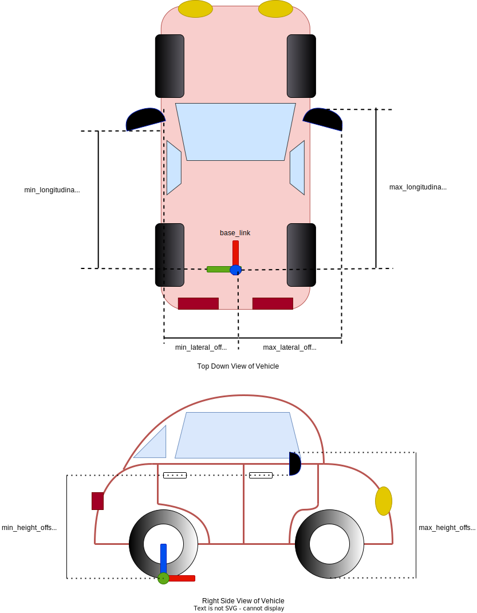
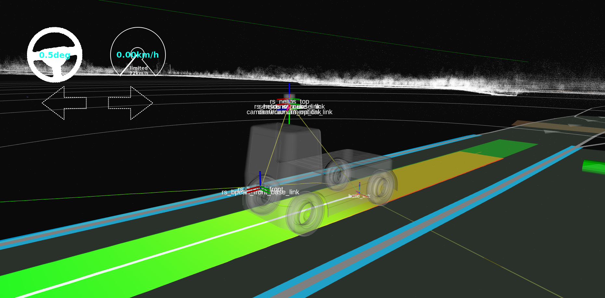

# Autoware 用の車両モデルの作成

## 導入

このページでは、以下の車両モデル向けのパッケージを紹介します:

1. `<YOUR-VEHICLE-NAME>_vehicle_description`
2. `<YOUR-VEHICLE-NAME>_vehicle_launch`

以前は、
[Autoware リポジトリの作成](../../creating-your-autoware-repositories/creating-autoware-repositories.md) ページのステップで車両モデルをフォークしました
たとえば、
上記のステップの実装例として、[tutorial_vehicle_launch](https://github.com/leo-drive/tutorial_vehicle_launch)を
作成しました。
以下のディレクトリ構造に従って、<YOUR-VEHICLE-NAME>\_vehicle_launchリポジトリが Autoware に
含まれていることを確認してください。:

```diff
<YOUR-OWN-AUTOWARE-DIR>/
  └─ src/
       └─ vehicle/
            └─ <YOUR-VEHICLE-NAME>_vehicle_launch/
                 ├─ <YOUR-VEHICLE-NAME>_vehicle_description/
                 └─ <YOUR-VEHICLE-NAME>_vehicle_launch/
```

フォークされた Autoware メタ リポジトリに上記のような
`<YOUR-VEHICLE-NAME>_vehicle_launch`の正しいフォルダー構造が含まれていない場合は、
フォークされた`<YOUR-VEHICLE-NAME>_vehicle_launch`リポジトリをautoware.repos ファイルに追加し、
ターミナルでvcs import src < autoware.reposコマンドを実行して
新しく組み込まれたメタ リポジトリをautoware.repos ファイルのリポジトリにインポートしてください。

これで、次の車両モデル パッケージを車両用に変更する準備が整いました。
まず、説明の名前を変更してパッケージを起動する必要があります:

```diff
<YOUR-VEHICLE-NAME>_vehicle_launch/
- ├─ sample_vehicle_description/
+ ├─ <YOUR-VEHICLE-NAME>_vehicle_description/
- └─ sample_vehicle_launch/
+ └─ <YOUR-VEHICLE-NAME>_vehicle_launch/
```

その後、
sample_vehicle_description パッケージと Sample_vehicle_launch パッケージの package.xml ファイルと CMakeLists.txt ファイルのパッケージ名を変更します。
そのため、
任意のテキスト エディターまたは IDE で package.xml ファイルと CMakeLists.txt ファイルを開き、
次の変更を実行します:

`package.xml`ファイルの`<name>`属性を変更します:

```diff
<package format="3">
- <name>sample_vehicle_description</name>
+ <name><YOUR-VEHICLE-NAME>_vehicle_description</name>
  <version>0.1.0</version>
  <description>The vehicle_description package</description>
  ...
  ...
```

`CmakeList.txt`ファイルの`project()`メソッドを変更します。

```diff
  cmake_minimum_required(VERSION 3.5)
- project(sample_vehicle_description)
+ project(<YOUR-VEHICLE-NAME>_vehicle_description)

  find_package(ament_cmake_auto REQUIRED)
...
...
```

名前の変更とプロジェクト メソッドを、
`<YOUR-VEHICLE-NAME>_vehicle_description`と`<YOUR-VEHICLE-NAME>_vehicle_launch` ROS 2パッケージの**両方に**に忘れずに適用してください。
完了したら、上記のパッケージのビルドに進むことができます:

```bash
colcon build --symlink-install --cmake-args -DCMAKE_BUILD_TYPE=Release --packages-up-to <YOUR-VEHICLE-NAME>_vehicle_description <YOUR-VEHICLE-NAME>_vehicle_launch
```

## 車両の説明

このパッケージの主な目的は、車両の寸法、
車両の 3D モデル、車両のミラー寸法、シミュレータ モデル パラメータ、
および車両の URDF を記述することです。

vehicle_description パッケージのフォルダー構造は次のとおりです:

```diff
<YOUR-VEHICLE-NAME>_vehicle_description/
   ├─ config/
   │     ├─ mirror.param.yaml
   │     ├─ simulator_model.param.yaml
   │     └─ vehicle_info.param.yaml
   ├─ mesh/
   │     ├─ <YOUR-VEHICLE-MESH-FILE>.dae (or .fbx)
   │     ├─ ...
   └─ urdf/
         └─ vehicle.xacro
```

次に、車両の設計に従ってこれらのファイルを変更します。

### mirror.param.yaml

このファイルは[PointCloudPreprocessor](../../../../design/autoware-architecture/sensing/data-types/point-cloud.md)の
[CropBox filter](https://autowarefoundation.github.io/autoware.universe/main/sensing/pointcloud_preprocessor/docs/crop-box-filter/)の車両ミラーの寸法を記述します 。
これは、lidarの点群からミラーをトリミングする場合に重要です。

`mirror.param.yaml`は次のパラメータで構成されます:

```yaml
/**:
  ros__parameters:
    min_longitudinal_offset: 0.0
    max_longitudinal_offset: 0.0
    min_lateral_offset: 0.0
    max_lateral_offset: 0.0
    min_height_offset: 0.0
    max_height_offset: 0.0
```

ミラーパラメータファイルにはこの寸法情報を記入する必要がありますが、
`min_lateral_offset`パラメータには注意してください。
下のミラー寸法図のように負の値になる可能性があります。

<figure markdown>
  { align=center }
  <figcaption>
    mirror.param.yamlのディメンションのデモ
  </figcaption>
</figure>

!!! 警告

    `tutorial_vehicle` にはミラーがないため、すべての値は 0.0 に設定されます。
    車両にミラーがない場合は、これらの値を 0.0 に設定することもできます。

### simulator_model.param.yaml

このファイルは[シミュレータ環境](https://autowarefoundation.github.io/autoware.universe/main/simulator/simple_planning_simulator/)用の設定ファイルです。
車両の仕様に応じてこれらのパラメータを更新してください。
変数の詳細については、
[simple_planning_simulator](https://github.com/autowarefoundation/autoware.universe/tree/main/simulator/simple_planning_simulator)パッケージを確認してください。
ファイルは次のパラメータで構成されます:

```yaml
/**:
  ros__parameters:
    simulated_frame_id: "base_link" # center of the rear axle.
    origin_frame_id: "map"
    vehicle_model_type: "DELAY_STEER_ACC_GEARED" # options: IDEAL_STEER_VEL / IDEAL_STEER_ACC / IDEAL_STEER_ACC_GEARED / DELAY_STEER_ACC / DELAY_STEER_ACC_GEARED
    initialize_source: "INITIAL_POSE_TOPIC" #  options: ORIGIN / INITIAL_POSE_TOPIC
    timer_sampling_time_ms: 25
    add_measurement_noise: False # the Gaussian noise is added to the simulated results
    vel_lim: 50.0 # limit of velocity
    vel_rate_lim: 7.0 # limit of acceleration
    steer_lim: 1.0 # limit of steering angle
    steer_rate_lim: 5.0 # limit of steering angle change rate
    acc_time_delay: 0.1 # dead time for the acceleration input
    acc_time_constant: 0.1 # time constant of the 1st-order acceleration dynamics
    steer_time_delay: 0.24 # dead time for the steering input
    steer_time_constant: 0.27 # time constant of the 1st-order steering dynamics
    x_stddev: 0.0001 # x standard deviation for dummy covariance in map coordinate
    y_stddev: 0.0001 # y standard deviation for dummy covariance in map coordinate
```

### vehicle_info.param.yaml

このファイルには、Autoware モジュールの車両の寸法が保存されます。
車両情報を更新してください。
詳細な寸法のデモンストレーションについては、[車両の寸法](../../../../design/autoware-interfaces/components/vehicle-dimensions.md)ページを参照してください。
これは[sample_vehicle](https://github.com/autowarefoundation/sample_vehicle_launch/blob/main/sample_vehicle_description/config/vehicle_info.param.yaml)の`vehicle_info.param.yaml`です:

```yaml
/**:
  ros__parameters:
    wheel_radius: 0.383 # The radius of the wheel, primarily used for dead reckoning.
    wheel_width: 0.235 # The lateral width of a wheel tire, primarily used for dead reckoning.
    wheel_base: 2.79 # between front wheel center and rear wheel center
    wheel_tread: 1.64 # between left wheel center and right wheel center
    front_overhang: 1.0 # between front wheel center and vehicle front
    rear_overhang: 1.1 # between rear wheel center and vehicle rear
    left_overhang: 0.128 # between left wheel center and vehicle left
    right_overhang: 0.128 # between right wheel center and vehicle right
    vehicle_height: 2.5
    max_steer_angle: 0.70 # [rad]
```

`vehicle_info.param.yaml`の車両情報を更新してください。

### 車両の3Dモデル

autoware では、.fbx または .dae 形式を 3D モデルとして使用できます。
tutorial_vehicle の場合、
tutorial_vehicle の場合、3D モデルを .fbx ファイルとして[tutorial_vehicle_launch](https://github.com/leo-drive/tutorial_vehicle_launch/tree/main/tutorial_vehicle_description/mesh) リポジトリにエクスポートしました。
`vehicle.xacro`ファイルに .fbx ファイルのパスを設定します。

### vehicle.xacro

この.xacroファイルは、車両のbase_link を 3D メッシュにリンクします。したがって、このファイルにいくつかの変更を加える必要があります。

```diff
<?xml version="1.0"?>
<robot xmlns:xacro="http://ros.org/wiki/xacro">
  <!-- load parameter -->
- <xacro:property name="vehicle_info" value="${xacro.load_yaml('$(find sample_vehicle_description)/config/vehicle_info.param.yaml')}"/>
+ <xacro:property name="vehicle_info" value="${xacro.load_yaml('$(find <YOUR-VEHICLE-NAME>_vehicle_description)/config/vehicle_info.param.yaml')}"/>

  <!-- vehicle body -->
  <link name="base_link">
    <visual>
      <origin xyz="${vehicle_info['/**']['ros__parameters']['wheel_base']/2.0} 0 0" rpy="${pi/2.0} 0 ${pi}"/>
      <geometry>
-       <mesh filename="package://sample_vehicle_description/mesh/lexus.dae" scale="1 1 1"/>
+       <mesh filename="package://<YOUR-VEHICLE-NAME>_vehicle_description/mesh/<YOUR-3D-MESH-FILE>" scale="1 1 1"/>
      </geometry>
    </visual>
  </link>
</robot>
```

車両の正しい位置と方向を得るために、ロール、ピッチ、ヨー、x、
y、z およびスケールの値を変更することもできます。

<YOUR-VEHICLE-NAME>\_vehicle_descriptionパッケージが完成したら、 vehicle_description パッケージをビルドしてください。

```bash
cd <YOUR-AUTOWARE-DIR>
colcon build --symlink-install --cmake-args -DCMAKE_BUILD_TYPE=Release --packages-up-to <YOUR-VEHICLE-NAME>_vehicle_description <YOUR-VEHICLE-NAME>_vehicle_launch
```

### 車両インターフェースの起動

車両インターフェースの準備ができている場合は、
 vehicle_interface 起動ファイルを`vehicle_interface.launch.xml`に追加できます。
詳細については、[車両インターフェースの作成](../../creating-vehicle-interface-package/creating-a-vehicle-interface-for-an-ackermann-kinematic-model.md)ページをご確認ください。

### 自分の車両で計画シミュレーターを起動

[sensor_model](../creating-sensor-model/index.md),
[individual_parameters](../creating-individual-params/index.md)
および車両モデルを完了すると 、
自分の車両でプランニング シミュレーターを起動する準備が整います。
Autoware プロジェクト フォルダー内のすべてのカスタム パッケージがビルドされているかどうかわからない場合は、
すべてのパッケージをビルドしてください:

```bash
cd <YOUR-AUTOWARE-DIR>
colcon build --symlink-install --cmake-args -DCMAKE_BUILD_TYPE=Release
```

計画シミュレーターを起動するには、
Autoware プロジェクト フォルダー内の install/setup.bash ファイルを実行し、
ターミナルで次のコマンドを実行します:

```bash
ros2 launch autoware_launch planning_simulator.launch.xml map_path:=$HOME/Files/autoware_map/sample-map-planning/ vehicle_model:=<YOUR-VEHICLE-MODEL> sensor_model:=<YOUR-SENSOR-KIT> vehicle_id:=<YOUR-VEHICLE-ID>
```

たとえば、tutorial_vehicle を使用して計画シミュレータを試してみると、次のようになります:

```bash
ros2 launch autoware_launch planning_simulator.launch.xml map_path:=$HOME/Files/autoware_map/sample-map-planning/ vehicle_model:=tutorial_vehicle sensor_model:=tutorial_vehicle_sensor_kit vehicle_id:=tutorial_vehicle
```

プランニング シミュレータが開き、
`2D Pose Estimate`ボタンを使用するか`P`キーを押して、車両に初期ポーズを与えることができます。
車両の初期化のためにどこでもクリックできます。

<figure markdown>
  { align=center }
  <figcaption>
    TF データを使用した rviz 上のtutorial_vehicle
  </figcaption>
</figure>
