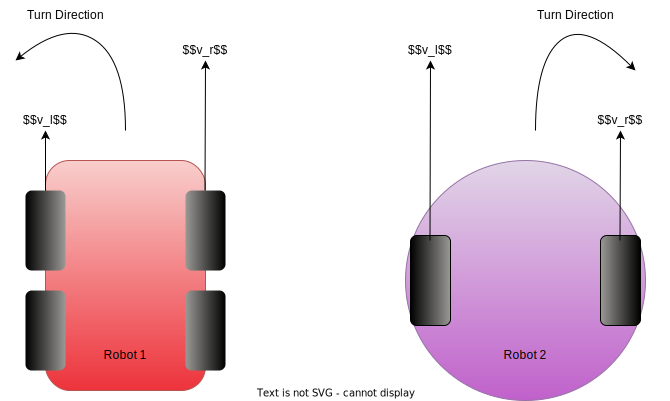

# デフ車のカスタマイズ

## 1. はじめに

現在、Autoware は、車両がアッカーマン ステアリングを備えたアッカーマン運動学モデルを使用していることを前提としています。
したがって、Autoware は、Control モジュールの出力に Ackermann コマンド形式を採用します
(Ackermann コマンドの概要については[AckermannDrive ROS メッセージ定義](http://docs.ros.org/en/api/ackermann_msgs/html/msg/AckermannDrive.html)を、
詳細については Autoware で使用される[AckermannControlCommands 構造体](https://gitlab.com/autowarefoundation/autoware.auto/autoware_auto_msgs/-/blob/master/autoware_auto_control_msgs/msg/AckermannControlCommand.idl)を
参照してください)。

ただし、
小型移動ロボットで一般的に使用される
差動駆動運動学モデルに従う車両と
Autoware を統合することは可能です。
以下の図に示すように、ディファレンシャル車両は 4 輪または 2 輪のいずれかになります。

<figure markdown>
  { align=center }
  <figcaption>
    4 輪モデルと 2 輪モデルの差動車両のサンプル。
  </figcaption>
</figure>

## 2. 手順

Autoware を差動駆動車両で使用する簡単な方法の 1 つは、アッカーマン コマンドを差動駆動コマンドに変換する`vehicle_interface`パッケージを作成することです。
考慮する必要がある点は次の 2 つです:

- デフ車用`vehicle_interface`パッケージの作成
- `wheel_base`の適切な値を設定します

### 2.1 デフ車用`vehicle_interface`パッケージの作成

Autoware の Ackermann コマンドは、次の 2 つの主要な制御入力で構成されます:

- ステアリング角度 ($\omega$)
- 速度 ($v$)

逆に、一般的な差動駆動コマンドは次の入力で構成されます:

- 左車輪速度 ($v_l$)
- 右車輪速度 ($v_r$)

したがって、アッカーマン コマンドを差動ドライブ コマンドに変換する 1 つの方法は、次の方程式を使用することです:

$$
v_l = v - \frac{l\omega}{2},
v_r = v + \frac{l\omega}{2}
$$

$l$は車輪の踏面を指します。

以下は、アッカーマンモデルの運動学を差分モデルに
変換するための`.cpp` スニペットの例です:

```c++
...
void convert_ackermann_to_differential(
  autoware_auto_control_msgs::msg::AckermannControlCommand & ackermann_msg
  my_vehicle_msgs::msg::DifferentialCommand & differential_command)
{
    differential_command.left_wheel.velocity =
      ackermann_msg.longitudinal.speed - (ackermann_msg.lateral.steering_tire_angle * my_wheel_tread) / 2;
    differential_command.right_wheel.velocity =
      ackermann_msg.longitudinal.speed + (ackermann_msg.lateral.steering_tire_angle * my_wheel_tread) / 2;
}
...
```

`vehicle_interface`パッケージを作成するときに
考慮する必要があるその他の要素については、 
[creating `vehicle_interface`の作成ページ](./creating-vehicle-interface.md)を参照してください。

### 2.2 `wheel_base`の適切な設定

- 
差動駆動ロボットには必ずしも前輪と後輪があるわけではないため、ホイールベース（前輪と後輪の車軸間の水平距離）を定義することができません。ただし、Autoware は`vehicle_info.param.yaml`の`wheel_base`に何らかの値が設定されることを期待しています。
したがって、`wheel_base`に疑似値を設定する必要があります。

`wheel_base`の適切な疑似値は、車両のサイズによって異なります。
考えられる選択肢の 1 つは、`wheel_tread`と同じ値に設定することです。

!!! 警告

    - `wheel_base`の値が小さすぎると、車両が予期せぬ動作をする可能性があります。たとえば、車両が計算された経路の境界を越えて走行する場合があります。
    - 逆に、wheel_base を大きく設定しすぎると、車両の可動範囲が制限されてしまいます。その理由は、Autoware の計画モジュールが、想定される車両の長さに基づいて過度に保守的な軌道を計算するためです。

## 3. 既知の問題

### モーションモデルの非互換性

Autoware は車両がステアリング システムを使用することを前提としているため、差動駆動システムの運動モデルの柔軟性を利用することはできません。

たとえば、`freespace_planner`モジュールを使用して駐車操作を計画する場合、純粋な回転運動を使用する単純な軌道で車両を駐車できる場合でも、Autoware は差動駆動車両を前後に駆動する場合があります。
