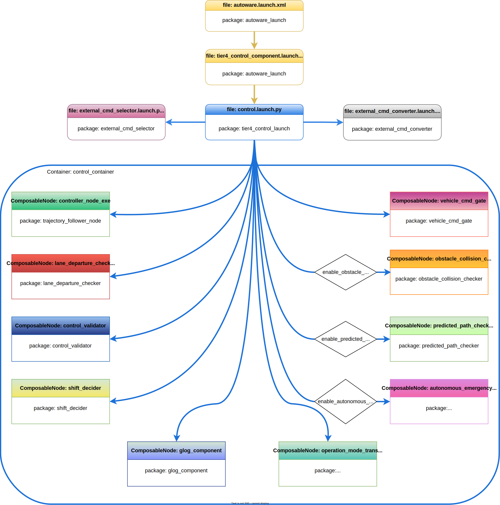

# 起動ファイルの制御

## 概要

Autoware コントロール スタックは、
[Autoware の起動](../index.md)ページで説明されているように、`autoware_launch.xml`で起動を開始します。
`autoware_launch`パッケージには、
`autoware_launch.xml`からの制御起動ファイルの呼び出しを開始するための`tier4_control_component.launch.xml`が含まれています。
以下の図は、autoware_launch および autoware.universe パッケージ内の Autoware コントロール起動ファイルのフローを示しています。

<figure markdown>
  { align=center }
  <figcaption>
    Autoware コントロール起動フロー図
  </figcaption>
</figure>

!!! 注記

    Autoware プロジェクトは大規模なプロジェクトです。
    したがって、Autoware プロジェクトを管理する際には、
    起動ファイル内の特定の引数を利用します。
    ROS 2 は、これらの起動ファイルの引数をオーバーライドする機能を提供します。
    詳細については[公式 ROS 2 起動ドキュメント](https://docs.ros.org/en/humble/Tutorials/Intermediate/Launch/Using-ROS2-Launch-For-Large-Projects.html#parameter-overrides)を参照してください。
    例えば、
    トップレベルの起動時に引数を定義すると、
    下位レベルの起動時に値をオーバーライドします。

## tier4_control_component.launch.xml

tier4_control_component.launch.xml 起動ファイルは、autoware_launch パッケージ内のメインの制御コンポーネント起動です。
この起動ファイルは、autoware.universe リポジトリ内の[tier4_control_launch](https://github.com/autowarefoundation/autoware.universe/tree/main/launch/tier4_control_launch)パッケージから
control.launch.xmlを呼び出します。
tier4_control_component.launch.xml でコントロール起動引数を変更できます。
さらに
tier4_control_component.launch.xml は他のコントロール起動ファイルの最上位起動ファイルとして機能するため、
調整が必要なその他の必要な引数を追加できます。
以下に、事前定義されたコントロール起動引数をいくつか示します:

- **`lateral_controller_mode:`** この引数は、
  ラテラル コントローラーのアルゴリズムを決定します。
  デフォルト値は`mpc`です。
  pure pursuitに変更するには、
  `tier4_control_component.launch.xml`ファイル内で次の更新を行います:

  ```diff
  - <arg name="lateral_controller_mode" default="mpc"/>
  + <arg name="lateral_controller_mode" default="pure_pursuit"/>
  ```

- **`enable_autonomous_emergency_braking:`** の引数により、
  特定の状況下で自律的な緊急ブレーキが有効になります。
  詳細については、[自動緊急ブレーキ (AEB) ](https://autowarefoundation.github.io/autoware.universe/main/control/autonomous_emergency_braking/)のページを
  参照してください。.
  これを有効にするには、`tier4_control_component.launch.xml`ファイル内の値を更新します:

  ```diff
  - <arg name="enable_autonomous_emergency_braking" default="false"/>
  + <arg name="enable_autonomous_emergency_braking" default="true"/>
  ```

- **`enable_predicted_path_checker:`** この引数は、予測パス チェッカー モジュールを有効にします。
  詳細については、[予測パス チェッカー](https://autowarefoundation.github.io/autoware.universe/main/control/predicted_path_checker/)のページを
  参照してください。
  これを有効にするには、`tier4_control_component.launch.xml`ファイル内の値を更新します:

  ```diff
  - <arg name="enable_predicted_path_checker" default="false"/>
  + <arg name="enable_predicted_path_checker" default="true"/>
  ```

!!! 注記

    この引数をコマンドライン引数として使用することもできます:
    ```bash
    ros2 launch autoware_launch autoware.launch.xml ... enable_predicted_path_checker:=true lateral_controller_mode:=pure_pursuit ...
    ```

tier4_control_component.launch.xml の事前定義引数については上で説明しました。
ただし、autoware_launch 制御構成パラメーターには、多数の制御引数が含まれています。
