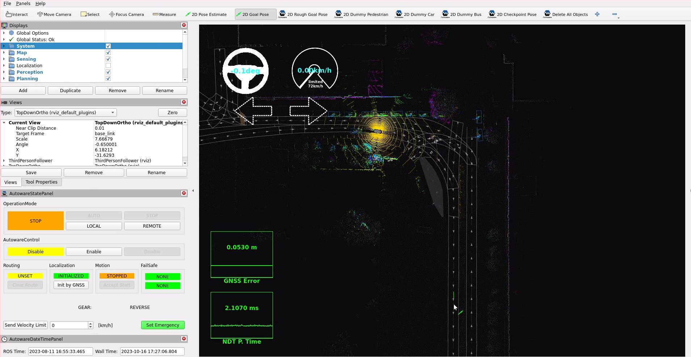

オートウェアを起動する
このセクションでは、Autoware を使用して車両を実行する方法について説明します。これらのモジュールを使用して Autoware を実行および起動する方法を説明します。

車両
システム
地図
センシング
ローカリゼーション
感知
企画
コントロール
実車で Autoware を起動するための前提条件
Autoware を車両に統合するには、次の手順を完了してください。

Autoware メタリポジトリを作成します。
車両とセンサーのモデルを作成します。
センサーを調整します。
Autoware 互換の車両インターフェイスを作成します。
環境マップを作成します。
個々の車両に応じてこれらの手順を完了すると、Autoware を使用する準備が整います。

autoware_launch パッケージ
autoware_launchパッケージは、 Autoware ソフトウェア スタック起動ファイルの開始を開始します。autoware.launch.xml起動ファイルは、次の起動引数を有効にすることで、これらのモジュール起動の呼び出しを有効にします。

  <arg name="launch_vehicle" default="true" description="launch vehicle"/>
  <arg name="launch_system" default="true" description="launch system"/>
  <arg name="launch_map" default="true" description="launch map"/>
  <arg name="launch_sensing" default="true" description="launch sensing"/>
  <arg name="launch_sensing_driver" default="true" description="launch sensing driver"/>
  <arg name="launch_localization" default="true" description="launch localization"/>
  <arg name="launch_perception" default="true" description="launch perception"/>
  <arg name="launch_planning" default="true" description="launch planning"/>
  <arg name="launch_control" default="true" description="launch control"/>
たとえば、ローカリゼーション デバッグのために認識、計画、および制御を起動する必要がない場合は、次のようにこれらのモジュールを無効にすることができます。

-  <arg name="launch_perception" default="true" description="launch perception"/>
+  <arg name="launch_perception" default="false" description="launch perception"/>
-  <arg name="launch_planning" default="true" description="launch planning"/>
+  <arg name="launch_planning" default="false" description="launch planning"/>
-  <arg name="launch_control" default="true" description="launch control"/>
+  <arg name="launch_control" default="false" description="launch control"/>
また、コマンドライン引数を使用して起動するコンポーネントを指定することもできます。

ros2 launch autoware_launch autoware.launch.xml vehicle_model:=YOUR_VEHICLE sensor_kit:=YOUR_SENSOR_KIT map_path:=/PATH/TO/YOUR/MAP \
    launch_perception:=false \
    launch_planning:=false \
    launch_control:=false
また、autoware_launch パッケージには、ディレクトリの下に autoware モジュールのパラメータ ファイルが含まれていますconfig。

<YOUR-OWN-AUTOWARE-DIR>/
  └─ src/
       └─ launcher/
            └─ autoware_launch/
                 ├─ config/
                 ├─     ├─ control/
                 ├─     ├─ localization/
                 ├─     ├─ map/
                 ├─     ├─ perception/
                 ├─     ├─ planning/
                 ├─     ├─ simulator/
                 ├─     └─ system/
                 ├─launch/
                 └─ rviz/
したがって、ディレクトリ内のパラメータを変更すると、パラメータ ファイルのパスがパラメータのロードに使用されるconfigため、元のパラメータ値が上書きされます。autoware_launch

{ align=center } autoware_launch パッケージの起動とパラメータ移行の図
構成、設定autoware.launch.xml
上で述べたように、autoware.launch.xmlコマンドライン引数を変更または使用することで、Autoware モジュールの起動を有効または無効にすることができます。また、Autoware 構成を指定するための引数がいくつかあります。autoware.launch.xml 起動ファイルの基本構成をいくつか示します: (さらに、前述したように、これらをコマンドライン引数として使用することもできます)

車両
「車両」セクションでは、車両インターフェースを起動するかどうかを選択できます。たとえば、これを無効にすると、 はvehicle_interface.launch.xml呼び出されなくなります。

- <arg name="launch_vehicle_interface" default="true" description="launch vehicle interface"/>
+ <arg name="launch_vehicle_interface" default="false" description="launch vehicle interface"/>
車両インターフェース ドライバーが に含まれていることを確認してくださいvehicle_interface.launch.xml。詳細については、 車両インターフェースの作成 ページを参照してください。

地図
点群および Lanlet2 マップ名が pointcloud_map.pcd および Lanlet2_map.osm と異なる場合は、これらのマップ ファイル名の引数を更新する必要があります。

- <arg name="lanelet2_map_file" default="lanelet2_map.osm" description="lanelet2 map file name"/>
+ <arg name="lanelet2_map_file" default="<YOUR-LANELET2-MAP-FILE-NAME>" description="lanelet2 map file name"/>
- <arg name="pointcloud_map_file" default="pointcloud_map.pcd" description="pointcloud map file name"/>
+ <arg name="pointcloud_map_file" default="<YOUR-POINTCLOUD-MAP-FILE-NAME>" description="pointcloud map file name"/>
感知
ここでパスを定義できますautoware_data。Autoware は、yabloc_pose_initializer、image_projection_based_fusion、lidar_apollo_instance_segmentation などのモデル ファイルをautoware_dataパスとともに取得します。自動ウェアのインストールに ansible を使用する場合、必要なアーティファクトがディレクトリautoware_data上のフォルダーにダウンロードされます$HOME。アーティファクトを手動でダウンロードする場合は、Ansibleartifactsページで情報を確認してください。

- <arg name="data_path" default="$(env HOME)/autoware_data" description="packages data and artifacts directory path"/>
+ <arg name="data_path" default="<YOUR-AUTOWARE-DATA-PATH>" description="packages data and artifacts directory path"/>
また、ここで認識方法を変更することもできます。Autoware はcamera-lidar-radar fusion、 camera-lidar fusion、lidar-radar fusion、 、lidar onlyおよびradar only知覚モードを提供します。デフォルトの認識方法はlidar onlyモードですが、使用したい場合はcamera-lidar fusion認識モードを変更する必要があります。

-  <arg name="perception_mode" default="lidar" description="select perception mode. camera_lidar_radar_fusion, camera_lidar_fusion, lidar_radar_fusion, lidar, radar"/>
+  <arg name="perception_mode" default="camera_lidar_fusion" description="select perception mode. camera_lidar_radar_fusion, camera_lidar_fusion, lidar_radar_fusion, lidar, radar"/>
信号認識と視覚化を使用する場合は、traffic_light_recognition/enable_fine_detectiontrue (デフォルト) に設定できます。 詳細については、traffic_light_fine_detectorページを確認してください 。信号分類器を使用したくない場合は、それを無効にすることができます。

- <arg name="traffic_light_recognition/enable_fine_detection" default="true" description="enable traffic light fine detection"/>
+ <arg name="traffic_light_recognition/enable_fine_detection" default="false" description="enable traffic light fine detection"/>
詳細については、「起動認識」ページをご覧ください。

オートウェアを起動する
次のコマンドで Autoware を起動します。

ros2 launch autoware_launch autoware_launch.launch.xml map_path:=<YOUR-MAP-PATH> vehicle_model:=<YOUR-VEHICLE-MODEL> sensor_model:=<YOUR-SENSOR-MODEL> vehicle_id:=<YOUR-VEHICLE-ID>
コマンドライン引数を使用して、起動するコンポーネントを指定できます。たとえば、ローカリゼーション デバッグのために認識、計画、および制御を起動する必要がない場合は、次のものを起動できます。

ros2 launch autoware_launch autoware_launch.launch.xml map_path:=<YOUR-MAP-PATH> vehicle_model:=<YOUR-VEHICLE-MODEL> sensor_model:=<YOUR-SENSOR-MODEL> vehicle_id:=<YOUR-VEHICLE-ID> \
    launch_perception:=false \
    launch_planning:=false \
    launch_control:=false
Autoware を起動した後、マップ上で車両を初期化する必要があります。GNSS/INS センサーのgnss_poser をに設定するとgnss.launch.xml、gnss_poser は初期化のためにポーズを送信します。GNSS センサーがない場合は、初期ポーズを手動で設定する必要があります。

初期ポーズを設定する
そうでない場合、または自動初期化によって間違った位置が返された場合は、RViz GUI を使用して初期ポーズを設定する必要があります。

ツールバーの 2D ポーズ推定ボタンをクリックするか、P キーを押します。
{ align=center } RViz による 2D ポーズ推定
[3D ビュー] パネルで、マウスの左ボタンをクリックしたままドラッグして、初期ポーズの方向を設定します。
{ align=center } RViz で 2D ポーズ推定を設定する
その後、車両の初期化が行われます。次に、車両と Autoware の出力の両方を観察します。
{ align=center } 車両の初期化
ゴールポーズを設定する
自我車両のゴールポーズを設定します。

ツールバーの「2D ナビゲーション目標」ボタンをクリックするか、G キーを押します。
{ align=center } 車両の初期化
3D ビュー ペインで、マウスの左ボタンをクリックしたままドラッグして、ゴール ポーズの方向を設定します。
{ align=center } 車両の初期化
成功すると、計算された計画パスが RViz 上に表示されます。
{ align=center } RViz 上の計画されたパス
従事する
エンゲージメントには 2 つのオプションがあります。

まず、 を使用できますAutowareStatePanel。これは Autoware RViz 構成ファイルに含まれていますが、 にありますPanels > Add New Panel > tier4_state_rviz_plugin > AutowareStatePanel。
ルートが計算されると、「AUTO」ボタンがアクティブになります。AUTO ボタンを押すと自動運転モードになります。

{ align=center } Autoware 状態パネル (STOP 動作モード)
次に、ROS 2 のトピックに取り組むことができます。ターミナルで次のコマンドを実行します。
source ~/<YOUR-AUTOWARE-DIR>/install/setup.bash
ros2 topic pub /<YOUR-AUTOWARE-DIR>/engage autoware_auto_vehicle_msgs/msg/Engage "engage: true" -1
これで、車両は計算された経路に沿って走行するはずです。

自動運転中は、下の図に示すように StatePanel が表示されます。「STOP」ボタンを押すと車両を停止できます。

{ align=center } Autoware 状態パネル (AUTO 動作モード)
# Launch Autoware

This section explains how to run your vehicle with Autoware.
We will explain how to run and launch autoware with these modules:

- [Vehicle](./vehicle)
- [System](./system)
- [Map](./map)
- [Sensing](./sensing)
- [Localization](./localization)
- [Perception](./perception)
- [Planning](./planning)
- [Control](./control)

## Pre-requirements of launching Autoware with real vehicle

Please complete these steps for integration Autoware on your vehicle:

- [Create your Autoware meta-repository](../creating-your-autoware-repositories/creating-autoware-repositories.md).
- [Create your vehicle and sensor model](../creating-vehicle-and-sensor-model/index.md).
- [Calibrate your sensors](../creating-vehicle-and-sensor-model/calibrating-sensors/index.md).
- [Create your Autoware compatible vehicle interface](../creating-vehicle-interface-package/vehicle-interface.md).
- [Create your environment map](../creating-maps).

After the completion of these steps according to your individual vehicle,
you are ready to use Autoware.

## autoware_launch package

The [autoware_launch](https://github.com/autowarefoundation/autoware_launch) package starts the initiation of Autoware software stack launch files.
The [autoware.launch.xml](https://github.com/autowarefoundation/autoware_launch) launch file enables the invocation of these module launches
by enabling the following launch arguments:

```xml
  <arg name="launch_vehicle" default="true" description="launch vehicle"/>
  <arg name="launch_system" default="true" description="launch system"/>
  <arg name="launch_map" default="true" description="launch map"/>
  <arg name="launch_sensing" default="true" description="launch sensing"/>
  <arg name="launch_sensing_driver" default="true" description="launch sensing driver"/>
  <arg name="launch_localization" default="true" description="launch localization"/>
  <arg name="launch_perception" default="true" description="launch perception"/>
  <arg name="launch_planning" default="true" description="launch planning"/>
  <arg name="launch_control" default="true" description="launch control"/>
```

For example, if you don't need to launch perception, planning,
and control for localization debug, you can disable these modules like the following:

```diff
-  <arg name="launch_perception" default="true" description="launch perception"/>
+  <arg name="launch_perception" default="false" description="launch perception"/>
-  <arg name="launch_planning" default="true" description="launch planning"/>
+  <arg name="launch_planning" default="false" description="launch planning"/>
-  <arg name="launch_control" default="true" description="launch control"/>
+  <arg name="launch_control" default="false" description="launch control"/>
```

Also, it is possible to specify which components to launch using command-line arguments.

```bash
ros2 launch autoware_launch autoware.launch.xml vehicle_model:=YOUR_VEHICLE sensor_kit:=YOUR_SENSOR_KIT map_path:=/PATH/TO/YOUR/MAP \
    launch_perception:=false \
    launch_planning:=false \
    launch_control:=false
```

Also, `autoware_launch`
package includes autoware modules parameter files under the `config` directory.

```diff
<YOUR-OWN-AUTOWARE-DIR>/
  └─ src/
       └─ launcher/
            └─ autoware_launch/
                 ├─ config/
                 ├─     ├─ control/
                 ├─     ├─ localization/
                 ├─     ├─ map/
                 ├─     ├─ perception/
                 ├─     ├─ planning/
                 ├─     ├─ simulator/
                 ├─     └─ system/
                 ├─launch/
                 └─ rviz/
```

So, if we change any parameter in `config` directory,
it will override the original parameter values
since `autoware_launch` parameter file path is used for parameter loading.

<figure markdown>
  { align=center }
  <figcaption>
    autoware_launch package launching and parameter migrating diagram
  </figcaption>
</figure>

## Configure `autoware.launch.xml`

As we mentioned above,
we can enable or disable Autoware modules
to launch by modifying `autoware.launch.xml` or using command-line arguments.
Also, we have some arguments for specifying our Autoware configurations.
Here are some basic configurations for the autoware.launch.xml launch file:
(Additionally, you can use them as command-line arguments, as we mentioned before)

### Vehicle

In the Vehicle section, you can choose whether the vehicle interface will be launched or not.
For example, if you disable it, then `vehicle_interface.launch.xml` will not be called:

```diff
- <arg name="launch_vehicle_interface" default="true" description="launch vehicle interface"/>
+ <arg name="launch_vehicle_interface" default="false" description="launch vehicle interface"/>
```

Please be sure your vehicle interface driver included in `vehicle_interface.launch.xml`,
for more information you can refer the
[creating vehicle interface](../creating-vehicle-interface-package/creating-vehicle-interface.md#3-prepare-a-launch-file)
page.

### Map

If your point cloud and lanelet2 map names are different from pointcloud_map.pcd and lanelet2_map.osm,
you will need to update these map file name arguments:

```diff
- <arg name="lanelet2_map_file" default="lanelet2_map.osm" description="lanelet2 map file name"/>
+ <arg name="lanelet2_map_file" default="<YOUR-LANELET2-MAP-FILE-NAME>" description="lanelet2 map file name"/>
- <arg name="pointcloud_map_file" default="pointcloud_map.pcd" description="pointcloud map file name"/>
+ <arg name="pointcloud_map_file" default="<YOUR-POINTCLOUD-MAP-FILE-NAME>" description="pointcloud map file name"/>
```

### Perception

You can define your `autoware_data` path here.
Autoware gets yabloc_pose_initializer,
image_projection_based_fusion,
lidar_apollo_instance_segmentation etc. models file with `autoware_data` path.
If you use ansible for autoware installation,
the necessary artifacts will be downloaded at `autoware_data` folder on your `$HOME` directory.
If you want to download artifacts manually,
please check ansible [`artifacts`](https://github.com/autowarefoundation/autoware/tree/main/ansible/roles/artifacts) page for information.

```diff
- <arg name="data_path" default="$(env HOME)/autoware_data" description="packages data and artifacts directory path"/>
+ <arg name="data_path" default="<YOUR-AUTOWARE-DATA-PATH>" description="packages data and artifacts directory path"/>
```

Also, you can change your perception method here.
The Autoware provides `camera-lidar-radar fusion`,
`camera-lidar fusion`, `lidar-radar fusion`, `lidar only` and `radar only` perception modes.
The default perception method is `lidar only` mode,
but if you want to use `camera-lidar fusion` you need to change your perception mode:

```diff
-  <arg name="perception_mode" default="lidar" description="select perception mode. camera_lidar_radar_fusion, camera_lidar_fusion, lidar_radar_fusion, lidar, radar"/>
+  <arg name="perception_mode" default="camera_lidar_fusion" description="select perception mode. camera_lidar_radar_fusion, camera_lidar_fusion, lidar_radar_fusion, lidar, radar"/>
```

If you want to use traffic light recognition and visualization,
you can set `traffic_light_recognition/enable_fine_detection` as true (default).
Please check
[traffic_light_fine_detector](https://autowarefoundation.github.io/autoware.universe/main/perception/traffic_light_fine_detector/)
page for more information.
If you don't want to use traffic light classifier, then you can disable it:

```diff
- <arg name="traffic_light_recognition/enable_fine_detection" default="true" description="enable traffic light fine detection"/>
+ <arg name="traffic_light_recognition/enable_fine_detection" default="false" description="enable traffic light fine detection"/>
```

Please look at [Launch perception](./perception) page for detailed information.

## Launch Autoware

Launch Autoware with the following command:

```bash
ros2 launch autoware_launch autoware_launch.launch.xml map_path:=<YOUR-MAP-PATH> vehicle_model:=<YOUR-VEHICLE-MODEL> sensor_model:=<YOUR-SENSOR-MODEL> vehicle_id:=<YOUR-VEHICLE-ID>
```

It is possible to specify which components to launch using command-line arguments.
For example, if you don't need to launch perception, planning, and control for localization debug, you can launch the following:

```bash
ros2 launch autoware_launch autoware_launch.launch.xml map_path:=<YOUR-MAP-PATH> vehicle_model:=<YOUR-VEHICLE-MODEL> sensor_model:=<YOUR-SENSOR-MODEL> vehicle_id:=<YOUR-VEHICLE-ID> \
    launch_perception:=false \
    launch_planning:=false \
    launch_control:=false
```

After launching Autoware, we need to initialize our vehicle on our map.
If you set [gnss_poser](https://autowarefoundation.github.io/autoware.universe/main/sensing/gnss_poser/) for your GNSS/INS sensor at `gnss.launch.xml`,
then gnss_poser will send pose for initialization.
If you don't have a GNSS sensor, then you need to set initial pose manually.

### Set initial pose

If not or if the automatic initialization returns an incorrect position, you need to set the initial pose using the RViz GUI.

- Click the 2D Pose estimate button in the toolbar, or hit the P key

<figure markdown>
  { align=center }
  <figcaption>
    2D Pose estimate with RViz
  </figcaption>
</figure>

- In the 3D View panel, click and hold the left mouse button, and then drag to set the direction for the initial pose.

<figure markdown>
  { align=center }
  <figcaption>
    Setting 2D Pose estimate with RViz
  </figcaption>
</figure>

- After that, the vehicle will be initialized. You will then observe both your vehicle and Autoware outputs.

<figure markdown>
  { align=center }
  <figcaption>
    Initialization of the vehicle
  </figcaption>
</figure>

### Set goal pose

Set a goal pose for the ego vehicle.

- Click the 2D Nav Goal button in the toolbar, or hit the G key

<figure markdown>
  { align=center }
  <figcaption>
    Initialization of the vehicle
  </figcaption>
</figure>

- In the 3D View pane, click and hold the left mouse button,
  and then drag to set the direction for the goal pose.

<figure markdown>
  { align=center }
  <figcaption>
    Initialization of the vehicle
  </figcaption>
</figure>

- If successful, you will see the calculated planning path on RViz.

<figure markdown>
  { align=center }
  <figcaption>
    Planned path on RViz
  </figcaption>
</figure>

### Engage

There are two options for engage:

- Firstly, you can use `AutowareStatePanel`,
  it is included in Autoware RViz configuration file,
  but it can be found in `Panels > Add New Panel > tier4_state_rviz_plugin > AutowareStatePanel`.

Once the route is computed, the "AUTO" button becomes active.
Pressing the AUTO button engages the autonomous driving mode.

<figure markdown>
  { align=center }
  <figcaption>
    Autoware state panel (STOP operation mode)
  </figcaption>
</figure>

- Secondly, you can engage with ROS 2 topic. In your terminal, execute the following command.

```bash
source ~/<YOUR-AUTOWARE-DIR>/install/setup.bash
ros2 topic pub /<YOUR-AUTOWARE-DIR>/engage autoware_auto_vehicle_msgs/msg/Engage "engage: true" -1
```

Now the vehicle should drive along the calculated path!

During the autonomous driving, the StatePanel appears as shown in the image below. Pressing the "STOP" button allows you to stop the vehicle.

<figure markdown>
  { align=center }
  <figcaption>
    Autoware state panel (AUTO operation mode)
  </figcaption>
</figure>
