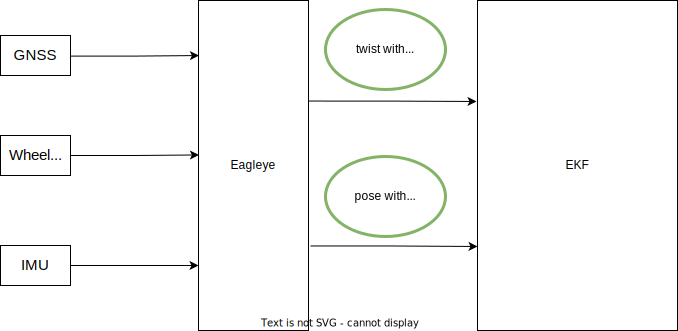

Autoware で Eagleye を使用する
このページでは、 Autoware で使用するためにEagleye をセットアップする方法を説明します。統合提案の詳細については、こちらのディスカッションを参照してください。

イーグリーとは何ですか？
Eagleye は、MAP IV によって最初に開発されたオープンソースの GNSS/IMU ベースのローカライザーです。株式会社_ 低コストの GNSS センサーと IMU センサーを使用して車両の位置、方位、および高度の情報を提供することで、LiDAR および点群ベースの位置特定に代わる費用対効果の高い代替手段を提供します。

依存関係
以下のパッケージはautoware.reposにリストされているため、Autoware のセットアップ中に自動的にインストールされます。

Eagleye (autoware-main ブランチ)
RTKLIB ROS ブリッジ(ros2-v0.1.0 ブランチ)
LLH コンバーター(ros2 ブランチ)
建築
Eagleye は、Autoware ローカリゼーション スタックで次の 2 つの方法で利用できます。

EKF ローカライザーにツイストのみをフィードします。

Eagleye ツイストの統合

Eagleye からツイストとポーズの両方を EKF ローカライザーにフィードします (ツイストは通常​​の で使用することもできますgyro_odometry)。

Eagleye ポーズ ツイストの統合

注: Eagleye を姿勢推定器として使用する場合は、RTK 位置決めが必要です。 一方、ツイスト推定器として使用する場合は必須ではありません。

要件
Eagleye では、入力として GNSS、IMU、車両速度が必要です。

IMUトピック
sensor_msgs/msg/ImuEagleye IMU 入力でサポートされています。

車速の話題
geometry_msgs/msg/TwistStampedおよびgeometry_msgs/msg/TwistWithCovarianceStamped入力車両速度に対してサポートされます。

GNSSトピック
Eagleye には、GNSS 受信機によって生成された緯度/経度の高さとドップラー速度が必要です。GNSS ROS ドライバーは次のメッセージを発行する必要があります。

sensor_msgs/msg/NavSatFix: このメッセージには、緯度、経度、高さの情報が含まれています。
geometry_msgs/msg/TwistWithCovarianceStamped: このメッセージには、GNSS ドップラー速度情報が含まれています。Eagleye は、GNSS ROS ドライバーの例、ublox_gps および septentrio_gnss_driver を使用してテストされています。これらの各ドライバーに必要な設定は次のとおりです。
GNSS ROS ドライバー	修正
ublox_gps	追加の設定は必要ありません。これはデフォルト設定で公開されsensor_msgs/msg/NavSatFix、geometry_msgs/msg/TwistWithCovarianceStampedEagley によって要求されます。
セプテントリオ_gnss_ドライバー	構成ファイルでpublish.navsatfixと を次のように設定しますpublish.twistgnss.yamltrue
車両に組み込むためのパラメータ変更
トピック名とトピックの種類
ユーザーは、 で GNSS 緯度、経度、高さ 、GNSS ドップラー速度 、IMU 、および車両速度の入力トピックを正しく指定する必要がありますeagleye_config.yaml。

# Topic
twist:
  twist_type: 1 # TwistStamped : 0, TwistWithCovarianceStamped: 1
  twist_topic: /sensing/vehicle_velocity_converter/twist_with_covariance
imu_topic: /sensing/imu/tamagawa/imu_raw
gnss:
  velocity_source_type: 2 # rtklib_msgs/RtklibNav: 0, nmea_msgs/Sentence: 1, ublox_msgs/NavPVT: 2, geometry_msgs/TwistWithCovarianceStamped: 3
  velocity_source_topic: /sensing/gnss/ublox/navpvt
  llh_source_type: 2 # rtklib_msgs/RtklibNav: 0, nmea_msgs/Sentence: 1, sensor_msgs/NavSatFix: 2
  llh_source_topic: /sensing/gnss/ublox/nav_sat_fix
センサー周波数
また、GNSS と IMU の周波数を設定する必要があります。eagleye_config.yaml

common:
  imu_rate: 50
  gnss_rate: 5
固定からポーズへの変換
sensor_msgs/msg/NavSatFixに変換するためのパラメータをgeometry_msgs/msg/PoseWithCovarianceStampedに示しますgeo_pose_converter.launch.xml。別のジオイドまたは投影タイプを使用する場合は、これらのパラメータを変更します。

その他のパラメータ
他のパラメータについてはここで説明します。基本的には変更する必要はありません。

初期化に関する注意事項
Eagleye を適切に動作させるには、初期化プロセスが必要です。初期化しないと、ツイストの出力は生の値になり、ポーズ データは使用できなくなります。

1. 静的初期化
最初のステップは静的初期化です。これには、ヨーレート オフセットを推定するために、起動後約 5 秒間 Eaglelye を静止させておくことが含まれます。

2. 動的初期化
次のステップは動的初期化です。これには、Eaglee を約 30 秒間直線で実行することが含まれます。このプロセスでは、車輪速度と方位角のスケール係数を推定します。

動的初期化が完了すると、Eagleye は修正されたツイストとポーズのデータ​​を提供できるようになります。

初期化の進行状況を確認する方法
TODO
地理参照マップに関する注意事項
適切に地理参照されていないマップを使用している場合、出力位置が点群マップに表示されない可能性があることに注意してください。単一の GNSS アンテナの場合、GNSS 測位が利用可能な環境で実行を開始してから、初期位置推定 (動的初期化) が完了するまでに数秒かかることがあります。
# Using Eagleye with Autoware

This page will show you how to set up [Eagleye](https://github.com/MapIV/eagleye) in order to use it with Autoware.
For the details of the integration proposal, please refer to [this discussion](https://github.com/orgs/autowarefoundation/discussions/3257).

## What is Eagleye?

Eagleye is an open-source GNSS/IMU-based localizer initially developed by [MAP IV. Inc](https://map4.jp/). It provides a cost-effective alternative to LiDAR and point cloud-based localization by using low-cost GNSS and IMU sensors to provide vehicle position, orientation, and altitude information.

### Dependencies

The below packages are automatically installed during the setup of Autoware as they are listed in [autoware.repos](https://github.com/autowarefoundation/autoware/blob/main/autoware.repos).

1. [Eagleye](https://github.com/MapIV/eagleye.git) (autoware-main branch)
2. [RTKLIB ROS Bridge](https://github.com/MapIV/rtklib_ros_bridge.git) (ros2-v0.1.0 branch)
3. [LLH Converter](https://github.com/MapIV/llh_converter.git) (ros2 branch)

## Architecture

Eagleye can be utilized in the Autoware localization stack in two ways:

1. Feed only twist into the EKF localizer.

   

2. Feed both twist and pose from Eagleye into the EKF localizer (twist can also be used with regular `gyro_odometry`).

   

**Note: RTK positioning is required when using Eagleye as the pose estimator.**
On the other hand, it is not mandatory when using it as the twist estimator.

## Requirements

Eagleye requires GNSS, IMU and vehicle speed as inputs.

### IMU topic

`sensor_msgs/msg/Imu` is supported for Eagleye IMU input.

### Vehicle speed topic

`geometry_msgs/msg/TwistStamped` and `geometry_msgs/msg/TwistWithCovarianceStamped` are supported for the input vehicle speed.

### GNSS topic

Eagleye requires latitude/longitude height and doppler velocity generated by the GNSS receiver.
Your GNSS ROS driver must publish the following messages:

- `sensor_msgs/msg/NavSatFix`: This message contains latitude, longitude, and height information.
- `geometry_msgs/msg/TwistWithCovarianceStamped`: This message contains gnss doppler velocity information.
  <!-- cspell: ignore ublox -->
  Eagleye has been tested with the following example GNSS ROS drivers: ublox_gps and septentrio_gnss_driver. The settings needed for each of these drivers are as follows:

| GNSS ROS drivers                                                                              | modification                                                                                                                                                                     |
| --------------------------------------------------------------------------------------------- | -------------------------------------------------------------------------------------------------------------------------------------------------------------------------------- |
| [ublox_gps](https://github.com/KumarRobotics/ublox/tree/ros2/ublox_gps)                       | No additional settings are required. It publishes `sensor_msgs/msg/NavSatFix` and `geometry_msgs/msg/TwistWithCovarianceStamped` required by Eagleye with default settings.      |
| [septentrio_gnss_driver](https://github.com/septentrio-gnss/septentrio_gnss_driver/tree/ros2) | Set `publish.navsatfix` and `publish.twist` in the config file [`gnss.yaml`](https://github.com/septentrio-gnss/septentrio_gnss_driver/blob/ros2/config/gnss.yaml#L90) to `true` |

## Parameter Modifications for Integration into Your Vehicle

### topic name & topic type

The users must correctly specify input topics for GNSS latitude, longitude, and height , GNSS doppler speed , IMU , and vehicle speed in the [`eagleye_config.yaml`](https://github.com/MapIV/autoware_launch/blob/3f04a9dd7bc4a4c49d4ec790e3f6b9958ab822da/autoware_launch/config/localization/eagleye_config.param.yaml#L7-L16).

```yaml
# Topic
twist:
  twist_type: 1 # TwistStamped : 0, TwistWithCovarianceStamped: 1
  twist_topic: /sensing/vehicle_velocity_converter/twist_with_covariance
imu_topic: /sensing/imu/tamagawa/imu_raw
gnss:
  velocity_source_type: 2 # rtklib_msgs/RtklibNav: 0, nmea_msgs/Sentence: 1, ublox_msgs/NavPVT: 2, geometry_msgs/TwistWithCovarianceStamped: 3
  velocity_source_topic: /sensing/gnss/ublox/navpvt
  llh_source_type: 2 # rtklib_msgs/RtklibNav: 0, nmea_msgs/Sentence: 1, sensor_msgs/NavSatFix: 2
  llh_source_topic: /sensing/gnss/ublox/nav_sat_fix
```

### sensor frequency

Also, the frequency of GNSS and IMU must be set in [`eagleye_config.yaml`](https://github.com/MapIV/autoware_launch/blob/3f04a9dd7bc4a4c49d4ec790e3f6b9958ab822da/autoware_launch/config/localization/eagleye_config.param.yaml#L36)

```yaml
common:
  imu_rate: 50
  gnss_rate: 5
```

### Conversion from fix to pose

The parameters for converting `sensor_msgs/msg/NavSatFix` to `geometry_msgs/msg/PoseWithCovarianceStamped` is listed in [`geo_pose_converter.launch.xml`](https://github.com/MapIV/eagleye/blob/autoware-main/eagleye_util/geo_pose_converter/launch/geo_pose_converter.launch.xml).
If you use a different geoid or projection type, change these parameters.

### Other parameters

The other parameters are described [here](https://github.com/MapIV/eagleye/tree/autoware-main/eagleye_rt/config).
Basically, these do not need to be changed .

## Notes on initialization

Eagleye requires an initialization process for proper operation. **Without initialization, the output for twist will be in the raw value, and the pose data will not be available.**

### 1. Static Initialization

The first step is static initialization, which involves allowing the Eagleye to remain stationary for approximately 5 seconds after startup to estimate the yaw-rate offset.

### 2. Dynamic initialization

The next step is dynamic initialization, which involves running the Eagleye in a straight line for approximately 30 seconds. This process estimates the scale factor of wheel speed and azimuth angle.

Once dynamic initialization is complete, the Eagleye will be able to provide corrected twist and pose data.

### How to check the progress of initialization

- **TODO**

## Note on georeferenced maps

Note that the output position might not appear to be in the point cloud maps if you are using maps that are not properly georeferenced.
In the case of a single GNSS antenna, initial position estimation (dynamic initialization) can take several seconds to complete after starting to run in an environment where GNSS positioning is available.
