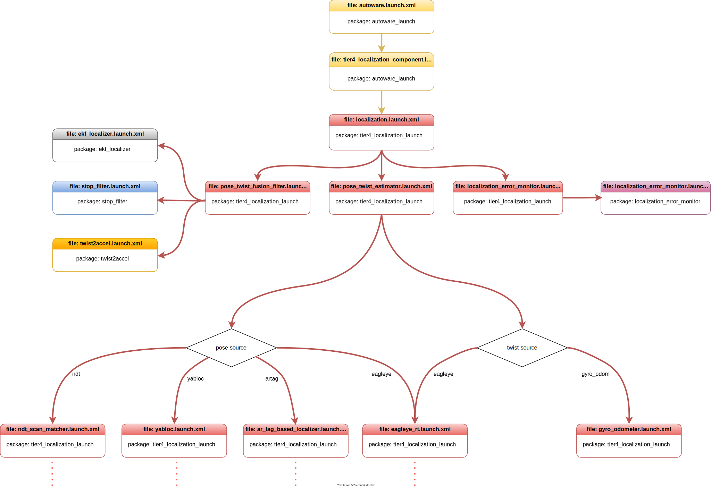

# 位置推定起動ファイル

## 概要

[Autoware の起動](../index.md)ページで説明したように、
Autoware ローカリゼーション スタックは`autoware_launch.xml`で起動を開始します。
`autoware_launch`パッケージには、`autoware_launch.xml`から位置推定を開始する
起動ファイルの呼び出すための`tier4_localization_component.launch.xml`が含まれています。
この図は、`autoware_launch`と`autoware.universe`パッケージでの Autoware ローカリゼーション起動ファイル フローの一部を説明しています。

<figure markdown>
  { align=center }
  <figcaption>
    Autoware位置推定起動フロー図
  </figcaption>
</figure>

!!! 注記

    Autoware プロジェクトは大規模なプロジェクトです。
    したがって、Autoware プロジェクトを管理する際には、
    起動ファイル内の特定の引数を利用します。
    ROS 2 は、これらの起動ファイルの引数をオーバーライドする機能を提供します。
    詳細については[公式 ROS 2 起動ドキュメント](https://docs.ros.org/en/humble/Tutorials/Intermediate/Launch/Using-ROS2-Launch-For-Large-Projects.html#parameter-overrides)を参照してください。
    たとえば、
    トップレベルの起動で引数を定義すると、
    下位レベルの起動ではその値がオーバーライドされます。

## tier4_localization_component.launch.xml

`tier4_localization_component.launch.xml`起動ファイルは、`autoware_launch`パッケージで起動されるメインのローカリゼーション コンポーネントです。
この起動ファイルは、`autoware.universe`リポジトリから[tier4_localization_launch](https://github.com/autowarefoundation/autoware.universe/tree/main/launch/tier4_localization_launch)パッケージの`localization.launch.xml`を呼び出します。
tier4_localization_component.launch.xml でローカリゼーション起動引数を変更できます。

TIER IV によって実装されている現在の位置推定ランチャーは、複数のローカライゼーション方法 (姿勢推定器とねじれ推定器の両方) をサポートしています。T
`tier4_localization_component.launch.xml`には、起動する推定器を選択するための 2 つの引数があります:

- **`pose_source:`** この引数は、位置推定用のpose_estimatorを指定しますが、現在`ndt`(デフォルト)、`yabloc`、`artag`および`eagleye`をサポートしています。
  デフォルトでは、Autoware は姿勢推定器として[ndt_scan_matcher](https://github.com/autowarefoundation/autoware.universe/tree/main/localization/ndt_scan_matcher)起動します。
  YabLoc をカメラベースの位置特定方法として使用できます。
  YabLoc の詳細については、
  autoware.universe の[YabLoc の README](https://github.com/autowarefoundation/autoware.universe/blob/main/localization/yabloc/README.md)を参照してください。
  また、Eagleye を GNSS、IMU、ホイール オドメトリ ベースの位置特定方法として使用することもできます。Eagleye の詳細については、[Eagleye](./eagleye)を参照してください。

  `tier4_localization_component.launch.xml`に`pose_source`引数を設定できます。
  たとえば、eagleye をポーズソースとして使用したい場合は、
  `tier4_localization_component.launch.xml`を次のように更新する必要があります:

  ```diff
  - <arg name="pose_source" default="ndt" description="select pose_estimator: ndt, yabloc, eagleye"/>
  + <arg name="pose_source" default="eagleye" description="select pose_estimator: ndt, yabloc, eagleye"/>
  ```

  また、コマンドラインを使用して起動引数をオーバーライドすることもできます:

  ```bash
  ros2 launch autoware_launch autoware.launch.xml ... pose_source:=eagleye
  ```

- **`twist_source:`** この引数は、Twist_estimatorを指定します。現在(`gyro_odom` デフォルト) および`eagleye`をサポートしています。
  デフォルトでは、
  Autoware はねじれ推定器として[gyro_odometer](https://github.com/autowarefoundation/autoware.universe/tree/main/localization/gyro_odometer)を起動します。
  また、ツイストソースに eagleye を使用することもできます。[Eagleye](./eagleye)を参照してください。
  ツイストソースを eaglee に変更したい場合は、`tier4_localization_component.launch.xml`を次のように更新できます:

  ```diff
  - <arg name="twist_source" default="gyro_odom" description="select twist_estimator. gyro_odom, eagleye"/>
  + <arg name="twist_source" default="eagleye" description="select twist_estimator. gyro_odom, eagleye"/>
  ```

  または、コマンドラインを使用して起動引数をオーバーライドすることもできます:

  ```bash
  ros2 launch autoware_launch autoware.launch.xml ... twist_source:=eagleye
  ```

- **`input_pointcloud:`** この引数は、ローカリゼーション ポイントクラウド パイプラインの入力ポイントクラウドを指定します。デフォルト値は、
  センシングからの[ポイントクラウド前処理/](https://autowarefoundation.github.io/autoware.universe/main/sensing/pointcloud_preprocessor/) パイプラインの出力である`/sensing/lidar/top/outlier_filtered/pointcloud`です。
  LiDAR トピック名に応じてこの値を変更することも、
  連結された点群の使用を選択することもできます:

  ```diff
  - <arg name="input_pointcloud" default="/sensing/lidar/top/outlier_filtered/pointcloud" description="The topic will be used in the localization util module"/>
  + <arg name="input_pointcloud" default="/sensing/lidar/concatenated/pointcloud"/>
  ```

これらの例のように、
必要なすべての引数を`tier4_localization_component.launch.xml` 起動ファイルに追加できます。
ジャイロ オドメーター ツイスト入力トピックを変更したい場合は、
`tier4_localization_component.launch.xml`起動ファイルに次の引数を追加できます:

```diff
+ <arg name="input_vehicle_twist_with_covariance_topic" value="<YOUR-VEHICLE-TWIST-TOPIC-NAME>"/>
```

**注記:** 速度コンバーター パッケージから提供されるジャイロ走行距離計入力トピック。このパッケージは sensor_kit で起動されます。 詳細については、
[速度コンバータ パッケージ](https://github.com/autowarefoundation/autoware.universe/tree/main/sensing/vehicle_velocity_converter)を確認してください。
