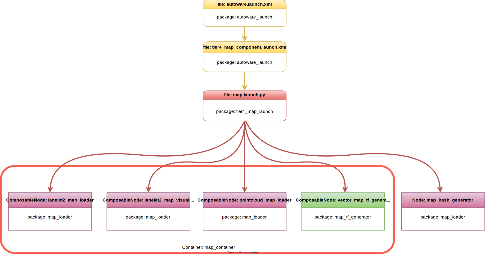

マップ起動ファイル
概要
「 Autoware の起動」autoware_launch.xmlページで説明したように、Autoware マップ スタックは で起動を開始します。パッケージには、 からマップ起動ファイルの呼び出しを開始するためのものが含まれています。この図は、Autoware マップ起動ファイル フロー およびパッケージの一部を説明しています。autoware_launchtier4_map_component.launch.xmlautoware_launch.xmlautoware_launchautoware.universe

{ align=center } Autoware マップ起動フロー図
!!! 注記

The Autoware project is a large project.
Therefore, as we manage the Autoware project, we utilize specific
arguments in the launch files.
ROS 2 offers an argument-overriding feature for these launch files.
Please refer to [the official ROS 2 launch documentation](https://docs.ros.org/en/humble/Tutorials/Intermediate/Launch/Using-ROS2-Launch-For-Large-Projects.html#parameter-overrides) for further information.
For instance,
if we define an argument at the top-level launch,
it will override the value on lower-level launches.
tier4_map_launch パッケージの map.launch.py​​ 起動ファイルには、マッピングに必要なノード定義が直接含まれています。Autoware の現在の設計では、lanelet2_map_loader、 lanelet2_map_visualization、pointcloud_map_loader、およびvector_map_tf_generatorコンポーザブル ノードは に含まれていますmap_container。

マップ起動ファイルには多くの変更オプションがありません (パラメーターは構成ファイルに含まれているため)。ただし、起動時に pointcloud および LANELET2 マップの名前を指定できます (デフォルト値は pointcloud_map.pcd および Lanlet2_map.osm)。たとえば、マップ ファイル名を変更する場合は、次のコマンド ライン引数を使用して Autoware を実行できます。

ros2 launch autoware_launch autoware.launch.xml ... pointcloud_map_file:=<YOUR-PCD-FILE-NAME> lanelet2_map_file:=<YOUR-LANELET2-MAP-NAME> ...
または、起動ファイルで変更することもできますautoware.launch.xml。

- <arg name="lanelet2_map_file" default="lanelet2_map.osm" description="lanelet2 map file name"/>
+ <arg name="lanelet2_map_file" default="<YOUR-LANELET2-MAP-NAME>" description="lanelet2 map file name"/>
- <arg name="pointcloud_map_file" default="pointcloud_map.pcd" description="pointcloud map file name"/>
+ <arg name="pointcloud_map_file" default="<YOUR-PCD-FILE-NAME>" description="pointcloud map file name"/>

# Map Launch Files

## Overview

The Autoware map stacks start
launching at `autoware_launch.xml` as we mentioned at [Launch Autoware](../index.md) page.
The `autoware_launch` package includes `tier4_map_component.launch.xml`
for starting map launch files invocation from `autoware_launch.xml`.
This diagram describes some of the Autoware map launch files flow at `autoware_launch`
and `autoware.universe` packages.

<figure markdown>
  { align=center }
  <figcaption>
    Autoware map launch flow diagram
  </figcaption>
</figure>

!!! note

    The Autoware project is a large project.
    Therefore, as we manage the Autoware project, we utilize specific
    arguments in the launch files.
    ROS 2 offers an argument-overriding feature for these launch files.
    Please refer to [the official ROS 2 launch documentation](https://docs.ros.org/en/humble/Tutorials/Intermediate/Launch/Using-ROS2-Launch-For-Large-Projects.html#parameter-overrides) for further information.
    For instance,
    if we define an argument at the top-level launch,
    it will override the value on lower-level launches.

The map.launch.py launch file from the tier4_map_launch package directly includes
the necessary node definitions for mapping. In the current design of Autoware, the `lanelet2_map_loader`,
`lanelet2_map_visualization`, `pointcloud_map_loader`, and `vector_map_tf_generator` composable
nodes are included in the `map_container`.

We don't have many modification options in the map launching files
(as the parameters are included in the config files).
However, you can specify the names for your pointcloud and lanelet2 map during the launch
(the default values are pointcloud_map.pcd and lanelet2_map.osm).
For instance, if you wish to change your map file names, you can run Autoware using
the following command line arguments:

```bash
ros2 launch autoware_launch autoware.launch.xml ... pointcloud_map_file:=<YOUR-PCD-FILE-NAME> lanelet2_map_file:=<YOUR-LANELET2-MAP-NAME> ...
```

Or you can change it on your `autoware.launch.xml` launch file:

```diff
- <arg name="lanelet2_map_file" default="lanelet2_map.osm" description="lanelet2 map file name"/>
+ <arg name="lanelet2_map_file" default="<YOUR-LANELET2-MAP-NAME>" description="lanelet2 map file name"/>
- <arg name="pointcloud_map_file" default="pointcloud_map.pcd" description="pointcloud map file name"/>
+ <arg name="pointcloud_map_file" default="<YOUR-PCD-FILE-NAME>" description="pointcloud map file name"/>
```
