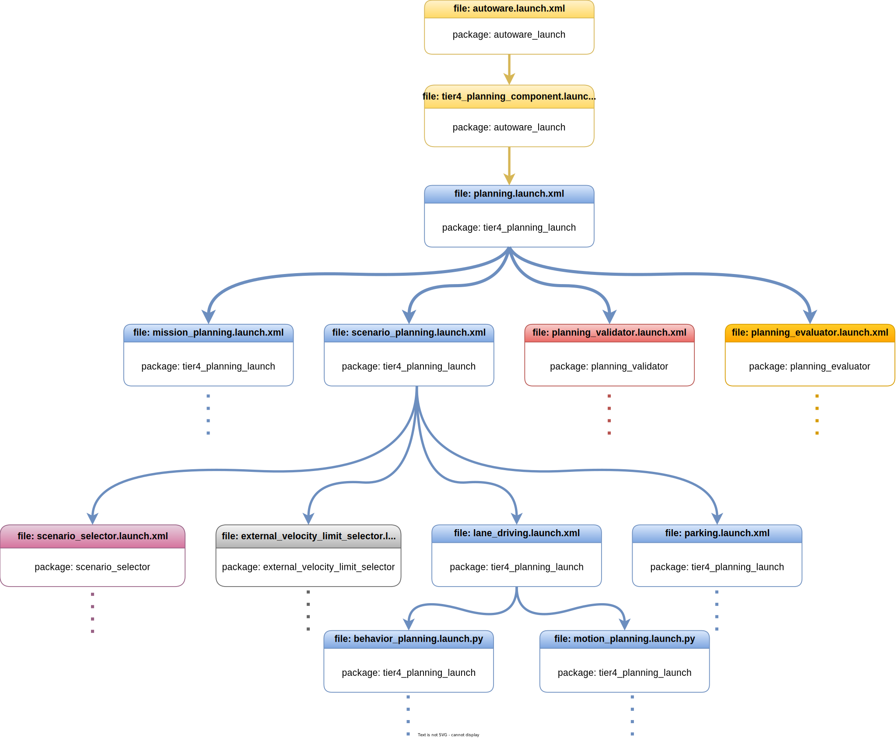

起動ファイルの計画
概要
Autoware 計画スタックは、「Autoware の起動」autoware_launch.xmlページで説明されているように、起動を開始します。パッケージには、 からの計画起動ファイルの呼び出しを開始するためのものが含まれています。以下の図は、autoware_launch および autoware.universe パッケージ内の Autoware 計画起動ファイルのフローを示しています。autoware_launchtier4_planning_component.launch.xmlautoware_launch.xml

{ align=center } Autoware の計画起動フロー図
!!! 注記

The Autoware project is a large project.
Therefore, as we manage the Autoware project, we utilize specific
arguments in the launch files.
ROS 2 offers an argument-overriding feature for these launch files.
Please refer to [the official ROS 2 launch documentation](https://docs.ros.org/en/humble/Tutorials/Intermediate/Launch/Using-ROS2-Launch-For-Large-Projects.html#parameter-overrides) for further information.
For instance,
if we define an argument at the top-level launch,
it will override the value on lower-level launches.
tier4_planning_component.launch.xml
起動tier4_planning_component.launch.xmlファイルは、パッケージで起動される主要な計画コンポーネントですautoware_launch。この起動ファイルは、リポジトリからtier4_planning_launchパッケージplanning.launch.xmlを呼び出します。計画起動引数は、tier4_planning_component.launch.xml で変更できます。また、これは他の計画起動ファイルの最上位の起動ファイルであるため、変更したいその他の必要な引数を追加することもできます。事前定義された計画起動引数の一部を次に示します。autoware.universetier4_planning_component.launch.xml

use_experimental_lane_change_function:この引数により enable_collision_check_at_prepare_phase、実験的なレーン変更のための Autoware のuse_predicted_path_outside_lanelet、 、およびuse_all_predicted_pathオプションが有効になります (詳細については、lane_change ドキュメントを参照してください)。デフォルト値は True です。これを False に設定するには、ファイルに次の変更を加えますtier4_planning_component.launch.xml。

- <arg name="use_experimental_lane_change_function" default="true"/>
+ <arg name="use_experimental_lane_change_function" default="false"/>
cruise_planner_type:Autoware には、障害物停止プランナー と障害物クルーズプランナーという 2 種類のクルーズ プランナーがあります。これらのクルーズ プランナー タイプの仕様については、パッケージのドキュメントを参照してください。デフォルトのクルーズ プランナーは ですobstacle_stop_planner。これを障害物_クルーズ_プランナーに変更するには、ファイル内の引数の値を更新しますtier4_planning_component.launch.xml。

- <arg name="cruise_planner_type" default="obstacle_stop_planner" description="options: obstacle_stop_planner, obstacle_cruise_planner, none"/>
+ <arg name="cruise_planner_type" default="obstacle_cruise_planner" description="options: obstacle_stop_planner, obstacle_cruise_planner, none"/>
use_surround_obstacle_check:この引数は、 Autoware のaround_obstacle_checkerを有効にします 。これを無効にしたい場合は、 tier4_planning_component.launch.xmlファイル内で次の操作を行うことができます。

- <arg name="use_surround_obstacle_check" default="true"/>
+ <arg name="use_surround_obstacle_check" default="false"/>
velocity_smoother_type:この引数は、 motion_velocity_smootherパッケージのスムーサーのタイプを指定します。利用可能なスムーズなタイプの詳細については、ドキュメントを参照してください。たとえば、スムーズなタイプを JerkFiltered から L2 に変更したい場合は、tier4_planning_component.launch.xml ファイルで変更できます。

- <arg name="velocity_smoother_type" default="JerkFiltered" description="options: JerkFiltered, L2, Analytical, Linf(Unstable)"/>
+ <arg name="velocity_smoother_type" default="L2" description="options: JerkFiltered, L2, Analytical, Linf(Unstable)"/>
!!! 注記

You can also use this arguments as command line arguments:
```bash
ros2 launch autoware_launch autoware.launch.xml ... use_surround_obstacle_check:=false velocity_smoother_type:=L2 ...
```
tier4_planning_component.launch.xml の事前定義引数については上で説明しました。ただし、autoware_launch 計画構成パラメータには、多数の計画引数が含まれています。
# Planning Launch Files

## Overview

The Autoware planning stacks start
launching at `autoware_launch.xml` as mentioned on the [Launch Autoware](../index.md) page.
The `autoware_launch` package includes `tier4_planning_component.launch.xml`
for initiating planning launch files invocation from `autoware_launch.xml`.
The diagram below illustrates the flow of Autoware planning launch files within the autoware_launch and autoware.universe packages.

<figure markdown>
  { align=center }
  <figcaption>
    Autoware planning launch flow diagram
  </figcaption>
</figure>

!!! note

    The Autoware project is a large project.
    Therefore, as we manage the Autoware project, we utilize specific
    arguments in the launch files.
    ROS 2 offers an argument-overriding feature for these launch files.
    Please refer to [the official ROS 2 launch documentation](https://docs.ros.org/en/humble/Tutorials/Intermediate/Launch/Using-ROS2-Launch-For-Large-Projects.html#parameter-overrides) for further information.
    For instance,
    if we define an argument at the top-level launch,
    it will override the value on lower-level launches.

## tier4_planning_component.launch.xml

The `tier4_planning_component.launch.xml` launch file is the main planning component launch at the `autoware_launch` package.
This launch file calls `planning.launch.xml` at [tier4_planning_launch](https://github.com/autowarefoundation/autoware.universe/tree/main/launch/tier4_planning_launch) package from `autoware.universe` repository.
We can modify planning launch arguments at tier4_planning_component.launch.xml.
Also,
we can add any other necessary arguments
that we want
to change it since `tier4_planning_component.launch.xml` is the top-level launch file of other planning launch files.
Here are some predefined planning launch arguments:

- **`use_experimental_lane_change_function:`** This argument enables
  `enable_collision_check_at_prepare_phase`, `use_predicted_path_outside_lanelet`,
  and `use_all_predicted_path` options for Autoware for experimental lane changing
  (for more information, please refer to [lane_change documentation](https://autowarefoundation.github.io/autoware.universe/main/planning/behavior_path_planner/docs/behavior_path_planner_lane_change_design/)).
  The default value is True.
  To set it to False, make the following change in the `tier4_planning_component.launch.xml` file:

  ```diff
  - <arg name="use_experimental_lane_change_function" default="true"/>
  + <arg name="use_experimental_lane_change_function" default="false"/>
  ```

- **`cruise_planner_type:`** There are two types of cruise planners in Autoware: [obstacle_stop_planner](https://autowarefoundation.github.io/autoware.universe/main/planning/obstacle_stop_planner/)
  and [obstacle_cruise_planner](https://autowarefoundation.github.io/autoware.universe/main/planning/obstacle_cruise_planner/). For specifications on these cruise planner types,
  please refer to the package documentation. The default cruise planner is `obstacle_stop_planner`.
  To change it to obstacle_cruise_planner, update the argument value in the `tier4_planning_component.launch.xml` file:

  ```diff
  - <arg name="cruise_planner_type" default="obstacle_stop_planner" description="options: obstacle_stop_planner, obstacle_cruise_planner, none"/>
  + <arg name="cruise_planner_type" default="obstacle_cruise_planner" description="options: obstacle_stop_planner, obstacle_cruise_planner, none"/>
  ```

- **`use_surround_obstacle_check:`** This argument enables the [surround_obstacle_checker](https://autowarefoundation.github.io/autoware.universe/main/planning/surround_obstacle_checker/)
  for Autoware. If you want to disable it, you can do in the
  `tier4_planning_component.launch.xml` file:

  ```diff
  - <arg name="use_surround_obstacle_check" default="true"/>
  + <arg name="use_surround_obstacle_check" default="false"/>
  ```

- **`velocity_smoother_type:`** This argument specifies the type of smoother
  for the [motion_velocity_smoother](https://autowarefoundation.github.io/autoware.universe/main/planning/motion_velocity_smoother/) package. Please consult the documentation
  for detailed information about available smoother types. For instance, if
  you wish to change your smoother type from JerkFiltered to L2, you can do
  in the tier4_planning_component.launch.xml file.:

  ```diff
  - <arg name="velocity_smoother_type" default="JerkFiltered" description="options: JerkFiltered, L2, Analytical, Linf(Unstable)"/>
  + <arg name="velocity_smoother_type" default="L2" description="options: JerkFiltered, L2, Analytical, Linf(Unstable)"/>
  ```

!!! note

    You can also use this arguments as command line arguments:
    ```bash
    ros2 launch autoware_launch autoware.launch.xml ... use_surround_obstacle_check:=false velocity_smoother_type:=L2 ...
    ```

The predefined arguments in tier4_planning_component.launch.xml have been explained above.
However, numerous planning arguments are included in the autoware_launch planning config parameters.
