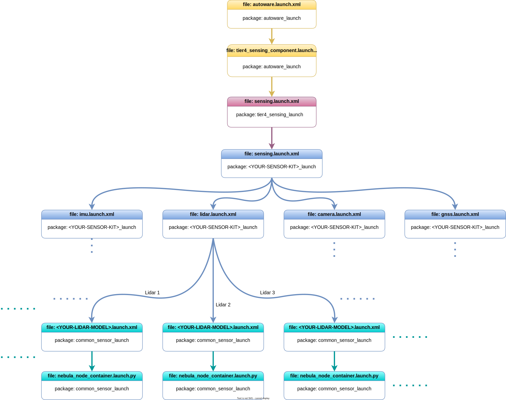

起動ファイルの検出
概要
「Autoware の起動」autoware_launch.xmlページで説明したように、Autoware センシング スタックは に起動を開始します。パッケージには、 からの起動ファイル呼び出しの検出を開始するためのものが含まれています。この図は、およびパッケージでの Autoware センシング起動ファイル フローの一部を説明しています。autoware_launchtier4_sensing_component.launch.xmlautoware_launch.xmlautoware_launchautoware.universe

{ align=center } Autoware センシング起動フロー図
!!! 注記

The Autoware project is a large project.
Therefore, as we manage the Autoware project, we utilize specific
arguments in the launch files.
ROS 2 offers an argument-overriding feature for these launch files.
Please refer to [the official ROS 2 launch documentation](https://docs.ros.org/en/humble/Tutorials/Intermediate/Launch/Using-ROS2-Launch-For-Large-Projects.html#parameter-overrides) for further information.
For instance,
if we define an argument at the top-level launch,
it will override the value on lower-level launches.
センシングの起動はセンサー キットにより関連しているため、起動を変更する場合は、これらの変更をパッケージに適用することをお勧めします。詳細については、センサーと車両モデルのページの作成を参照してください。ただし、トップレベルの起動ファイルで実行できる変更がいくつかあります。

たとえば、Autoware でセンサー ドライバーを起動したくない場合は、コマンド ライン引数を使用して無効にすることができます。

ros2 launch autoware_launch autoware.launch.xml ... launch_sensing_driver:=false ...
または、起動ファイルで変更することもできますautoware.launch.xml。

- <arg name="launch_sensing_driver" default="true" description="launch sensing driver"/>
+ <arg name="launch_sensing_driver" default="false" description="launch sensing driver"/>

# Sensing Launch Files

## Overview

The Autoware sensing stacks start
launching at `autoware_launch.xml` as we mentioned at [Launch Autoware](../index.md) page.
The `autoware_launch` package includes `tier4_sensing_component.launch.xml`
for starting sensing launch files invocation from `autoware_launch.xml`.
This diagram describes some of the Autoware sensing launch files flow at `autoware_launch` and `autoware.universe` packages.

<figure markdown>
  { align=center }
  <figcaption>
    Autoware sensing launch flow diagram
  </figcaption>
</figure>

!!! note

    The Autoware project is a large project.
    Therefore, as we manage the Autoware project, we utilize specific
    arguments in the launch files.
    ROS 2 offers an argument-overriding feature for these launch files.
    Please refer to [the official ROS 2 launch documentation](https://docs.ros.org/en/humble/Tutorials/Intermediate/Launch/Using-ROS2-Launch-For-Large-Projects.html#parameter-overrides) for further information.
    For instance,
    if we define an argument at the top-level launch,
    it will override the value on lower-level launches.

The sensing launch is more related to your sensor kit,
so if you want to modify your launch, we recommend applying
these modifications to the <YOUR-SENSOR-KIT> packages.
Please look
at [creating sensor and vehicle model](../../creating-vehicle-and-sensor-model/index.md) pages for more information but there
is are some modifications on which can you done at top-level launch files.

For example, if you do not want to launch the sensor driver with Autoware,
you can disable it with a command-line argument:

```bash
ros2 launch autoware_launch autoware.launch.xml ... launch_sensing_driver:=false ...
```

Or you can change it on your `autoware.launch.xml` launch file:

```diff
- <arg name="launch_sensing_driver" default="true" description="launch sensing driver"/>
+ <arg name="launch_sensing_driver" default="false" description="launch sensing driver"/>
```
