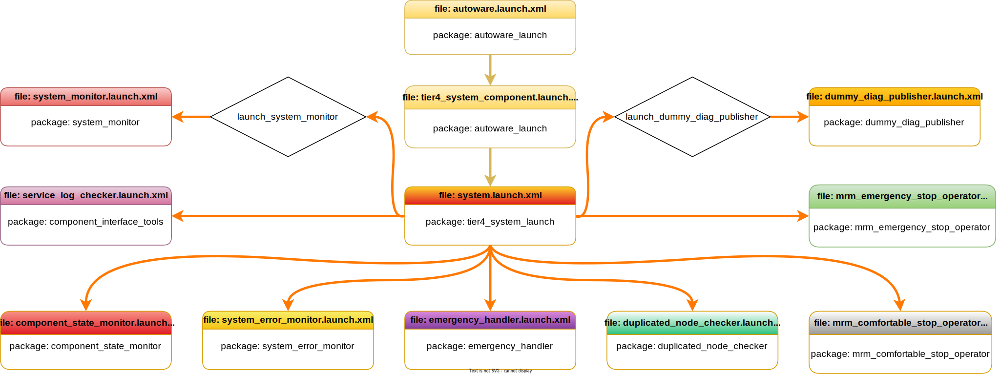

システム起動ファイル
概要
「Autoware の起動」autoware_launch.xmlページで説明したように、Autoware システム スタックは で起動を開始します。パッケージには、 からシステム起動ファイルの呼び出しを開始するためのものが含まれています。この図は、Autoware システム起動ファイル フローとパッケージの一部を説明しています。autoware_launchtier4_system_component.launch.xmlautoware_launch.xmlautoware_launchautoware.universe

{ align=center } Autoware システム起動フロー図
!!! 注記

The Autoware project is a large project.
Therefore, as we manage the Autoware project, we utilize specific
arguments in the launch files.
ROS 2 offers an argument-overriding feature for these launch files.
Please refer to [the official ROS 2 launch documentation](https://docs.ros.org/en/humble/Tutorials/Intermediate/Launch/Using-ROS2-Launch-For-Large-Projects.html#parameter-overrides) for further information.
For instance,
if we define an argument at the top-level launch,
it will override the value on lower-level launches.
システム起動パイプラインのフロー図で説明されているように、パッケージsystem.launch.xmlからはtier4_system_launch次のパッケージを直接起動します。

システムモニター
コンポーネントインターフェースツール
コンポーネント状態モニター
システムエラーモニター
緊急対応者
重複ノードチェッカー
mrm_comfortable_stop_operator
mrm_emergency_stop_operator
dummy_diag_publisher
システム起動ファイルには多くの変更オプションはありませんが (パラメータは構成ファイルに含まれているため)、system_error_monitor パラメータのファイル パスを変更できます。たとえば、system_error_monitor.param.yaml ファイルのパスを変更する場合は、次のコマンド ライン引数を使用して Autoware を実行できます。

ros2 launch autoware_launch autoware.launch.xml ... system_error_monitor_param_path:=<YOUR-SYSTEM-ERROR-PARAM-PATH> ...
または、起動ファイルで変更することもできますtier4_system_component.launch.xml。

- <arg name="system_error_monitor_param_path" default="$(find-pkg-share autoware_launch)/config/..."/>
+ <arg name="system_error_monitor_param_path" default="<YOUR-SYSTEM-ERROR-PARAM-PATH>"/>

# System Launch Files

## Overview

The Autoware system stacks start
launching at `autoware_launch.xml` as we mentioned at [Launch Autoware](../index.md) page.
The `autoware_launch` package includes `tier4_system_component.launch.xml`
for starting system launch files invocation from `autoware_launch.xml`.
This diagram describes some of the Autoware system launch files flow at `autoware_launch` and `autoware.universe` packages.

<figure markdown>
  { align=center }
  <figcaption>
    Autoware system launch flow diagram
  </figcaption>
</figure>

!!! note

    The Autoware project is a large project.
    Therefore, as we manage the Autoware project, we utilize specific
    arguments in the launch files.
    ROS 2 offers an argument-overriding feature for these launch files.
    Please refer to [the official ROS 2 launch documentation](https://docs.ros.org/en/humble/Tutorials/Intermediate/Launch/Using-ROS2-Launch-For-Large-Projects.html#parameter-overrides) for further information.
    For instance,
    if we define an argument at the top-level launch,
    it will override the value on lower-level launches.

As described in the flow diagram of the system launch pipeline,
the `system.launch.xml` from the `tier4_system_launch` package directly launches the following packages:

- [system_monitor](https://autowarefoundation.github.io/autoware.universe/main/system/system_monitor/)
- [component_interface_tools](https://autowarefoundation.github.io/autoware.universe/main/common/component_interface_tools/)
- [component_state_monitor](https://autowarefoundation.github.io/autoware.universe/main/system/component_state_monitor/)
- [system_error_monitor](https://autowarefoundation.github.io/autoware.universe/main/system/system_error_monitor/)
- [emergency_handler](https://autowarefoundation.github.io/autoware.universe/main/system/emergency_handler/)
- [duplicated_node_checker](https://autowarefoundation.github.io/autoware.universe/main/system/duplicated_node_checker/)
- [mrm_comfortable_stop_operator](https://autowarefoundation.github.io/autoware.universe/main/system/mrm_comfortable_stop_operator/)
- [mrm_emergency_stop_operator](https://autowarefoundation.github.io/autoware.universe/main/system/mrm_emergency_stop_operator/)
- [dummy_diag_publisher](https://autowarefoundation.github.io/autoware.universe/main/system/dummy_diag_publisher/)

We don't have many modification options in the system launching files
(as the parameters are included in config files),
but you can modify the file path for the system_error_monitor parameter.
For instance, if you want to change the path for your system_error_monitor.param.yaml file,
you can run Autoware with the following command line argument:

```bash
ros2 launch autoware_launch autoware.launch.xml ... system_error_monitor_param_path:=<YOUR-SYSTEM-ERROR-PARAM-PATH> ...
```

Or you can change it on your `tier4_system_component.launch.xml` launch file:

```diff
- <arg name="system_error_monitor_param_path" default="$(find-pkg-share autoware_launch)/config/..."/>
+ <arg name="system_error_monitor_param_path" default="<YOUR-SYSTEM-ERROR-PARAM-PATH>"/>
```
