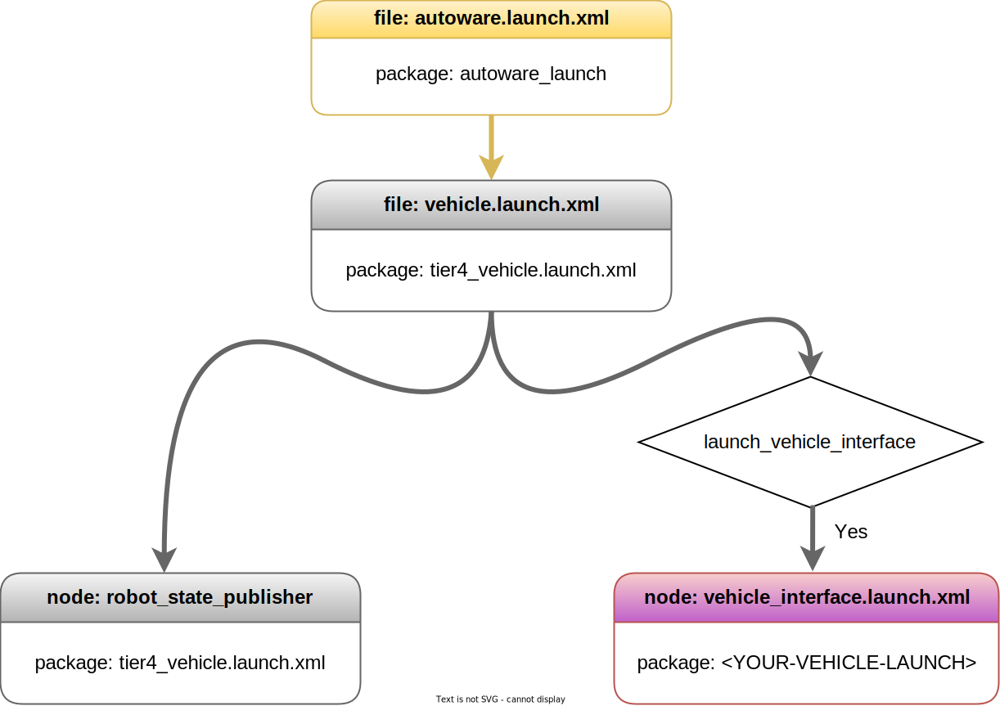

車両起動ファイル
概要
「Autoware の起動」ページで説明したように、Autoware 車両スタックは autoware_launch.xml で起動を開始し 、このコンテキストで tier4_vehicle.launch.xml が呼び出されます。autoware_launch次の図は、およびパッケージ内の Autoware 車両起動ファイル フローの一部を説明していますautoware.universe。

{ align=center width=720} Autoware 車両起動フロー図
!!! 注記

The Autoware project is a large project.
Therefore, as we manage the Autoware project, we utilize specific
arguments in the launch files.
ROS 2 offers an argument-overriding feature for these launch files.
Please refer to [the official ROS 2 launch documentation](https://docs.ros.org/en/humble/Tutorials/Intermediate/Launch/Using-ROS2-Launch-For-Large-Projects.html#parameter-overrides) for further information.
For instance,
if we define an argument at the top-level launch,
it will override the value on lower-level launches.
車両起動ファイルには多くの変更オプションはありませんが (パラメータは vehicle_launch リポジトリに含まれているため)、vehicle_interface 起動を無効にすることを選択できます。たとえば、robot_state_publisher は実行したいが、vehicle_interface は実行したくない場合は、次のコマンド ライン引数を使用して Autoware を起動できます。

ros2 launch autoware_launch autoware.launch.xml ... launch_vehicle_interface:=false ...
または、起動ファイルで変更することもできますautoware.launch.xml。

- <arg name="launch_vehicle_interface" default="true" description="launch vehicle interface"/>
+ <arg name="launch_vehicle_interface" default="false" description="launch vehicle interface"/>

# Vehicle Launch Files

## Overview

The Autoware vehicle stacks begin launching with autoware_launch.xml as mentioned on the
[Launch Autoware](../index.md) page,
and the tier4_vehicle.launch.xml is called in this context. The following diagram describes some of
the Autoware vehicle launch file flow within the `autoware_launch` and `autoware.universe` packages.

<figure markdown>
  { align=center width=720}
  <figcaption>
    Autoware vehicle launch flow diagram
  </figcaption>
</figure>

!!! note

    The Autoware project is a large project.
    Therefore, as we manage the Autoware project, we utilize specific
    arguments in the launch files.
    ROS 2 offers an argument-overriding feature for these launch files.
    Please refer to [the official ROS 2 launch documentation](https://docs.ros.org/en/humble/Tutorials/Intermediate/Launch/Using-ROS2-Launch-For-Large-Projects.html#parameter-overrides) for further information.
    For instance,
    if we define an argument at the top-level launch,
    it will override the value on lower-level launches.

We don't have many modification options in the vehicle launching files
(as the parameters are included in the vehicle_launch repository),
but you can choose to disable the vehicle_interface launch.
For instance, if you want to run robot_state_publisher but not vehicle_interface,
you can launch Autoware with the following command line arguments:

```bash
ros2 launch autoware_launch autoware.launch.xml ... launch_vehicle_interface:=false ...
```

Or you can change it on your `autoware.launch.xml` launch file:

```diff
- <arg name="launch_vehicle_interface" default="true" description="launch vehicle interface"/>
+ <arg name="launch_vehicle_interface" default="false" description="launch vehicle interface"/>
```
