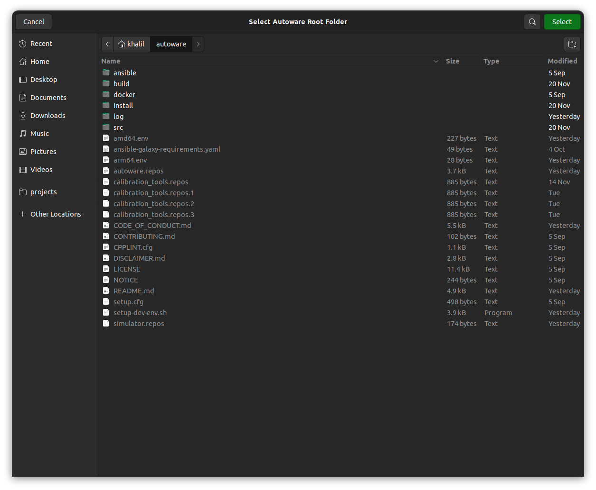
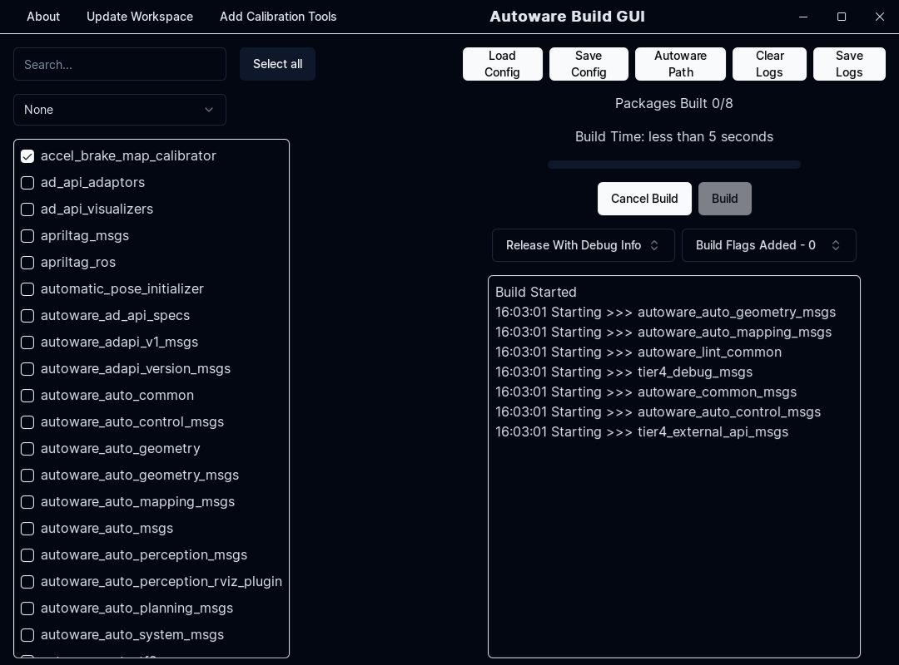
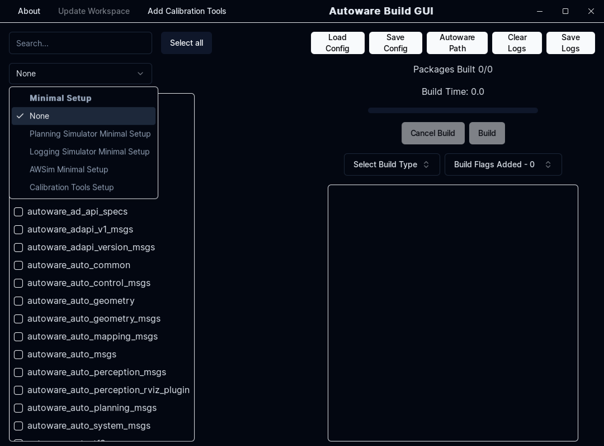
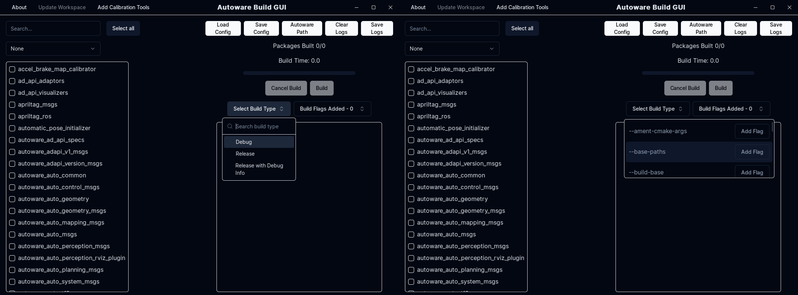
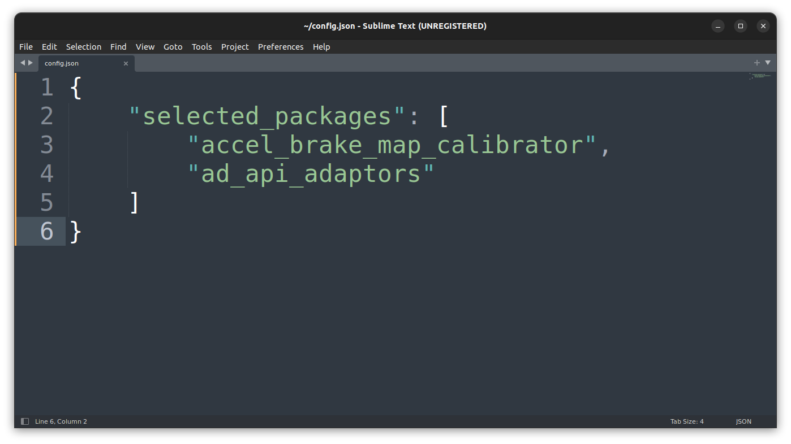
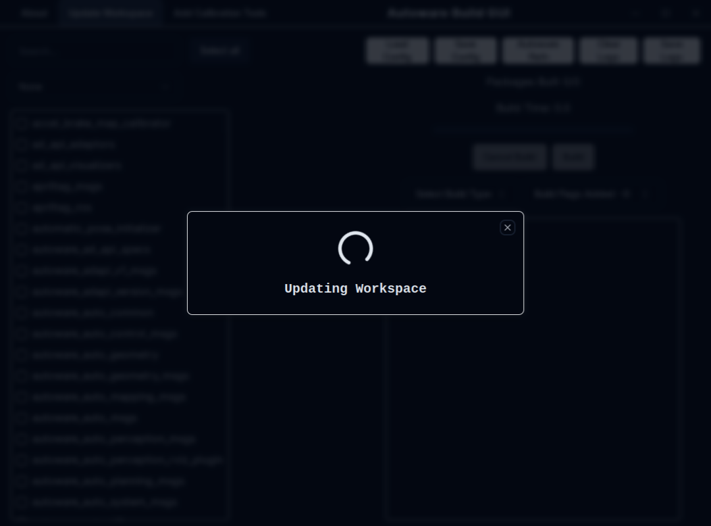

# ソースインストール

## 前提条件

- OS

  - [Ubuntu 22.04](https://releases.ubuntu.com/22.04/)

- ROS

  - ROS 2 Humble

  ROS2システムの依存関係については[REP-2000](https://www.ros.org/reps/rep-2000.html)を参照してください。

- [Git](https://git-scm.com/)
  - [SSHキーをGitHubに登録すること](https://github.com/settings/keys)を推奨します。

```bash
sudo apt-get -y update
sudo apt-get -y install git
```

> 注意:Ubuntu 20.04でROS2 Galacticを使用したい場合は[galactic](https://autowarefoundation.github.io/autoware-documentation/galactic/installation/autoware/source-installation/)ブランチのインストール手順を参照してください。ただしGalactic版には最新の機能が含まれていない可能性があることに注意してください。

## 開発環境のセットアップ

1. `autowarefoundation/autoware`のクローンを作成しディレクトリに移動します。

   ```bash
   git clone https://github.com/autowarefoundation/autoware.git
   cd autoware
   ```

2. Autowareを初めてインストールする場合は提供されたAnsibleスクリプトを使用して依存関係を自動的にインストールできます。

   ```bash
   ./setup-dev-env.sh
   ```

   ビルドで問題が発生した場合は[トラブルシューティング](../../support/troubleshooting/index.md#build-issues)を参照してサポートを求めてください。

!!! 注意

    NVIDIAライブラリをインストールする前にnvidiaライセンスに同意していることを確認してください。

    - [CUDA](https://docs.nvidia.com/cuda/eula/index.html)
    - [cuDNN](https://docs.nvidia.com/deeplearning/cudnn/sla/index.html)
    - [TensorRT](https://docs.nvidia.com/deeplearning/tensorrt/sla/index.html)

!!! 注記

    以下の項目が自動的にインストールされます。Ansibleスクリプトが機能しない場合、または別のバージョンの依存ライブラリがすでにインストールされている場合は、以下のアイテムを手動でインストールしてください。

    - [ROS2のインストール](https://github.com/autowarefoundation/autoware/tree/main/ansible/roles/ros2#manual-installation)
    - [ROS2 Dev Toolsのインストール](https://github.com/autowarefoundation/autoware/tree/main/ansible/roles/ros2_dev_tools#manual-installation)
    - [RMW Implementationのインストール](https://github.com/autowarefoundation/autoware/tree/main/ansible/roles/rmw_implementation#manual-installation)
    - [pacmodのインストール](https://github.com/autowarefoundation/autoware/tree/main/ansible/roles/pacmod#manual-installation)
    - [Autoware Coreの依存関係のインストール](https://github.com/autowarefoundation/autoware/tree/main/ansible/roles/autoware_core#manual-installation)
    - [Autoware Universeの依存関係のインストール](https://github.com/autowarefoundation/autoware/tree/main/ansible/roles/autoware_universe#manual-installation)
    - [pre-commitの依存関係のインストール](https://github.com/autowarefoundation/autoware/tree/main/ansible/roles/pre_commit#manual-installation)
    - [Nvidia CUDAのインストール](https://github.com/autowarefoundation/autoware/tree/main/ansible/roles/cuda#manual-installation)
    - [Nvidia cuDNNとTensorRTのインストール](https://github.com/autowarefoundation/autoware/tree/main/ansible/roles/tensorrt#manual-installation)

    Ansibleスクリプトを使用しなかった場合は[アーティファクトの手動ロードマニュアル](https://github.com/autowarefoundation/autoware/tree/main/ansible/roles/artifacts)で説明されているようにいくつかのアーティファクトパッケージをダウンロードする必要があります。そうしないと推論にこれらのアーティファクトが必要なため一部のパッケージ(主に認識に関連するもの)が実行できなくなります。

## ワークスペースの設定方法

!!! [Autoware Build GUIの使用](#using-autoware-build-gui)に関する情報

    シミュレーションの起動と管理にコマンドラインよりもグラフィカルユーザーインターフェイス(GUI)を使用したい場合は、このドキュメントの最後にある`Autoware Build GUI の使用`セクションのステップ・バイ・ステップガイドを参照してください。

1. `src`ディレクトリを作成し、その中にリポジトリのクローンします。

   Autowareは[vcstool](https://github.com/dirk-thomas/vcstool)を使用してワークスペースを構築します。

   ```bash
   cd autoware
   mkdir src
   vcs import src < autoware.repos
   ```

2. 依存するROSパッケージをインストールします。

   Autowareにはコアコンポーネントに加えていくつかのROS2パッケージが必要です。
   `rosdep`ツールを使用すると、依存関係の自動検索とインストールが可能になります。
   `rosdep install`の前に`rosdep update`を実行する必要があります.

   ```bash
   source /opt/ros/humble/setup.bash
   rosdep install -y --from-paths src --ignore-src --rosdistro $ROS_DISTRO
   ```

3. ワークスペースをビルドします。

   Autowareは[colcon](https://github.com/colcon)を使用してワークスペースをビルドします。
   より高度なオプションについては[ドキュメント](https://colcon.readthedocs.io/)を参照してください。

   ```bash
   colcon build --symlink-install --cmake-args -DCMAKE_BUILD_TYPE=Release
   ```

   ビルドで問題が発生した場合は[トラブルシューティング](../../support/troubleshooting/index.md#build-issues)を参照してください。

## ワークスペースのアップデート

1. `.repos` ファイルを更新します。

   ```bash
   cd autoware
   git pull <remote> <your branch>
   ```

   `<remote>`は通常`git@github.com:autowarefoundation/autoware.git`です。

2. リポジトリを更新します。

   ```bash
   vcs import src < autoware.repos
   vcs pull src
   ```

   Gitユーザーに向けて:

   - `vcs import`は`git checkout`と似ています。
     - remoteからは取得できないことに注意してください。
   - `vcs pull`は`git pull`と似ています.
     - ブランチは切り替わらないことに注意してください。

   詳細については[公式ドキュメント](https://github.com/dirk-thomas/vcstool)を参照してください。

3. 依存するROSパッケージをインストールします。

   ```bash
   source /opt/ros/humble/setup.bash
   rosdep install -y --from-paths src --ignore-src --rosdistro $ROS_DISTRO
   ```

4. ワークスペースをビルドします。

   ```bash
   colcon build --symlink-install --cmake-args -DCMAKE_BUILD_TYPE=Release
   ```

## Autoware Build GUIの使用

Autowareパッケージを構築する従来のコマンドライン方法に加えて、開発者とユーザーはAutoware Build GUIを活用して、より合理化されたユーザーフレンドリーなエクスペリエンスを実現できます。このGUIアプリケーションは、Autowareパッケージの構築および管理のプロセスを簡素化します。

### Autowareソースインストールとの統合

Autoware Build GUIを従来のソースインストールプロセスと組み合わせて使用​​する場合:

- **初期セットアップ**: 標準のAutowareソースインストールガイドに従って環境とワークスペースをセットアップします。
- **GUIの使用**: 初期セットアップが完了するとAutoware Build GUIを使用して後続のビルドとパッケージの更新を管理できます。

この統合により、Autowareパッケージを構築および管理するためのよりアクセスしやすいアプローチが提供され、新規ユーザーと経験豊富な開発者の両方に対応します。

### Autoware Build GUI の使用を開始する

1. **インストール:** Autoware Build GUIがインストールされていることを確認してください。 [インストール手順](https://github.com/autowarefoundation/autoware-build-gui#installation).
2. **アプリの起動**: インストールしたら、Autoware Build GUIを起動します。
   
3. **セットアップ**: GUI内でAutowareフォルダーへのパスを設定します。
   
4. **パッケージの構築**: 構築するAutowareパッケージを選択し、GUIを通じて構築プロセスを管理します。
   

   4.1. **ビルド構成**: デフォルトのビルド構成のリストから選択するか手動でビルドするパッケージを選択します。
   

   4.2. **ビルドオプション**: 追加のビルドオプションを指定する機能を使用して使用するビルドタイプを選択します。
   

5. **保存と読み込み**: 将来使用するためにビルド構成を保存します。すべてのパッケージをビルドしたくない場合や、提供されているデフォルト構成の1つを使用したくない場合は、以前に保存した構成をロードします。
   
6. **ワークスペースの更新**: GUIを使用するか、ワークスペースにキャリブレーションツールを追加して、Autowareワークスペースのパッケージを最新バージョンに更新します。
   
