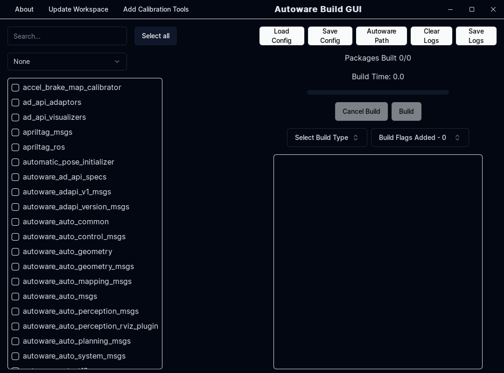

# ソースインストール

## 前提条件

- OS

  - [Ubuntu 22.04](https://releases.ubuntu.com/22.04/)

- ROS

  - ROS 2 Humble

  ROS2システムの依存関係については[REP-2000](https://www.ros.org/reps/rep-2000.html)を参照してください。

- [Git](https://git-scm.com/)
  - [SSHキーをGitHubに登録すること](https://github.com/settings/keys)を推奨します。

```bash
sudo apt-get -y update
sudo apt-get -y install git
```

> 注意:Ubuntu 20.04でROS2 Galacticを使用したい場合は[galactic](https://autowarefoundation.github.io/autoware-documentation/galactic/installation/autoware/source-installation/)ブランチのインストール手順を参照してください。ただしGalactic版には最新の機能が含まれていない可能性があることに注意してください。

## 開発環境のセットアップ

1. `autowarefoundation/autoware`のクローンを作成しディレクトリに移動します。

   ```bash
   git clone https://github.com/autowarefoundation/autoware.git
   cd autoware
   ```

2. Autowareを初めてインストールする場合は提供されたAnsibleスクリプトを使用して依存関係を自動的にインストールできます。

   ```bash
   ./setup-dev-env.sh
   ```

   ビルドで問題が発生した場合は[トラブルシューティング](../../support/troubleshooting/index.md#build-issues)を参照してサポートを求めてください。

!!! 注意

    NVIDIAライブラリをインストールする前にnvidiaライセンスに同意していることを確認してください。

    - [CUDA](https://docs.nvidia.com/cuda/eula/index.html)
    - [cuDNN](https://docs.nvidia.com/deeplearning/cudnn/sla/index.html)
    - [TensorRT](https://docs.nvidia.com/deeplearning/tensorrt/sla/index.html)

!!! 注記

    以下の項目が自動的にインストールされます。Ansibleスクリプトが機能しない場合、または別のバージョンの依存ライブラリがすでにインストールされている場合は、以下のアイテムを手動でインストールしてください。

    - [ROS2のインストール](https://github.com/autowarefoundation/autoware/tree/main/ansible/roles/ros2#manual-installation)
    - [ROS2 Dev Toolsのインストール](https://github.com/autowarefoundation/autoware/tree/main/ansible/roles/ros2_dev_tools#manual-installation)
    - [RMW Implementationのインストール](https://github.com/autowarefoundation/autoware/tree/main/ansible/roles/rmw_implementation#manual-installation)
    - [pacmodのインストール](https://github.com/autowarefoundation/autoware/tree/main/ansible/roles/pacmod#manual-installation)
    - [Autoware Coreの依存関係のインストール](https://github.com/autowarefoundation/autoware/tree/main/ansible/roles/autoware_core#manual-installation)
    - [Autoware Universeの依存関係のインストール](https://github.com/autowarefoundation/autoware/tree/main/ansible/roles/autoware_universe#manual-installation)
    - [pre-commitの依存関係のインストール](https://github.com/autowarefoundation/autoware/tree/main/ansible/roles/pre_commit#manual-installation)
    - [Nvidia CUDAのインストール](https://github.com/autowarefoundation/autoware/tree/main/ansible/roles/cuda#manual-installation)
    - [Nvidia cuDNNとTensorRTのインストール](https://github.com/autowarefoundation/autoware/tree/main/ansible/roles/tensorrt#manual-installation)

    Ansibleスクリプトを使用しなかった場合は[アーティファクトの手動ロードマニュアル](https://github.com/autowarefoundation/autoware/tree/main/ansible/roles/artifacts)で説明されているようにいくつかのアーティファクトパッケージをダウンロードする必要があります。そうしないと推論にこれらのアーティファクトが必要なため一部のパッケージ(主に認識に関連するもの)が実行できなくなります。

## ワークスペースの設定方法

!!! [Using Autoware Build GUI](#using-autoware-build-gui)[Autoware Build GUIの使用]に関する情報

    シミュレーションの起動と管理にコマンドラインよりもグラフィカルユーザーインターフェイス(GUI)を使用したい場合は、このドキュメントの最後にある`Autoware Build GUI の使用`セクションのステップ・バイ・ステップガイドを参照してください。

1. `src`ディレクトリを作成し、その中にリポジトリのクローンします。

   Autowareは[vcstool](https://github.com/dirk-thomas/vcstool)を使用してワークスペースを構築します。

   ```bash
   cd autoware
   mkdir src
   vcs import src < autoware.repos
   ```

2. 依存するROSパッケージをインストールします。

   Autowareにはコアコンポーネントに加えていくつかのROS2パッケージが必要です。
   `rosdep`ツールを使用すると、依存関係の自動検索とインストールが可能になります。
   `rosdep install`の前に`rosdep update`を実行する必要があります.

   ```bash
   source /opt/ros/humble/setup.bash
   rosdep install -y --from-paths src --ignore-src --rosdistro $ROS_DISTRO
   ```

3. ワークスペースをビルドします。

   Autowareは[colcon](https://github.com/colcon)を使用してワークスペースをビルドします。
   より高度なオプションについては[ドキュメント](https://colcon.readthedocs.io/)を参照してください。

   ```bash
   colcon build --symlink-install --cmake-args -DCMAKE_BUILD_TYPE=Release
   ```

   ビルドで問題が発生した場合は[トラブルシューティング](../../support/troubleshooting/index.md#build-issues)を参照してください。

## ワークスペースのアップデート

1. `.repos` ファイルを更新します。

   ```bash
   cd autoware
   git pull <remote> <your branch>
   ```

   `<remote>`は通常`git@github.com:autowarefoundation/autoware.git`です。

2. リポジトリを更新します。

   ```bash
   vcs import src < autoware.repos
   vcs pull src
   ```

   Gitユーザーに向けて:

   - `vcs import`は`git checkout`と似ています。
     - remoteからは取得できないことに注意してください。
   - `vcs pull`は`git pull`と似ています.
     - ブランチは切り替わらないことに注意してください。

   詳細については[公式ドキュメント](https://github.com/dirk-thomas/vcstool)を参照してください。

3. 依存するROSパッケージをインストールします。

   ```bash
   source /opt/ros/humble/setup.bash
   rosdep install -y --from-paths src --ignore-src --rosdistro $ROS_DISTRO
   ```

4. ワークスペースをビルドします。

   ```bash
   colcon build --symlink-install --cmake-args -DCMAKE_BUILD_TYPE=Release
   ```

## Using Autoware Build GUI

In addition to the traditional command-line methods of building Autoware packages, developers and users can leverage the Autoware Build GUI for a more streamlined and user-friendly experience. This GUI application simplifies the process of building and managing Autoware packages.

### Integration with Autoware Source Installation

When using the Autoware Build GUI in conjunction with the traditional source installation process:

- **Initial Setup**: Follow the standard Autoware source installation guide to set up your environment and workspace.
- **Using the GUI**: Once the initial setup is complete, you can use the Autoware Build GUI to manage subsequent builds and package updates.

This integration offers a more accessible approach to building and managing Autoware packages, catering to both new users and experienced developers.

### Getting Started with Autoware Build GUI

1. **Installation:** Ensure you have installed the Autoware Build GUI. [Installation instructions](https://github.com/autowarefoundation/autoware-build-gui#installation).
2. **Launching the App**: Once installed, launch the Autoware Build GUI.
   
3. **Setting Up**: Set the path to your Autoware folder within the GUI.
   
4. **Building Packages**: Select the Autoware packages you wish to build and manage the build process through the GUI.
   

   4.1. **Build Configuration**: Choose from a list of default build configurations, or select the packages you wish to build manually.
   

   4.2. **Build Options**: Choose which build type you wish to use, with ability to specify additional build options.
   

5. **Save and Load**: Save your build configurations for future use, or load a previously saved configuration if you don't wish to build all packages or use one of the default configurations provided.
   
6. **Updating Workspace**: Update your Autoware workspace's packages to the latest version using the GUI or adding Calibration tools to the workspace.
   
