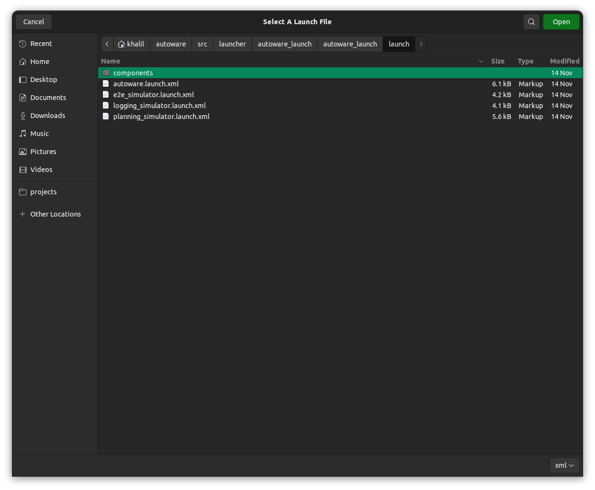

# 計画シミュレーション

## 準備

サンプルマップをダウンロードし解凍します。

- 手動で[マップ](https://drive.google.com/file/d/1499_nsbUbIeturZaDj7jhUownh5fvXHd/view?usp=sharing)をダウンロードすることもできます。

```bash
gdown -O ~/autoware_map/ 'https://docs.google.com/uc?export=download&id=1499_nsbUbIeturZaDj7jhUownh5fvXHd'
unzip -d ~/autoware_map ~/autoware_map/sample-map-planning.zip
```

!!! 注意

    サンプルマップ: Copyright 2020 TIER IV, Inc.

`~/autoware_data`フォルダとファイルがあるか確認します。

```bash
$ cd ~/autoware_data
$ ls -C -w 30
image_projection_based_fusion
lidar_apollo_instance_segmentation
lidar_centerpoint
tensorrt_yolo
tensorrt_yolox
traffic_light_classifier
traffic_light_fine_detector
traffic_light_ssd_fine_detector
yabloc_pose_initializer
```

もし無ければ[アーティファクトのダウンロード](https://github.com/autowarefoundation/autoware/tree/main/ansible/roles/artifacts)を確認してください。

## 基本シミュレーション

### レーン走行シナリオ
!!! info [Using Autoware Launch GUI](#using-autoware-launch-gui)

    If you prefer a graphical user interface (GUI) over the command line for launching and managing your simulations, refer to the `Using Autoware Launch GUI` section at the end of this document for a step-by-step guide.

### Lane driving scenario

#### 1. Autowareの起動

```bash
source ~/autoware/install/setup.bash
ros2 launch autoware_launch planning_simulator.launch.xml map_path:=$HOME/autoware_map/sample-map-planning vehicle_model:=sample_vehicle sensor_model:=sample_sensor_kit
```

!!! 警告

    `$HOME`の代わりに`~`を使用することはできないことに注意してください。

    `~`を使用するとマップの読み込みに失敗します。


#### 2. 自己車両の初期姿勢の設定


a) ツールバーの`2D Pose estimate`をクリックするか`P`キーを押してください。

b) 3Dビューパネル上でマウスの左ボタンをクリックしたままドラッグして初期ポーズの方向を設定します。車両を表す3Dモデルが表示されます。

!!! 警告

    車の初期姿勢を車線と同じ方向に設定してください。

    車線の方向を確認するには地図上に表示される矢印を確認してください。

#### 3. 自己車両の目標姿勢の設定

a) ツールバーの`2D Goal Pose`ボタンををクリックするか`G`キーを押してください。

b) 3Dビューパネル上でマウスの左ボタンをクリックしたままドラッグして目標姿勢の方向を設定します。正しく実行されると、初期姿勢から目標姿勢までの計画経路が表示されます。


#### 4. 自己車両の発進

`AutowareStatePanel`の`OperationMode`にある`AUTO`ボタンをクリックすることで自己車両を発進させられます。
あるいは次のコマンドを実行して車両を手動で始動することもできます:

```bash
source ~/autoware/install/setup.bash
ros2 service call /api/operation_mode/change_to_autonomous autoware_adapi_v1_msgs/srv/ChangeOperationMode {}
```

すると`OperationMode`の`AUTONOMOUS`が点灯し`AUTO`ボタンがグレーアウトすることが確認できます。


### 駐車シナリオ

1. 初期姿勢と目標姿勢を設定し、自己車両を操作します。

   

2. 車両が目標に近づくと、車線走行モードから駐車モードに切り替わります。
3. その後車両は後進して目的の駐車場に入ります。

   

### 車線変更シナリオ

1. 西新宿マップをダウンロードし解凍します。

   ```bash
   gdown -O ~/autoware_map/ 'https://github.com/tier4/AWSIM/releases/download/v1.1.0/nishishinjuku_autoware_map.zip'
   unzip -d ~/autoware_map ~/autoware_map/nishishinjuku_autoware_map.zip
   ```

2. 以下のコマンドで西新宿マップを読み込みながらautowareを起動します。:

   ```bash
   source ~/autoware/install/setup.bash
   ros2 launch autoware_launch planning_simulator.launch.xml map_path:=$HOME/autoware_map/nishishinjuku_autoware_map vehicle_model:=sample_vehicle sensor_model:=sample_sensor_kit
   ```

   

3. 隣接するレーンに初期姿勢と目標姿勢を設定します。

   

4. 自己車両を操作します。計画した経路に沿って車線変更を行います。

   

### 回避シナリオ

1. 初期姿勢と目標姿勢を同じレーンに設定します。経路が計画されます。

   

2. "2D Dummy Bus"を道路上に設定します。新しい経路が計画されます。

   

3. 自己車両を操作します。新しい計画経路に沿って障害物を回避します。

## 高度なシミュレーション

### ダミーオブジェクトの配置

1. ツールバーの`2D Dummy Car`か`2D Dummy Pedestrian`ボタンをクリックします。
2. マップ上をクリックしながらドラッグしてダミーオブジェクトの姿勢を設定します。
3. `Tool Properties -> 2D Dummy Car/Pedestrian`パネルでオブジェクトの速度を設定します。

   !!! 注記

   `velocity`パラメータの変更は、パラメータの変更後に配置されたオブジェクトにのみ影響します。

   

4. ツールバーの`Delete All Objects`ボタンをクリックして、ビューに配置されたダミーオブジェクトを削除します。

5. ツールバーの`Interactive` ボタンをクリックして、ダミーオブジェクトを対話形式にします。

   

6. 対話形式なダミーオブジェクトを追加するには`SHIFT`を押しながら`右クリック`をします。
7. 対話形式なダミーオブジェクトを削除するには`ALT`を押しながら`右クリック`をします.
8. 対話形式なダミーオブジェクトを移動するには`右クリック`をしながらオブジェクトをドラッグアンドドロップします。

   

### 信号認識シミュレーション

デフォルトではマップ上の信号はすべて青に設定されているかのように扱われます。その結果、信号機のある交差点を通過する経路が作成された場合、自己車両は交差点を停止せずに通過することになります。

次の項目では、計画コンポーネントがどのように応答するかをテストするために信号機を設定およびリセットする方法について説明します。

#### 信号機の設定

1. `Panels -> Add new panel`へ行き、`TrafficLightPublishPanel`を選択して`OK`を押します。

2. `TrafficLightPublishPanel`で信号機の`ID`と色を設定します。

3. `SET`ボタンをクリックします。
   

4. 最後に`PUBLISH`ボタンをクリックしてシミュレーターに信号情報を送ります。 選択した信号機を通過する計画された経路はそれに応じて変更されます。


デフォルトではRvizは地図上に各信号機のIDを表示する必要があります。領域をズームするかビュータイプを変更することでIDを詳しく見ることができます。

IDが表示されない場合は、次のトラブルシューティング手順を試してください。:

a) `Displays`パネルで`Map > Lanelet2VectorMap > Namespaces`にある三角形アイコンを切り替えて`traffic_light_id`トピックを見つけます。

b) `traffic_light_id`チェックボックスをチェックします。

c) `Map`チェックボックスを２回クリックしてトピックをリロードします。


#### 信号情報の更新/リセット

次の色を選択し(画像では`GREEN`)`SET`ボタンをクリックすると信号機の色を更新できます。画像では自車両の前の信号機が`RED`から`GREEN`に変わり車両が発進しました。


`TrafficLightPublishPanel`から信号機を削除するには`RESET`ボタンをクリックします。

[ビデオチュートリアルを参照する](https://drive.google.com/file/d/1bs_dX1JJ76qHk-SGvS6YF9gmekkN8fz7/view?usp=sharing)

## Using Autoware Launch GUI

This section provides a step-by-step guide on using the Autoware Launch GUI for planning simulations, offering an alternative to the command-line instructions provided in the Basic simulations section.

### Getting Started with Autoware Launch GUI

1. **Installation:** Ensure you have installed the Autoware Launch GUI. [Installation instructions](https://github.com/autowarefoundation/autoware-launch-gui#installation).

2. **Launching the GUI:** Open the Autoware Launch GUI from your applications menu.

   

### Launching a Planning Simulation

#### Lane Driving Scenario

1. **Set Autoware Path:** In the GUI, set the path to your Autoware installation.

   

2. **Select Launch File:** Choose `planning_simulator.launch.xml` for the lane driving scenario.

   

3. **Customize Parameters:** Adjust parameters such as `map_path`, `vehicle_model`, and `sensor_model` as needed.

   
   

4. **Start Simulation:** Click the launch button to start the simulation.

   

5. **Any Scenario:** From here, you can follow the instructions in the

- Lane driving scenario: [Lane Driving Scenario](#lane-driving-scenario)
- Parking scenario: [Parking scenario](#parking-scenario)
- Lane change scenario: [Lane change scenario](#lane-change-scenario)
- Avoidance scenario: [Avoidance scenario](#avoidance-scenario)
- Advanced Simulations: [Advanced Simulations](#advanced-simulations)

### Monitoring and Managing the Simulation

- **Real-Time Monitoring:** Use the GUI to monitor CPU/Memory usage and Autoware logs in real-time.
- **Profile Management:** Save your simulation profiles for quick access in future simulations.
- **Adjusting Parameters:** Easily modify simulation parameters on-the-fly through the GUI.
