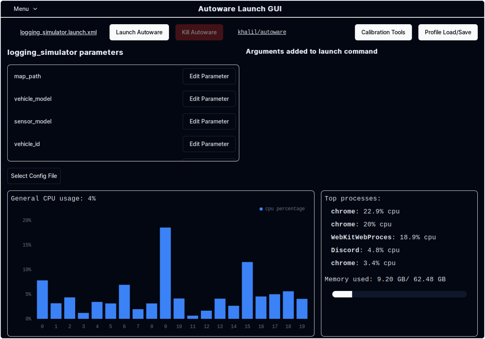
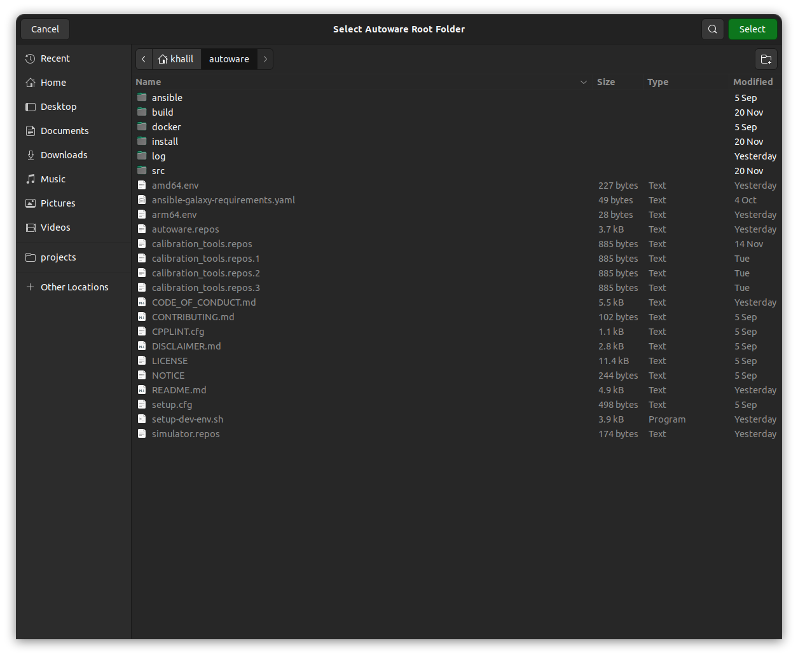
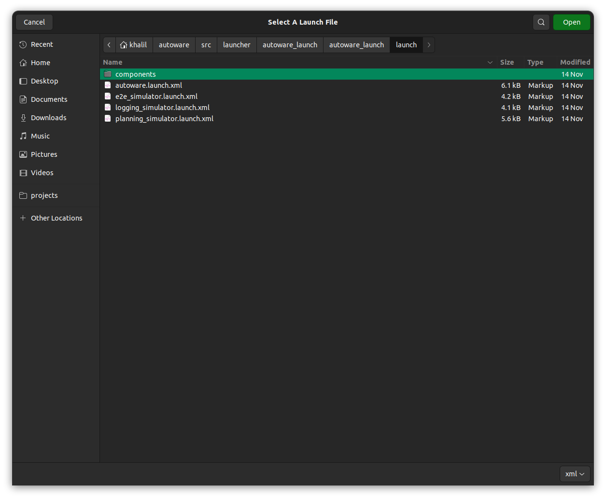
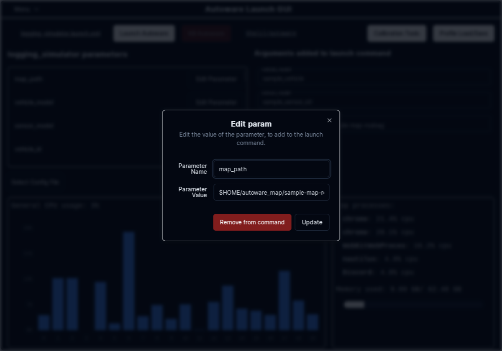
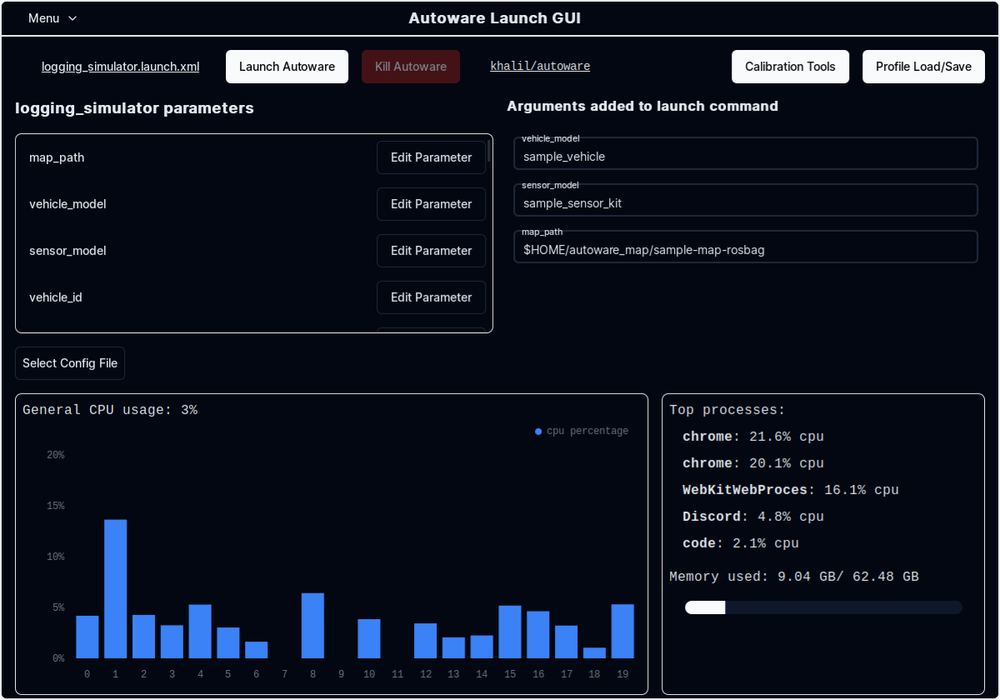
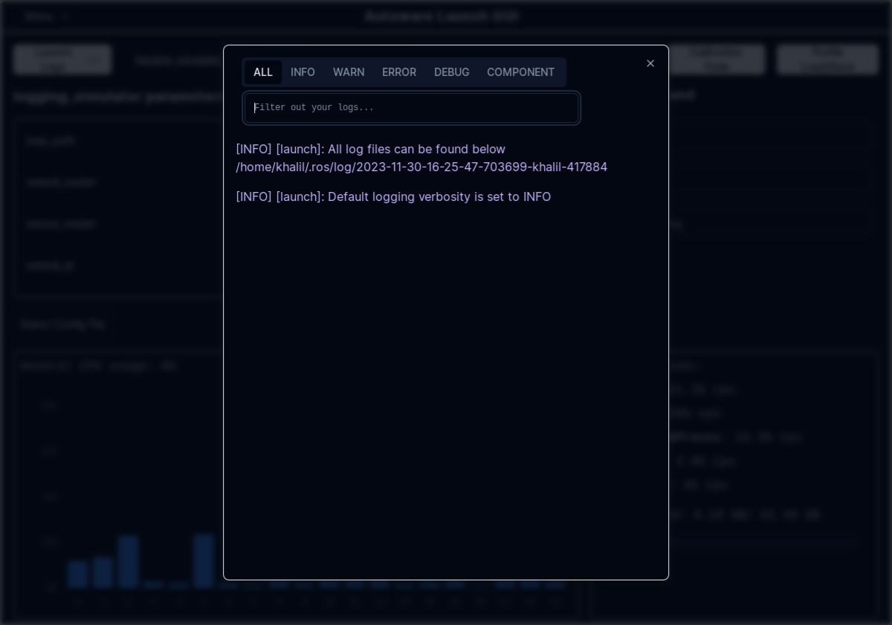
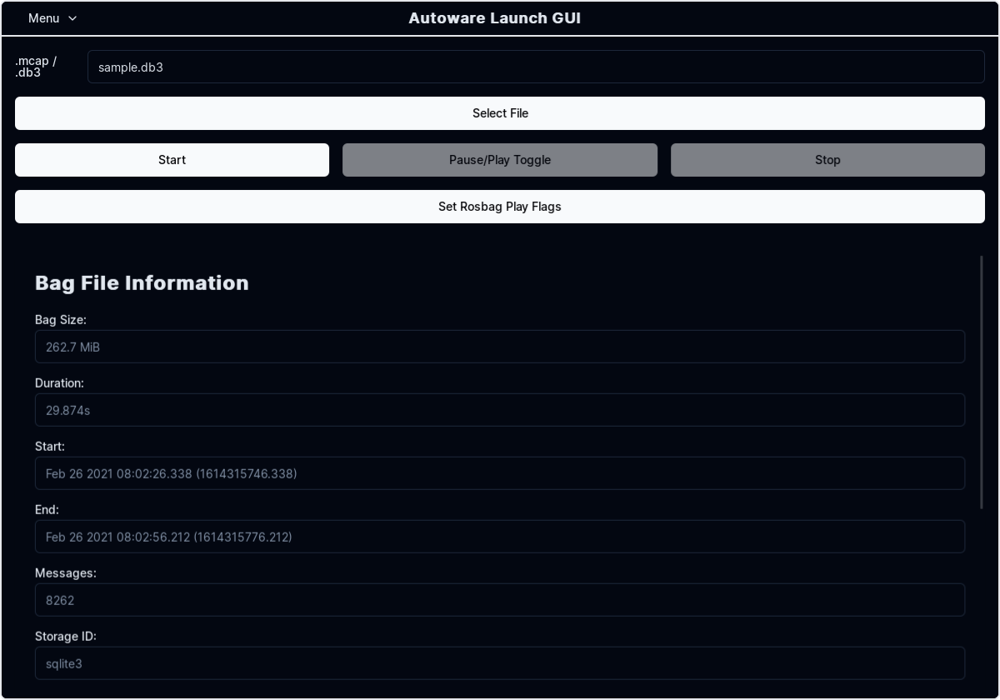
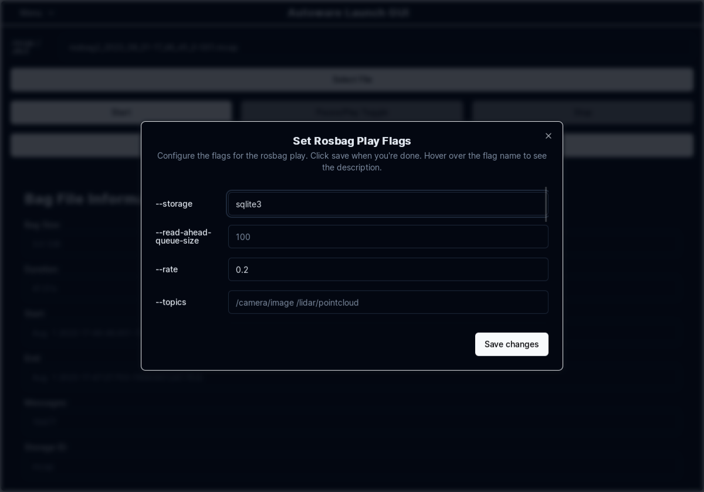
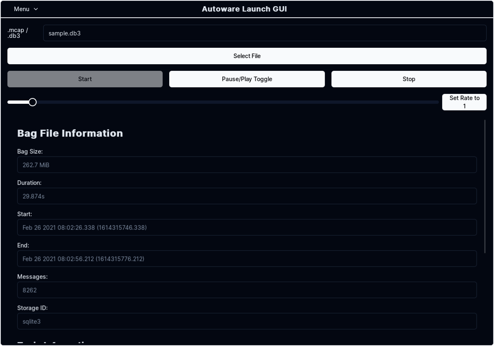

# Rosbagリプレイシミュレーション

## 手順

1. サンプルマップをダウンロードし解凍します。

   - [マップ](https://drive.google.com/file/d/1A-8BvYRX3DhSzkAnOcGWFw5T30xTlwZI/view?usp=sharing)を手動でダウンロードすることもできます。

   ```bash
   gdown -O ~/autoware_map/ 'https://docs.google.com/uc?export=download&id=1A-8BvYRX3DhSzkAnOcGWFw5T30xTlwZI'
   unzip -d ~/autoware_map/ ~/autoware_map/sample-map-rosbag.zip
   ```

2. サンプルrosbagファイルをダウンロードし解凍します。

   - [rosbagファイル](https://drive.google.com/file/d/1VnwJx9tI3kI_cTLzP61ktuAJ1ChgygpG/view?usp=sharing)を手動でダウンロードすることもできます。

   ```bash
   gdown -O ~/autoware_map/ 'https://docs.google.com/uc?export=download&id=1VnwJx9tI3kI_cTLzP61ktuAJ1ChgygpG'
   unzip -d ~/autoware_map/ ~/autoware_map/sample-rosbag.zip
   ```

3. `~/autoware_data`フォルダとファイルを確認します。

   ```bash
   $ cd ~/autoware_data
   $ ls -C -w 30
   image_projection_based_fusion
   lidar_apollo_instance_segmentation
   lidar_centerpoint
   tensorrt_yolo
   tensorrt_yolox
   traffic_light_classifier
   traffic_light_fine_detector
   traffic_light_ssd_fine_detector
   yabloc_pose_initializer
   ```

   もし異なれば[アーティファクトの手動ダウンロード](https://github.com/autowarefoundation/autoware/tree/main/ansible/roles/artifacts)を確認してください。

### 注記

- サンプルのmapとrosbag: Copyright 2020 TIER IV, Inc.
- プライバシーの観点により、rosbagには画像データが含まれていません:
  - 信号識別機能はこのサンプルではテストできません。
  - オブジェクト検出精度は低下しています。

## rosbagリプレイシミュレーションの実行方法

!!! [Autoware Launch GUIの使用](#using-autoware-launch-gui)に関する情報

    シミュレーションの起動と管理にコマンドラインよりもグラフィカルユーザーインターフェイス(GUI)を使用したい場合は、このドキュメントの最後にある`Autoware Launch GUIの使用`セクションのステップバイステップガイドを参照してください。

1. Autowareを起動します

   ```sh
   source ~/autoware/install/setup.bash
   ros2 launch autoware_launch logging_simulator.launch.xml map_path:=$HOME/autoware_map/sample-map-rosbag vehicle_model:=sample_vehicle sensor_model:=sample_sensor_kit
   ```

   `$HOME`の代わりに`~`を使用することはできないことに注意してください。

   

2. サンプルrosbagファイルを再生します。

   ```sh
   source ~/autoware/install/setup.bash
   ros2 bag play ~/autoware_map/sample-rosbag/sample.db3 -r 0.2 -s sqlite3
   ```

   

3. 自己車両に注目するためにRvizビューパネルの`Target Frame`を`viewer`から`base_link`に変更します。

   

4. `Third Person Follower`等に視点を切り替えるにはRVizビューパネルの`Type`を変更します。

   

[ビデオチュートリアルを参照する](https://drive.google.com/file/d/12D6aSC1Y3Kf7STtEPWG5RYynxKdVcPrc/view?usp=sharing)

## Autoware Launch GUIの使用

このセクションでは、Autoware Launch GUIを使用してrosbagリプレイシミュレーションを起動および管理するためのステップバイステップガイドを提供します。前のセクションで説明したコマンドライン命令の代替手段を提供します。

### Autoware Launch GUIの使用を開始する

1. **インストール:** Autoware Launch GUIがインストールされていることを確認します。 [インストール手順](https://github.com/autowarefoundation/autoware-launch-gui#installation).

2. **GUIの起動:** アプリケーションメニューからAutoware Launch GUIを開きます。
   

### 記録シミュレーションの起動

1. **Autowareパスの設定:** GUIでAutowareインストールへのパスを設定します。
   
2. **起動ファイルの選択:** 車線走行シナリオ用に`logging_simulator.launch.xml`を選択します。
   
3. **パラメーターの調整:** 必要に応じて`map_path`、`vehicle_model`、`sensor_model`等のパラメータを調整します。

   
   

4. **シミュレーションの開始:** 起動ボタンをクリックしてシミュレーションを開始し、すべてのログにアクセスします。

   

5. **Rosbagの再生:** `Rosbag`タブに移動し再生したいrosbagファイルを選択します。

   

6. **再生速度の調整:** 必要に応じて再生速度を調整し、カスタマイズしたいその他のパラメーターを調整します。

   

7. **再生開始:** 再生ボタンをクリックするとrosbagの再生が開始し、`pause/play`、`stop`、`speed slider`5などの設定にアクセスできます。

   

8. **シミュレーションを見る:** `RViz`ウィンドウに移動してシミュレーションを見ます。

   

9. 自己車両に焦点を当てるにはRVizのビューパネルの`Target Frame`を`viewer`から`base_link`に変更します。

   

10. ビューを`Third Person Follower`等に変更するにはRVizのビューパネルの`Type`を変更します。

    
